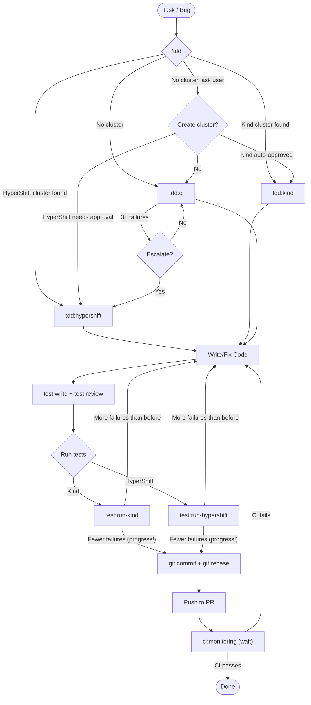
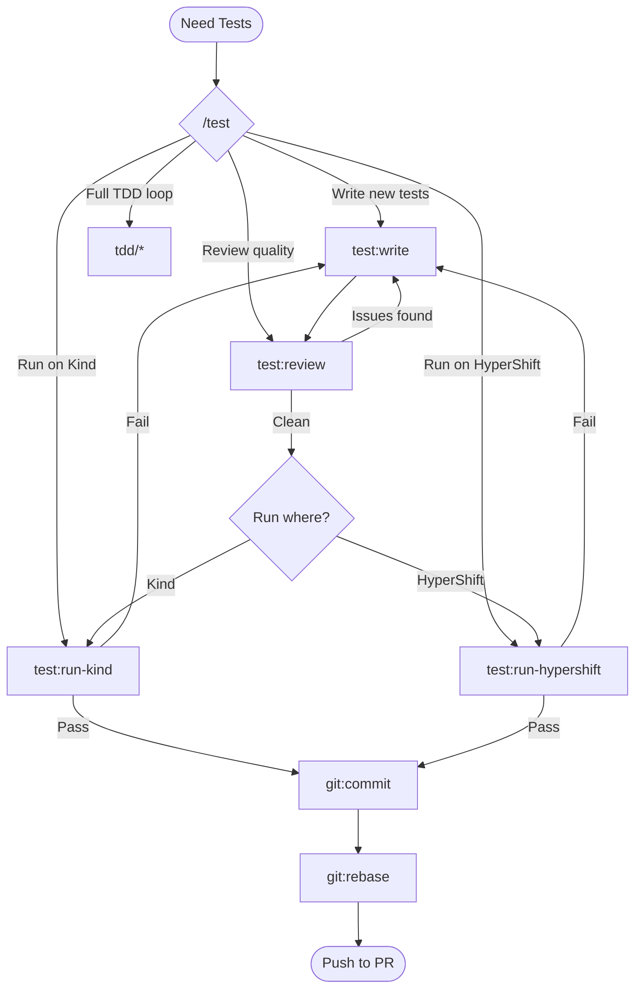
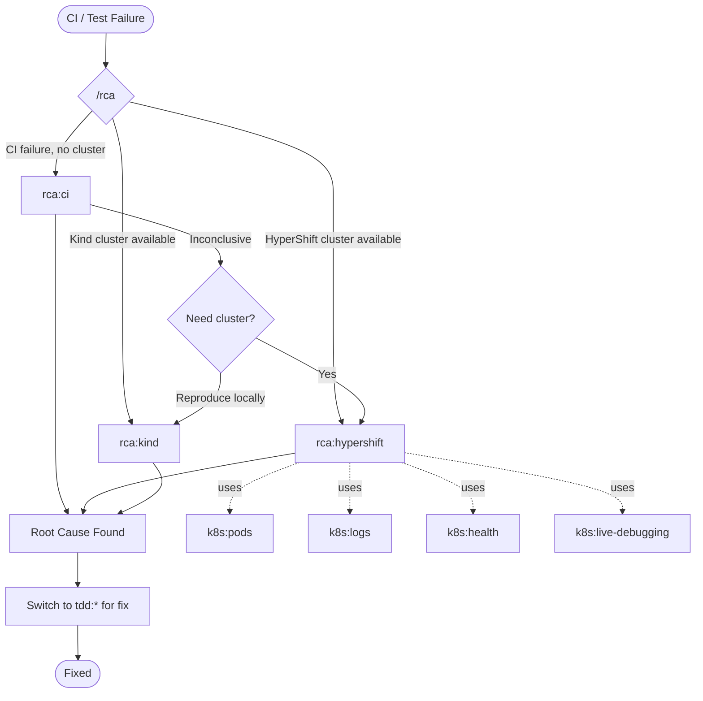
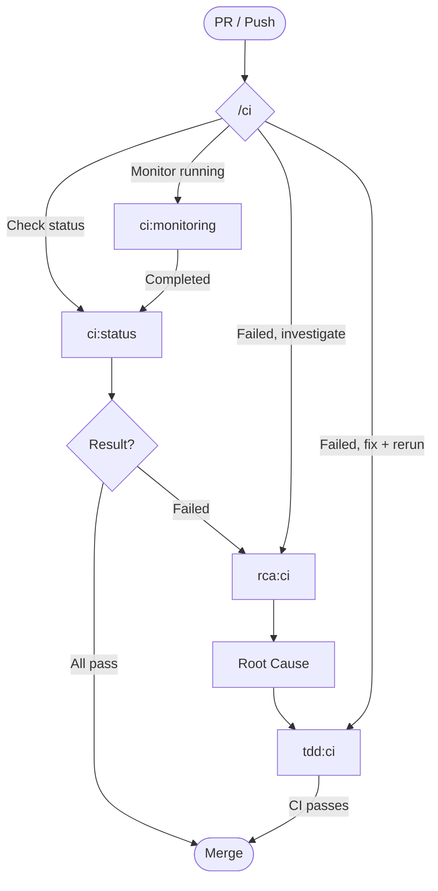
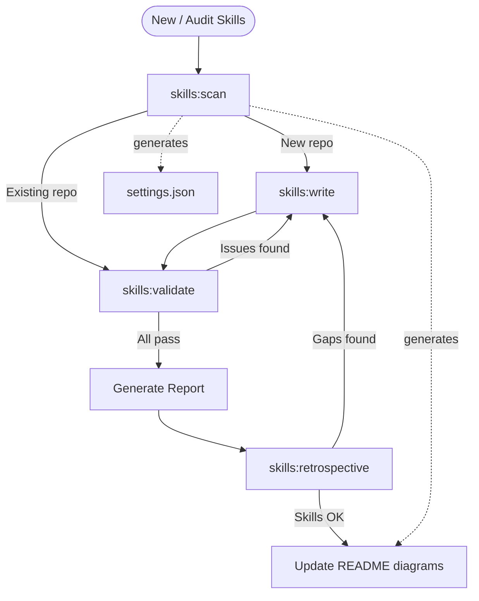
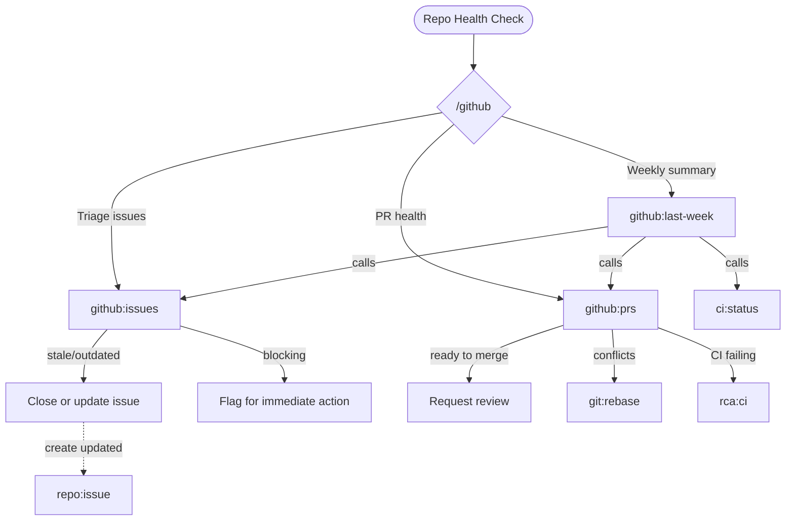
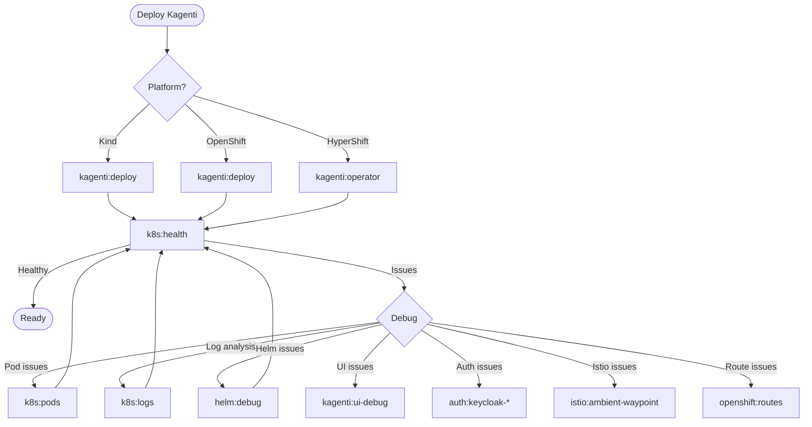
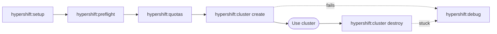

# Kagenti Claude Code Skills

Skills provide guided workflows for Claude Code to operate the Kagenti platform.
Each skill is a SKILL.md file that teaches Claude how to perform specific tasks
with copy-pasteable commands and decision trees.

## How Skills Work

- **Invoke**: Use the Skill tool with the skill name (e.g., `tdd:ci`)
- **Parent skills** (e.g., `tdd`) auto-select the right sub-skill based on context
- **Sandbox operations** (Kind/HyperShift hosted clusters) are auto-approved
- **Management operations** (cluster create/destroy, AWS) require user approval
- **Temp files** go to `/tmp/kagenti/<category>/`

## Workflow Diagrams

### TDD Workflow



### Test Workflow



### RCA Workflow



### CI Workflow



### Skills Meta Workflow



### GitHub Repository Analysis



### Deploy & Debug Workflow



### HyperShift Cluster Lifecycle (with mgmt creds)



## Complete Skill Tree

```
├── auth/                           OAuth2 & Keycloak patterns
│   ├── auth:keycloak-confidential-client
│   ├── auth:mlflow-oidc-auth
│   └── auth:otel-oauth2-exporter
├── ci/                             CI pipeline management (smart router)
│   ├── ci:status
│   └── ci:monitoring
├── genai/                          GenAI observability
│   └── genai:semantic-conventions
├── github/                         Repository health & analysis
│   ├── github:last-week
│   ├── github:issues
│   └── github:prs
├── git/                            Git operations
│   ├── git:status
│   ├── git:worktree
│   ├── git:rebase
│   └── git:commit
├── helm/                           Helm chart debugging
│   └── helm:debug
├── hypershift/                     HyperShift cluster lifecycle
│   ├── hypershift:cluster
│   ├── hypershift:debug
│   ├── hypershift:preflight
│   ├── hypershift:quotas
│   └── hypershift:setup
├── istio/                          Service mesh patterns
│   └── istio:ambient-waypoint
├── k8s/                            Kubernetes debugging
│   ├── k8s:health
│   ├── k8s:logs
│   ├── k8s:pods
│   └── k8s:live-debugging
├── kagenti/                        Platform management
│   ├── kagenti:deploy
│   ├── kagenti:operator
│   └── kagenti:ui-debug
├── kind/                           Local Kind clusters
│   └── kind:cluster
├── local/                          Local testing workflows
│   ├── local:full-test
│   └── local:testing
├── meta/                           Documentation
│   └── meta:write-docs
├── openshift/                      OpenShift operations
│   ├── openshift:debug
│   ├── openshift:routes
│   └── openshift:trusted-ca-bundle
├── rca/                            Root cause analysis (smart router)
│   ├── rca:ci
│   ├── rca:hypershift
│   └── rca:kind
├── skills/                         Skill management
│   ├── skills:scan
│   ├── skills:write
│   ├── skills:validate
│   └── skills:retrospective
├── tdd/                            TDD workflows (smart router)
│   ├── tdd:ci
│   ├── tdd:hypershift
│   └── tdd:kind
├── test/                           Test management (smart router)
│   ├── test:write
│   ├── test:review
│   ├── test:run-kind
│   └── test:run-hypershift
├── repo/                           Repository conventions
│   ├── repo:commit
│   ├── repo:pr
│   └── repo:issue
└── testing/                        Debugging techniques
    └── testing:kubectl-debugging
```

## Auto-Approve Policy

| Target | Read | Write | Create/Destroy |
|--------|------|-------|----------------|
| Kind cluster | Auto | Auto | Auto |
| HyperShift hosted cluster | Auto | Auto | N/A |
| HyperShift management cluster | Auto | Approval | Approval |
| AWS resources | Auto | Approval | Approval |
| `/tmp/kagenti/` | Auto | Auto | Auto |
| Git operations | Auto | Auto | N/A |

## Maintaining This README

This README is generated by `skills:scan`. Run it to update the diagrams
and connection analysis after adding or modifying skills.
