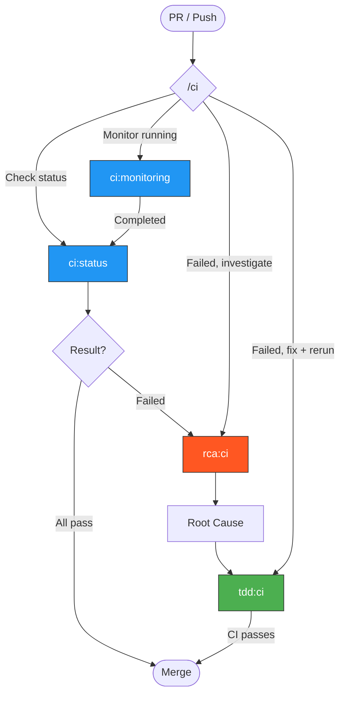

> Follow this diagram as the workflow.

# CI Skills

CI pipeline skills for monitoring and managing GitHub Actions workflows.

## Auto-Select Sub-Skill

When this skill is invoked, determine the right sub-skill based on context:

```
What do you need?
    │
    ├─ Check current PR status (what passed/failed?)
    │   → Use `ci:status`
    │
    ├─ Monitor a running CI job (wait for it to finish)
    │   → Use `ci:monitoring`
    │
    ├─ CI failed and need to investigate
    │   → Use `rca:ci` (root cause analysis from logs)
    │
    └─ CI failed and need to fix + re-run
        → Use `tdd:ci` (commit, push, iterate)
```

## Available Skills

| Skill | Purpose | When |
|-------|---------|------|
| `ci:status` | Check PR checks, failures, test results | Before/after pushing |
| `ci:monitoring` | Monitor running jobs, create tasks for results | After pushing, waiting |

## Quick Status Check

```bash
gh pr checks
```

## Related Skills

- `rca:ci` - Investigate CI failures
- `tdd:ci` - Fix and re-run CI iteratively
- `ci:status` - Detailed check status
- `ci:monitoring` - Wait for running jobs
