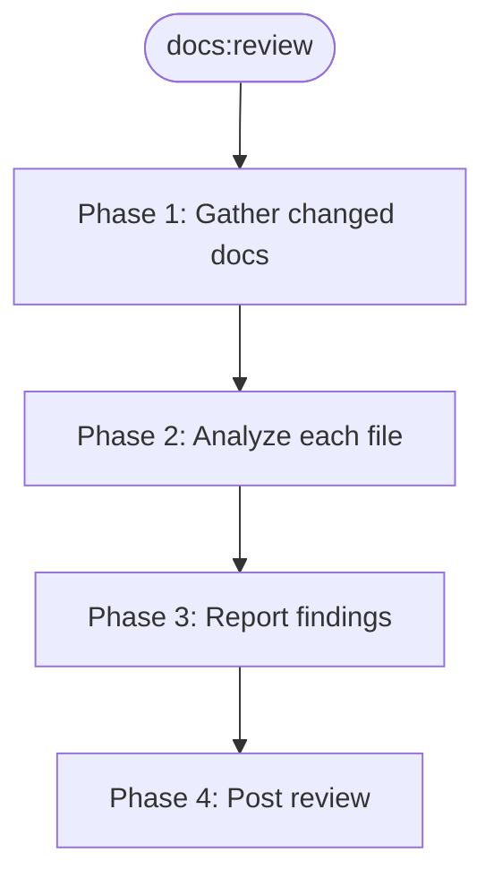

> Follow this diagram as the workflow.

# Documentation Review

AI-assisted review of documentation changes in Kagenti PRs. Checks structure,
accuracy, links, conciseness, and consistency against the `meta:write-docs` (planned)
standards. Use alongside the automated `Docs CI` workflow (markdownlint, lychee)
for comprehensive coverage.

## Table of Contents

- [When to Use](#when-to-use)
- [Phase 1: Gather Changed Docs](#phase-1-gather-changed-docs)
- [Phase 2: Analyze Each File](#phase-2-analyze-each-file)
- [Phase 3: Report Findings](#phase-3-report-findings)
- [Phase 4: Post Review](#phase-4-post-review)
- [Review Checklist](#review-checklist)
- [Related Skills](#related-skills)

## When to Use

- Reviewing a PR that adds or modifies `docs/**` or `*.md` files
- Validating documentation quality before merge
- Invoked as `/docs:review <PR-number>` or `/docs:review` (auto-detects current PR)

## Phase 1: Gather Changed Docs

```bash
export LOG_DIR=/tmp/kagenti/docs-review/$PR_NUMBER
mkdir -p $LOG_DIR

# Get list of changed markdown files
gh pr diff <PR-number> --name-only | grep '\.md$' > $LOG_DIR/changed-files.txt

# Save the full diff for context
gh pr diff <PR-number> > $LOG_DIR/pr.diff 2>&1
```

If no `.md` files are changed, report "No documentation changes found" and stop.

## Phase 2: Analyze Each File

For each changed markdown file, read the full file and check against these
categories. Use subagents for large PRs (>5 files changed).

### 2.1 Structure

- [ ] Single `#` title at the top of the file
- [ ] One-paragraph overview immediately after the title
- [ ] Table of Contents with working anchor links (required if >50 lines)
- [ ] `---` horizontal rules between major sections
- [ ] Heading hierarchy is correct (no skipped levels like `##` to `####`)

### 2.2 Accuracy

- [ ] Shell commands are syntactically valid and runnable
- [ ] YAML/JSON snippets are valid (check indentation, quoting)
- [ ] Version numbers match current releases (check `gh release list` output)
- [ ] File paths referenced actually exist in the repo (`ls` or `find` to verify)
- [ ] Environment variables and config keys match actual code
- [ ] Kubernetes resource names, namespaces, and labels are consistent with the codebase

### 2.3 Links

- [ ] Internal cross-references (`[text](../path.md)`) point to existing files
- [ ] Anchor links (`[text](#heading)`) resolve to actual headings in the target file
- [ ] External URLs are reachable (defer to lychee CI for exhaustive checking)
- [ ] No bare URLs — all links use `[descriptive text](url)` format

### 2.4 Conciseness

- [ ] No unnecessary prose — prefer bullets and tables over paragraphs
- [ ] No redundant sections that repeat information available elsewhere
- [ ] Code blocks include only the relevant fields, not entire manifests
- [ ] Steps are numbered when order matters, bulleted when it does not
- [ ] List items are 1-2 lines max

### 2.5 Consistency

- [ ] Terminology is consistent (e.g., "GA release" not mixed with "stable release" without definition)
- [ ] Component names match official naming (e.g., "AuthBridge" not "auth bridge" or "Auth-Bridge")
- [ ] Code block language tags are present and correct (`bash`, `yaml`, `text`)
- [ ] Callout style matches project convention (`> **Note:**`, `> **Warning:**`, `> **Tip:**`)
- [ ] Formatting conventions from `meta:write-docs` (planned) are followed

## Phase 3: Report Findings

Produce a structured summary grouped by severity:

```markdown
## Documentation Review: PR #<number>

### Files reviewed
- `docs/install.md` (modified)
- `docs/releasing.md` (new)

### Issues found

#### Must fix
- **docs/install.md:42** — Broken anchor link `#choosing-a-version` (heading was renamed)
- **docs/releasing.md:15** — YAML snippet has incorrect indentation

#### Suggestions
- **docs/releasing.md:78** — This paragraph could be condensed to a bullet list
- **docs/install.md:130** — Consider adding `git checkout` step to the OpenShift clone block

#### Looks good
- Structure follows `meta:write-docs` (planned) template
- All shell commands are syntactically valid
- Version numbers match current releases
```

### Severity definitions

| Severity | Meaning | Action |
|----------|---------|--------|
| **Must fix** | Broken links, invalid commands, incorrect information | Block merge |
| **Suggestion** | Style improvements, conciseness, missing context | Optional |
| **Looks good** | Positive observations worth noting | Informational |

## Phase 4: Post Review

Present the review to the user. If the user approves, post as a GitHub PR review:

```bash
# Post as a review comment (not inline, to avoid noise on large PRs)
gh pr review <PR-number> --comment --body "$(cat $LOG_DIR/review-summary.md)"
```

For critical issues, use `--request-changes` instead of `--comment`.

## Review Checklist

Quick reference for the complete review criteria:

- [ ] Title + overview paragraph present
- [ ] TOC with working anchors (if >50 lines)
- [ ] Section separators (`---`) between major sections
- [ ] Code blocks have language tags
- [ ] Commands are runnable
- [ ] YAML/JSON is valid
- [ ] Version numbers are current
- [ ] Internal links resolve
- [ ] No bare URLs
- [ ] Concise — no walls of text
- [ ] Consistent terminology
- [ ] Follows `meta:write-docs` (planned) conventions

## Related Skills

- `meta:write-docs` (planned) — Documentation writing standards and templates
- `github:pr-review` — General PR review workflow (code + docs)
- `repo:pr` — PR creation conventions
