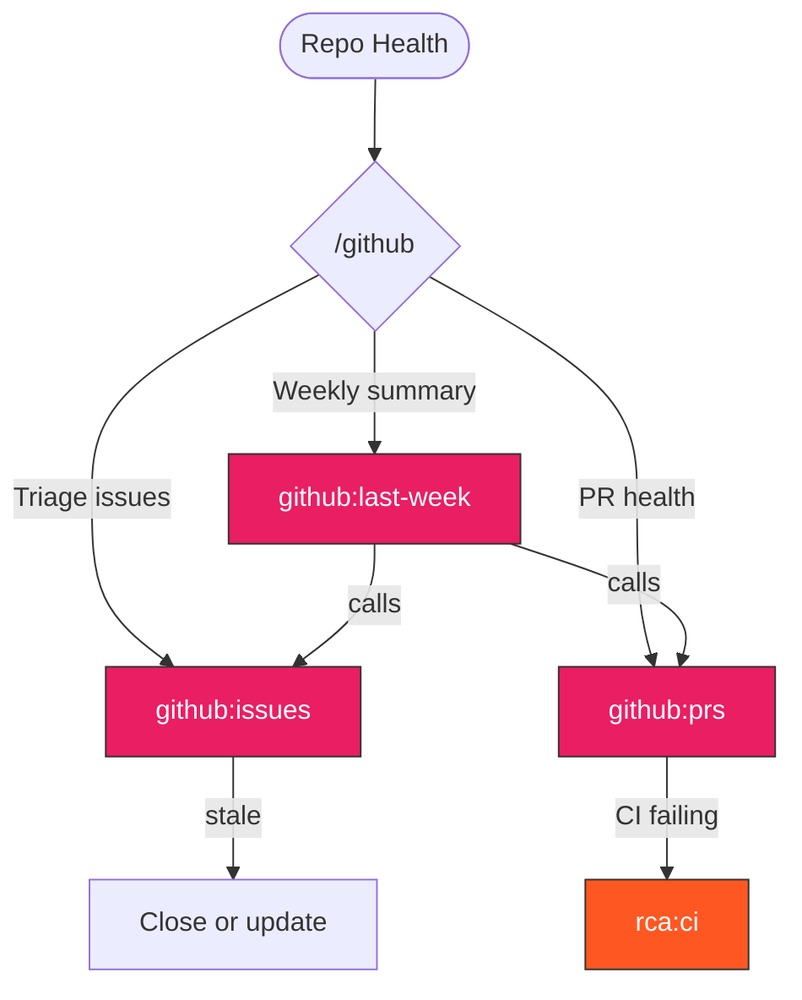

> Follow this diagram as the workflow.

# GitHub Skills

Repository health analysis, issue triage, and PR management.

## Auto-Select Sub-Skill

```
What do you need?
    │
    ├─ Weekly summary (what happened last week?)
    │   → github:last-week
    │
    ├─ Analyze open issues (triage, stale, priority)
    │   → github:issues
    │
    ├─ Analyze open PRs (CI status, review needed)
    │   → github:prs
    │
    └─ Create an issue with proper template
        → repo:issue
```

## Available Skills

| Skill | Purpose |
|-------|---------|
| `github:last-week` | Weekly report: merged PRs, new issues, CI health, priority analysis |
| `github:issues` | Issue triage: stale, blocking, no attention, should-close |
| `github:prs` | PR health: passing CI without review, stale, conflicts |

## Related Skills

- `repo:issue` - Issue template format
- `repo:pr` - PR template format
- `ci:status` - CI check details
- `ci:monitoring` - Monitor running CI
