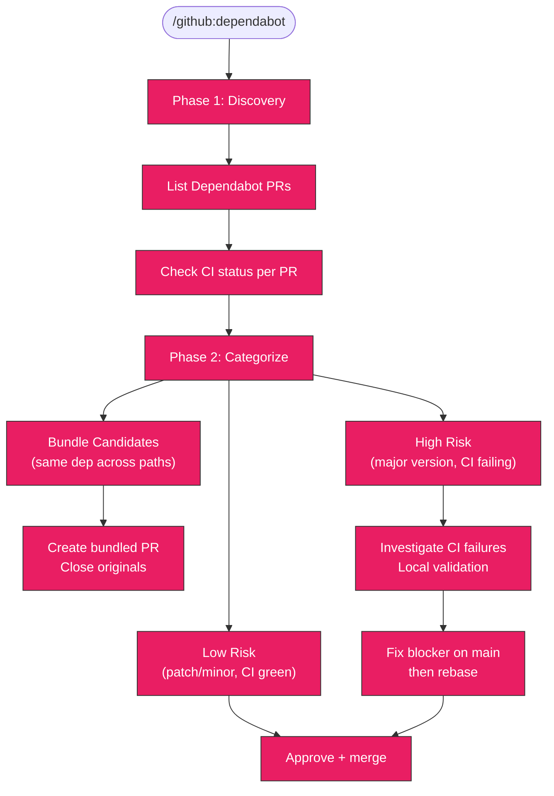

# Dependabot PR Triage

Analyze all open Dependabot PRs, categorize by risk, bundle duplicates into
single PRs, fix CI blockers, and approve safe merges.

## Table of Contents

- [When to Use](#when-to-use)
- [Variables](#variables)
- [Workflow](#workflow)
- [Workflow Diagram](#workflow-diagram)
- [Phase 1: Discovery](#phase-1-discovery)
- [Phase 2: Categorization](#phase-2-categorization)
- [Phase 3: Execution](#phase-3-execution)
- [Task Tracking](#task-tracking)
- [Troubleshooting](#troubleshooting)
- [Related Skills](#related-skills)

## When to Use

- Dependabot PRs are piling up (5+)
- Weekly or biweekly dependency grooming
- Before a release freeze to clear the backlog
- After enabling Dependabot on a new repo

> **Auto-approved**: All `gh` read commands are auto-approved. Merge and
> write commands require user confirmation.

## Variables

Set these at the start of every session. All commands below use them.

```bash
export OWNER=<org-or-user>       # e.g. kagenti
export REPO=<repo-name>          # e.g. kagenti
export LOG_DIR=/tmp/dependabot-triage/$REPO
mkdir -p $LOG_DIR
```

## Workflow

```
1. Discovery   → list all Dependabot PRs, CI status, mergeability
2. Categorize  → sort into Low Risk / Bundle / High Risk
3. Execute     → fix blockers, create bundles, approve, merge
```

## Workflow Diagram



## Phase 1: Discovery

### List all Dependabot PRs with CI status

```bash
gh pr list --repo $OWNER/$REPO --state open --json number,title,author,createdAt,updatedAt,statusCheckRollup,mergeable --jq '.[] | select(.author.login == "app/dependabot" or .author.login == "dependabot[bot]")' > $LOG_DIR/dependabot-prs.json
```

Parse summary:

```bash
cat $LOG_DIR/dependabot-prs.json | jq -r '{number, title: .title[:80], updated: .updatedAt[:10], mergeable, ci: ([.statusCheckRollup // [] | .[] | select(.conclusion != null) | .conclusion] | unique)}'
```

### Check CI failures for specific PRs

```bash
gh pr checks <NUMBER> --repo $OWNER/$REPO
```

### Get failed job logs

```bash
gh run view <RUN_ID> --repo $OWNER/$REPO --log-failed > $LOG_DIR/pr-<NUMBER>-failed.log 2>&1
```

Use a subagent to analyze:

```
Agent(subagent_type='Explore'):
  "Grep $LOG_DIR/pr-<NUMBER>-failed.log for error|Error|FAIL.
   Report the root cause in under 100 words."
```

### Check main branch CI health

```bash
gh run list --repo $OWNER/$REPO --branch main --limit 3 --json conclusion,displayTitle
```

If main is failing the same checks, the Dependabot failures may be pre-existing.

## Phase 2: Categorization

Sort each PR into exactly one bucket:

### Low Risk / Safe to Merge

- Minor or patch version bumps
- CI passing (all checks green)
- No known breaking changes in changelog
- GitHub Actions version bumps
- Docker base image digest bumps (when only one Dockerfile affected)

### Bundling Candidate

Detect duplicates: multiple PRs updating the same dependency across different
paths (e.g., the same Docker base image digest in 5 Dockerfiles). Also bundle
related dev-only dependency bumps that share the same component.

Identify bundles:

```bash
cat $LOG_DIR/dependabot-prs.json | jq -r '.title' | sort | uniq -c | sort -rn | head -10
```

### High Risk / Manual Intervention

- **Major version bumps** (e.g., TypeScript 5→6, pytest 8→9, pylint 3→4)
- **Core runtime dependencies** (pydantic, httpx, kubernetes client)
- **Security-critical libraries** (python-jose, cryptography)
- **CI failing due to the dependency change itself** (not pre-existing issues)

For each high-risk PR, check the changelog:

```bash
gh pr view <NUMBER> --repo $OWNER/$REPO --json body --jq '.body' > $LOG_DIR/pr-<NUMBER>-body.txt
```

## Phase 3: Execution

### Low Risk: Approve and merge

```bash
gh pr review <NUMBER> --repo $OWNER/$REPO --approve --body "Low-risk Dependabot update. CI passing."
```

```bash
gh pr merge <NUMBER> --repo $OWNER/$REPO --merge
```

### Bundles: Create bundled PR and close originals

1. Create a branch from main:

```bash
git checkout -b build/bundle-<description> main
```

2. Apply changes from all PRs in the bundle. For Docker digest bumps, use a
   global find-and-replace across the affected files. For pyproject.toml /
   package.json changes, apply each version bump manually.

3. Commit with references to the original PRs:

```bash
git commit -s -m "build(deps): <description>

Bundles Dependabot PRs #N, #N, #N into a single update.

Assisted-By: Claude (Anthropic AI) <noreply@anthropic.com>"
```

4. Push and create PR:

```bash
git push origin build/bundle-<description>
```

```bash
gh pr create --repo $OWNER/$REPO --title "build(deps): <description>" --body "..."
```

5. Close the originals (comment to prevent Dependabot from recreating):

```bash
gh pr close <NUMBER> --repo $OWNER/$REPO --comment "Superseded by #<bundled-PR>"
```

### High Risk: Investigate, fix, validate

1. **If CI fails due to pre-existing issues** (e.g., stricter linter catches
   old violations): fix on main first, then rebase the Dependabot PR.

2. **If CI fails due to the dependency change**: check out the PR branch,
   fix locally, push to a new branch that supersedes the original.

3. **For major version bumps in compiled languages** (TypeScript, Go):
   - Run type checks / build locally
   - Fix breaking changes
   - Create a superseding PR with fixes included

4. **For major version bumps in test frameworks** (pytest, jest):
   - Run the full test suite locally
   - Check for deprecated API usage

Local validation pattern:

```bash
gh pr checkout <NUMBER> --repo $OWNER/$REPO
```

```bash
# Language-specific build/test — examples:
# Python: make lint && uv run pytest
# Node: npm install && npx tsc --noEmit && npm run build
# Go: make build && make test
```

## Presentation Format

Present the analysis as a table before taking action:

```markdown
## Dependabot PR Triage — $OWNER/$REPO

| PR | Change | Component | CI | Risk | Action |
|----|--------|-----------|----|------|--------|
| #N | dep X.Y → X.Z | backend | PASS | Low | Merge |
| #N | dep A.B → C.D | frontend | FAIL | High | Investigate |
| #N | image digest | auth/* (5 files) | PASS | Low | Bundle |

### Proposed Bundles
- **Bundle 1**: #N, #N, #N — same Docker image across N Dockerfiles
- **Bundle 2**: #N, #N — test toolchain minor updates

### Execution Order
1. Fix pre-existing CI issues (if any)
2. Merge low-risk PRs
3. Create and merge bundled PRs, close originals
4. Validate and merge high-risk PRs
```

Wait for user approval before executing.

## Task Tracking

On invocation:

1. `TaskList` — check for existing dependabot triage tasks
2. Create one task per execution phase:
   - `<repo> | dependabot | Phase 0 | Fix CI blockers`
   - `<repo> | dependabot | Phase 1 | Merge N low-risk PRs`
   - `<repo> | dependabot | Phase 2 | Bundle N image PRs`
   - `<repo> | dependabot | Phase 3 | Validate high-risk PRs`
3. `TaskUpdate` as each phase completes

## Troubleshooting

### Problem: CI failures across many Dependabot PRs
**Symptom**: Multiple unrelated PRs fail the same CI check (usually lint).
**Fix**: The CI environment resolves to a newer version of a tool (e.g., pylint
4.x when `>=3.0.0` is pinned). Fix the violations on main first, then rebase.

### Problem: Cannot merge — branch protection requires reviews
**Symptom**: `gh pr merge` fails with permission error.
**Fix**: Use `gh pr review --approve` first, or batch-approve all low-risk PRs
and let the user merge from the GitHub UI.

### Problem: Cannot push to Dependabot branch
**Symptom**: Dependabot branches are read-only for contributors.
**Fix**: Create a new branch from main, apply the same changes plus any fixes,
create a new PR that supersedes the Dependabot one, then close the original.

### Problem: Bundled PR has merge conflicts after merging other PRs
**Symptom**: The bundled PR was created before other PRs were merged.
**Fix**: Rebase the bundled branch onto main:
```bash
git rebase main
```

## Related Skills

- `github:prs` - General PR health analysis
- `github:pr-review` - In-depth review of a single PR
- `ci:status` - Detailed CI check analysis
- `git:rebase` - Fix merge conflicts and rebase branches
- `cve:scan` - Scan dependencies for security vulnerabilities
