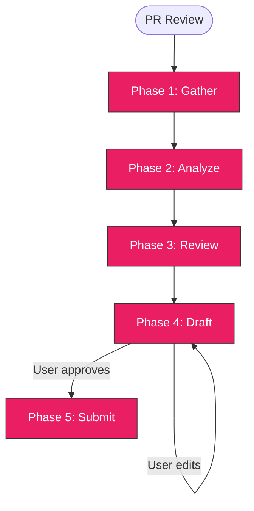

> Follow this diagram as the workflow.

# PR Review

Automated code review workflow. Gathers PR data,
analyzes the diff, checks against repo conventions and CI, drafts inline review
comments, and posts a GitHub review after user approval.

## Variables

Set at session start:

```bash
export OWNER=<org-or-user>
export REPO=<repo-name>
```

## Table of Contents

- [Variables](#variables)
- [When to Use](#when-to-use)
- [Context-Safe Execution](#context-safe-execution-mandatory)
- [Phase 1: Gather PR Data](#phase-1-gather-pr-data)
- [Phase 2: Analyze Changes](#phase-2-analyze-changes)
- [Phase 3: Review Checklist](#phase-3-review-checklist)
- [Phase 4: Draft Review](#phase-4-draft-review)
- [Phase 5: Submit Review](#phase-5-submit-review)
- [Troubleshooting](#troubleshooting)
- [Related Skills](#related-skills)

## When to Use

- Reviewing a PR before approving or requesting changes
- Checking a PR against Kagenti conventions before merge
- Providing structured, inline feedback on PRs
- Invoked as `/github:pr-review <PR-number>`

## Context-Safe Execution (MANDATORY)

PR diffs can be very large. **Always redirect diff output to files and analyze with subagents.**

```bash
export LOG_DIR="${LOG_DIR:-${WORKSPACE_DIR:-/tmp}/kagenti-review}"
mkdir -p "$LOG_DIR"
```

Small output OK inline: `gh pr checks`, `gh pr view --json` (metadata only).

Large output MUST redirect: `gh pr diff`, commit logs, file contents.

## Phase 1: Gather PR Data

Collect all PR metadata, diff, CI status, and commit history.

### 1.1 PR Metadata

```bash
gh pr view <number> --json number,title,body,author,baseRefName,headRefName,commits,files,reviews,reviewDecision,labels,createdAt,updatedAt
```

### 1.2 PR Diff

```bash
gh pr diff <number> > $LOG_DIR/pr-<number>.diff 2>&1; echo "EXIT:$?"
```

### 1.3 CI Status

```bash
gh pr checks <number>
```

If checks are failing, delegate to `ci:status` for detailed analysis.

### 1.4 Commit History

```bash
gh pr view <number> --json commits --jq '.commits[] | "\(.oid[:7]) \(.messageHeadline)"'
```

### 1.5 Sync Local Repo (CRITICAL)

**Before verifying ANY PR claims against local source files**, fetch the latest upstream:

```bash
# Determine the target repo and sync
cd <local-clone-path>
git fetch upstream main
```

> **Anti-pattern**: Reading local files without fetching first. The PR diff comes from
> GitHub (up-to-date), but local files may be days behind. This mismatch causes
> false negatives — flagging correct version claims as wrong.

When verifying claims (versions, file existence, code patterns), always use:

```bash
# Verify against upstream/main, NOT local working tree
git show upstream/main:<path-to-file>
```

## Phase 2: Analyze Changes

Use a subagent to categorize the diff by area and produce a summary.

```
Task(subagent_type='Explore'):
  "Read $LOG_DIR/pr-<number>.diff. Categorize changed files into these areas:
   Python, Helm/K8s, Shell, YAML, Dockerfile, CI/GitHub Actions, Docs, Frontend, Other.
   For each area return: files changed, lines added/removed.
   Return a brief summary of what the PR does overall (2-3 sentences).
   Do NOT return the full diff content."
```

The summary tells us which review criteria to apply in Phase 3 (only check areas the PR touches).

## Phase 3: Review Checklist

Apply Kagenti-specific review criteria **only for areas the PR touches**.

> **Reminder**: When verifying version numbers, file paths, or code claims in the PR,
> use `git show upstream/main:<file>` — never trust the local working tree without
> fetching first (see §1.5).

### 3.1 Commit Conventions

Check all commits against `git:commit` conventions:

| Check | Criteria |
|-------|----------|
| Signed-off | Every commit has `Signed-off-by:` line |
| Emoji prefix | Subject starts with recognized emoji (see `git:commit`) |
| Imperative mood | "Add feature" not "Added feature" |
| Length | Subject line under 72 characters |

```bash
# Check sign-off on all PR commits
gh pr view <number> --json commits --jq '.commits[].messageBody' | grep -c 'Signed-off-by'
```

### 3.2 PR Format

Check against `repo:pr` conventions:

| Check | Criteria |
|-------|----------|
| Title | Has emoji prefix, under 72 chars |
| Summary section | Body contains `## Summary` |
| Issue linking | `Fixes #N` or `Closes #N` if applicable (optional) |

### 3.3 Python Changes

If the PR touches `.py` files:

| Check | What |
|-------|------|
| Formatting | Would `ruff format --check` pass? |
| Linting | Any pylint/ruff issues in changed files? |
| Security | No `bandit` HIGH severity issues in changed code |
| Imports | Clean imports, no unused |

### 3.4 Helm / Kubernetes Changes

If the PR touches `charts/`, K8s manifests, or values files:

| Check | What |
|-------|------|
| Chart lint | `helm lint` would pass |
| Labels | Uses `kagenti.io/*` labels where appropriate |
| Resource limits | Containers have resource requests/limits |
| Values | New values documented or self-explanatory |

### 3.5 Security

Always check regardless of area:

| Check | What |
|-------|------|
| Secrets | No hardcoded secrets, tokens, passwords in diff |
| Actions | GitHub Action versions pinned to SHA (not `@main` or `@v1`) |
| Dependencies | New dependencies reviewed for supply-chain risk |
| Dockerfiles | Non-root user, pinned base images |

### 3.6 Shell Scripts

If the PR touches `.sh` files:

| Check | What |
|-------|------|
| Shellcheck | Would `shellcheck` pass? |
| Error handling | Uses `set -euo pipefail` or equivalent |
| Quoting | Variables properly quoted |

### 3.7 YAML

If the PR touches `.yaml`/`.yml` files:

| Check | What |
|-------|------|
| yamllint | Would `yamllint` pass? |
| Indentation | Consistent indentation |

### 3.8 Tests

| Check | What |
|-------|------|
| Coverage | New features have corresponding tests |
| Quality | Tests are assertive, no hidden skips (delegate to `test:review`) |
| E2E | User-facing changes have E2E coverage |

### 3.9 Documentation

| Check | What |
|-------|------|
| Updated | User-facing changes have docs/README updates |
| Accurate | Docs match the actual behavior |

### 3.10 Feature Gate / Dual-Mode Code

If the PR introduces two code paths behind a feature gate (e.g. `legacy` vs `resolved`,
`ValueFrom` vs `literal`):

| Check | What |
|-------|------|
| Source parity | Both paths read config from the **same** ConfigMaps/keys |
| Env var parity | Both paths inject the **same** env var names |
| Fallback parity | Missing-resource behavior is equivalent across paths |

**Cross-file search**: For each key constant or ConfigMap name introduced in new code,
grep across ALL files in the diff to verify both paths reference the same source.
Dual-mode bugs often appear as a value read from CM-A in the new path but CM-B in the
legacy path — the inconsistency is only visible by comparing both files side-by-side.

```bash
# Example: find all ConfigMap name references in the diff (substring match)
grep -E 'authbridge-config|environments|spiffe-helper' $LOG_DIR/pr-<number>.diff
```

This check catches a class of bugs where a new code path was written against a planned
data layout that differs from the actual deployment (e.g. design doc says key X lives in
CM-A, but existing deployments have it in CM-B).

## Phase 4: Draft Review

Present proposed review to user for approval before posting.

### 4.1 Inline Comments Table

```markdown
## Proposed Review Comments

### Inline Comments
| # | File | Line | Severity | Comment |
|---|------|------|----------|---------|
| 1 | path/to/file.py | 42 | must-fix | Description of issue... |
| 2 | charts/values.yaml | 15 | suggestion | Consider adding... |
| 3 | scripts/deploy.sh | 8 | nit | Minor style issue... |
```

Severity levels:
- **must-fix** - Blocks merge. Security issues, broken functionality, missing sign-off.
- **suggestion** - Should fix but not blocking. Better patterns, missing tests.
- **nit** - Trivial. Style, naming, minor improvements.

Do NOT include praise comments — they clutter the review without adding value.

### 4.2 Summary Comment

```markdown
### Summary
[2-3 sentence overview of the review findings]

**Areas reviewed**: Python, Helm, CI (list areas actually checked)
**Commits**: N commits, all signed-off: yes/no
**CI status**: passing/failing/pending
```

### 4.3 Verdict

Decision tree (follow in order):

1. **Any must-fix issues?** → **REQUEST_CHANGES**
2. **No must-fix issues?** → **APPROVE**

That's it. Suggestions and nits are included as inline comments within the
APPROVE review — they do NOT downgrade the verdict. Never use COMMENT as the event;
it withholds approval unnecessarily when there are no blocking issues.

### 4.4 User Approval

Present the full draft and ask user to approve, edit, or cancel:

```
AskUserQuestion:
  "Review draft ready. Approve to submit, or edit first?"
  Options: ["Submit as-is", "Edit comments first", "Cancel review"]
```

## Phase 5: Submit Review

After user approves, post the review via GitHub API.

### 5.1 Post Review with Inline Comments

```bash
# Build the review payload as JSON (gh api does NOT support array params via -f)
# For each inline comment: path, line (in the file on HEAD side), body
# event: APPROVE (default when no must-fix) or REQUEST_CHANGES (when must-fix exists)

cat <<'EOF' | gh api repos/{owner}/{repo}/pulls/<number>/reviews --method POST --input -
{
  "event": "APPROVE",
  "body": "Review summary text...",
  "comments": [
    {"path": "path/to/file.py", "line": 42, "body": "Comment text..."},
    {"path": "charts/values.yaml", "line": 15, "body": "Another comment..."}
  ]
}
EOF
```

> **Note**: Use `"event": "APPROVE"` when there are no must-fix issues (even if there
> are suggestions/nits). Only use `"event": "REQUEST_CHANGES"` when must-fix issues exist.

> **Note**: `gh api` is NOT auto-approved. The user will be prompted to approve
> the review submission. This is intentional — reviews are write operations.

### 5.2 Confirm Submission

After posting, confirm with a link:

```markdown
Review submitted on PR #<number>: https://github.com/$OWNER/$REPO/pull/<number>
- Verdict: APPROVE / REQUEST_CHANGES / COMMENT
- Inline comments: N
```

## Troubleshooting

### Line numbers in diff vs file

The `line` parameter in the review API refers to the line number in the **diff hunk**,
not the file. Use the diff output to determine correct line numbers. The `line` field
should be the line number in the file on the HEAD side of the diff.

### Review already exists

GitHub allows multiple reviews. A new review will be added alongside existing ones.

### Large PRs (> 500 changed lines)

For very large PRs, focus the review on:
1. Security issues (always)
2. Architecture / design concerns
3. Convention violations
4. Skip nit-level comments to avoid noise

### PR from fork

For PRs from forks, `gh pr diff` still works but branch checkout may not.
Use the diff file for all analysis.

### Cross-repo reviews

When verifying cross-repo dependency files (e.g. checking whether `kagenti-extensions`
already handles something being removed from `$OWNER/$REPO`), **always fetch directly
from GitHub — never trust a local clone:**

```bash
# Fetch a specific file from the latest main of another repo
gh api repos/{owner}/{repo}/contents/{path/to/file} --jq '.content' \
  | base64 -d > /tmp/file-from-upstream.go
```

This is more reliable than a local clone, which may be stale or have no `upstream`
remote configured. Use the GitHub API for targeted single-file verification; a local
clone is only appropriate for broad multi-file exploration.

**Anti-pattern — stale cross-repo local clone:**

`git show upstream/main:<file>` in a sibling repo can silently return stale content
if the repo hasn't been fetched this session, or if there is no `upstream` remote.
A fetch you didn't explicitly run this session is a stale fetch.

The `--repo` flag works with `gh pr` commands, but cross-repo source verification
should go through the API, not the local filesystem.

### Stale local checkout (anti-pattern)

**Symptom**: PR claims a version/fact. You check the local file and it disagrees.
You flag it as wrong. The PR author says it's correct.

**Cause**: Your local `main` is behind `upstream/main`. The PR was based on the
latest upstream, which has newer dependency versions.

**Fix**: Always run `git fetch upstream main` and use `git show upstream/main:<file>`
before cross-referencing PR claims against source files. See §1.5.

### Subagent model access denied (401)

If the Explore subagent fails with `team not allowed to access model` or similar 401
error, fall back to reading the diff directly in the main context.

When reading large diffs without subagent help, **explicitly cross-reference** related
files — don't read them sequentially and assume consistency:

1. After reading each new function/struct, search for its key constants/field names
   across the entire diff: `grep "ConstantName\|fieldName" $LOG_DIR/pr-<number>.diff`
2. For any new config source (ConfigMap names, API paths), verify both the new code
   AND any legacy/fallback code use the same source name.
3. For dual-mode PRs: compare the two paths side-by-side rather than reading each
   path file-by-file in sequence.

### gh api array parameters

The `gh api` CLI does not support array parameters via `-f 'comments[0][path]=...'`.
Use JSON input instead:

```bash
cat <<'EOF' | gh api repos/{owner}/{repo}/pulls/<number>/reviews --method POST --input -
{
  "event": "APPROVE",
  "body": "Review summary...",
  "comments": [
    {"path": "file.py", "line": 42, "body": "Comment text..."}
  ]
}
EOF
```

## Related Skills

- `ci:status` - Detailed CI check analysis for failing PRs
- `test:review` - Deep test quality review
- `repo:pr` - PR format conventions
- `git:commit` - Commit format conventions
- `github:prs` - PR health overview (batch analysis)
- `rca:ci` - Root cause analysis when CI fails
