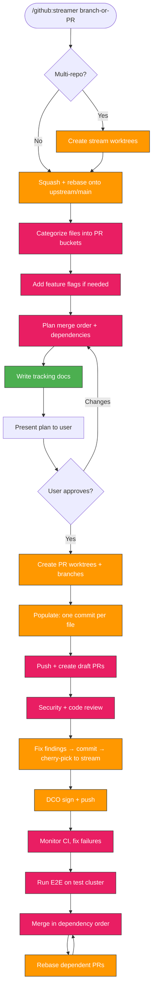

> Follow this diagram as the workflow.

# GitHub Streamer

Split a large feature branch (or PR) into a chain of smaller, independently mergeable PRs. Supports cross-repo work spanning multiple worktrees.

## Table of Contents

- [When to Use](#when-to-use)
- [Phase 1: Create Stream Worktrees](#phase-1-create-stream-worktrees)
- [Phase 2: Feature Flags](#phase-2-feature-flags-if-needed)
- [Phase 3: Create PR Branches](#phase-3-create-pr-branches)
- [Phase 4: Review and Fix](#phase-4-review-and-fix)
- [Phase 5: Rebase + DCO Signing](#phase-5-rebase--dco-signing)
- [Phase 6: Test on Cluster](#phase-6-test-on-cluster)
- [Phase 7: Merge in Dependency Order](#phase-7-merge-in-dependency-order)
- [PR Status Dashboard](#pr-status-dashboard)
- [Configuration](#configuration)
- [Troubleshooting](#troubleshooting)
- [Related Skills](#related-skills)

## When to Use

- Feature branch exceeds 500-700 lines (too large for effective review)
- Branch touches multiple independent concerns that can be separated
- Work spans multiple repos that need coordinated PRs
- Reviewer feedback asks to split the PR

## Phase 1: Create Stream Worktrees

For each repo involved, create a stream worktree **from the source branch HEAD**, then squash and rebase:

```bash
# Create worktree from source HEAD
git worktree add .worktrees/stream1-<name> -b feat/stream1-<name> <source-HEAD-hash>

# Squash all commits since fork point
cd .worktrees/stream1-<name>
FORK=$(git merge-base upstream/main HEAD)
git reset --soft "$FORK"
git commit -m "squash: <feature> — all changes for streaming (source <hash>)"

# Rebase onto latest upstream/main
git rebase upstream/main
# Resolve conflicts, then: git rebase --continue

# Push as backup
git push upstream feat/stream1-<name>
```

The stream worktree is the **integration branch** — all fixes get applied here first, then cherry-picked to individual PRs.

### Key Rules
- **NEVER touch source worktrees** — they're active development
- Use `git -c core.hooksPath=/dev/null commit` to skip pre-commit during streaming
- Record source HEAD hash in tracking doc for future syncing

## Phase 2: Feature Flags (if needed)

For large features that should be dormant until fully merged:

```bash
# Add feature flag infrastructure as a commit on stream1
# Env var propagation: values.yaml → Helm template → backend env → API endpoint → UI hook
```

Feature flag PR:
- **Helm**: `values.yaml` (defaults false), env vars in deployment template
- **Backend**: Pydantic settings, conditional router import with try/except, `/config/features` endpoint
- **UI**: `useFeatureFlags` hook, conditional nav items in AppLayout
- **App.tsx**: minimal diff only (hook + prop) — NO component imports (those go in the pages PR)

RBAC gating: base `get/list` always, `create/patch/delete` only when flag enabled.

## Phase 3: Create PR Branches

Create a worktree per PR from `upstream/main`:

```bash
for pr in k1-infra k2-skills k3-backend k4-proxy; do
    git worktree add .worktrees/pr-$pr -b feat/sandbox-$pr upstream/main
done
```

### Populate: One Commit Per File

For each file, copy from stream1 and commit with a description:

```bash
cd .worktrees/pr-<name>
STREAM1_HEAD=$(git -C ../.worktrees/stream1-<name> rev-parse HEAD)
git checkout $STREAM1_HEAD -- <file_path>
git -c core.hooksPath=/dev/null commit -m "<description of what this file does>"
```

Group related files into single commits where it makes sense (e.g., all test files, all deployment manifests).

### Push and Create Draft PRs

```bash
git push upstream feat/sandbox-<name>
gh pr create --repo <org>/<repo> --head feat/sandbox-<name> --base main --draft \
  --title "<title>" --body "<description>"
```

## Phase 4: Review and Fix

### Security Review
Run security review on each PR — check for:
- Hardcoded secrets → use secretKeyRef
- RBAC over-permissioning → gate behind feature flags
- SQL injection, XSS, command injection
- Path traversal, log injection
- Missing auth on endpoints

### Fix Workflow

Every fix follows this pattern:

1. **Fix in the PR worktree** — one commit per fix
2. **Copy to stream1** — so integration branch stays current
3. **Push both** — PR branch + stream1
4. **Record in tracking doc** — date, commit, file, description

```bash
# Fix in PR
cd .worktrees/pr-<name>
# ... edit file ...
git -c core.hooksPath=/dev/null commit -m "fix: <description>"
git push upstream feat/sandbox-<name> --force-with-lease

# Copy to stream1
cd .worktrees/stream1-<name>
cp ../.worktrees/pr-<name>/<file> <file>
git add <file>
git -c core.hooksPath=/dev/null commit -m "fix: <description>"
git push upstream feat/stream1-<name>
```

### CI Failures

- **Lint/format**: Run `ruff check --fix` + `ruff format` with the CI's exact ruff version
- **Cross-PR import errors**: Expected for dependent PRs — pass after sequential merge
- **Stale status checks**: Push empty commit to retrigger: `git commit --allow-empty -m "ci: retrigger"`
- **Trivy/Hadolint**: Fix properly — pin image tags, add securityContext, use `trivy.yaml` for trusted registries

## Phase 5: Rebase + DCO Signing

Before signing, ALWAYS rebase each worktree onto latest `upstream/main` to avoid merge conflicts.

### Step 1: Rebase all PR worktrees

For each worktree, verify location and branch, then rebase:

```bash
# ALWAYS verify you're in the right worktree and branch before rebasing
cd .worktrees/pr-<name>
echo "VERIFY: $(pwd) | $(git branch --show-current)"
# Should show the PR worktree path and feat/sandbox-<name> branch

# Fetch latest upstream (ALWAYS upstream/main, NOT origin/main)
git fetch upstream main

# Rebase onto upstream/main
git rebase upstream/main
# If conflicts: resolve, git add, git rebase --continue
# If no conflicts: done

# Verify clean state
git status --short  # should be empty
git log --oneline upstream/main..HEAD  # should show only PR commits
```

Or use `/git:rebase` skill which handles this automatically — it always targets `upstream/main` and verifies worktree/branch before rebasing.

### Step 2: Sign and push

Run the signing script from Claude Code — it uses `--no-gpg-sign` so no password prompts:

```bash
cd /path/to/kagenti
./scripts/sign_all_pr_worktrees.sh pr-feature-flags pr-k2-skills pr-k5-deploy

# List available worktrees
./scripts/sign_all_pr_worktrees.sh
```

The script adds `Signed-off-by` trailers (DCO only, no GPG) and force-pushes each branch.

### IMPORTANT
- Always rebase BEFORE signing — signing rewrites commits, rebasing after signing creates duplicates
- Always use `upstream/main` — NOT `origin/main` (origin is the fork, upstream is kagenti org)
- Always verify `pwd` and `git branch --show-current` before any rebase — wrong worktree = wrong branch rewritten
- If rebase has conflicts, resolve them manually — do NOT use `--skip` unless you understand what commit you're dropping

## Phase 6: Test on Cluster

Deploy the stream1 integration branch to a test cluster:

```bash
export PATH="/opt/homebrew/opt/helm@3/bin:/Library/Frameworks/Python.framework/Versions/3.13/bin:$PATH"
source .env.kagenti-team
.worktrees/stream1-<name>/.github/scripts/local-setup/hypershift-full-test.sh <cluster-suffix> --skip-cluster-destroy
```

Run E2E tests with feature flags enabled. Any fixes go back through the fix workflow.

## Phase 7: Merge in Dependency Order

### Merge Strategy

```
Phase 1: Feature flag PR (merge first — foundation)
Phase 2: Independent PRs (parallel — code dormant behind flags)
Phase 3: Dependent chain PRs (sequential — rebase after each merge)
Phase 4: Test PRs (last — enable feature flags in test config)
Phase 5: Activate — PR to enable flags in ocp_values.yaml
```

### After Each Merge

```bash
# Fetch updated main
git fetch upstream main

# Rebase dependent PRs
cd .worktrees/pr-<dependent>
git rebase upstream/main
git push upstream feat/sandbox-<dependent> --force-with-lease
```

## PR Status Dashboard

Use this format to show PR status. Generate with `gh pr checks` and `gh pr view`:

```bash
# Generate dashboard
for pr in <pr-numbers>; do
  f=$(gh pr checks $pr --repo <org>/<repo> 2>&1 | grep -v "DCO\|Waiting" | grep "fail" | wc -l | tr -d ' ')
  dco=$(gh pr checks $pr --repo <org>/<repo> 2>&1 | grep "DCO" | awk '{print $2}')
  t=$(gh pr view $pr --repo <org>/<repo> --json title --jq '.title' | head -c55)
  fails=$(gh pr checks $pr --repo <org>/<repo> 2>&1 | grep -v "DCO\|Waiting" | grep "fail" | awk '{print $1}' | tr '\n' ', ' | sed 's/,$//')
  # ... format as table row
done
```

Example output:

```
| PR | Title | CI | DCO | Failed Checks |
|----|-------|----|-----|---------------|
| #996 | feat: add feature flags | GREEN | pass | |
| #979 | feat: infrastructure | FAIL(1) | fail | Deploy |
| #981 | feat: session DB | FAIL(4) | fail | CodeQL,backend-tests,lint,lint |
| #988 | feat: graph views | GREEN | pass | |
```

Categories:
- **GREEN + DCO pass** = ready to merge
- **GREEN + DCO fail** = needs `./scripts/sign_all_pr_worktrees.sh <worktree>`
- **FAIL with stale checks** (Deploy, CodeQL) = retrigger with empty commit
- **FAIL with lint/backend-tests** on chain PRs = expected, passes after sequential merge

## Tracking Docs

### Main dashboard
`docs/plans/YYYY-MM-DD-streamer-pr-tracking.md` — links to all PRs, merge order, fix tracking

### Per-PR docs
`docs/plans/streaming-prs/<pr-key>.md` — commits, fixes, CI status per PR

### Review findings
`docs/plans/YYYY-MM-DD-review-findings.md` — all CRITICAL/WARNING/NOTE findings

## Configuration

| Setting | Default | Description |
|---------|---------|-------------|
| Target chunk size | 500-700 lines | Lines per PR |
| Branch prefix | `feat/sandbox-<name>` | PR branch naming |
| Stream branch | `feat/stream1-<name>` | Integration branch |
| Worktree prefix | `.worktrees/pr-<name>` | PR worktree location |
| Tracking doc | `docs/plans/` | In main repo |

## Troubleshooting

### TypeScript imports break when PR merges before its dependencies
**Cause**: Static `import` in App.tsx references components from another PR.
**Fix**: App.tsx route wiring goes in the LAST UI PR (pages). Feature flag PR only adds the hook + prop passing (3 lines).

### Python lint fails on individual PR (cross-module imports)
**Cause**: Route files import services from other PRs. Python lint checks all files.
**Fix**: Accept expected failures on chain PRs. They pass after sequential merge. Use `try/except ImportError` in main.py for conditional imports.

### Feature flags don't propagate
**Check**: `values.yaml` (defaults) → `ui.yaml` template (env vars) → backend `config.py` (Pydantic) → `/api/v1/config/features` → UI `useFeatureFlags` hook

### RBAC too broad when feature disabled
**Fix**: Split RBAC rules — base `get/list` unconditional, `create/patch/delete` inside `{{- if .Values.featureFlags.<name> }}` conditional.

### Stale GitHub status checks
**Fix**: Push empty commit: `git commit --allow-empty -m "ci: retrigger"` then force-push.

## Related Skills

- `git:worktree` - Create and manage worktrees
- `git:rebase` - Rebase branches after upstream merges
- `repo:pr` - PR format conventions
- `commit` - Commit message format
- `github:pr-review` - Automated PR review
- `cve:scan` - Security scanning
- `tdd:ci` - CI-driven iteration on PRs
