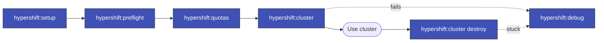

> Follow this diagram as the workflow.

# HyperShift Skills

Skills for managing HyperShift (hosted OpenShift) clusters on AWS.

## Available Sub-Skills

| Skill | Description |
|-------|-------------|
| `hypershift:cluster` | Create and destroy HyperShift clusters |
| `hypershift:debug` | Debug AWS resources for stuck clusters |
| `hypershift:quotas` | Check AWS service quotas and usage |
| `hypershift:setup` | Setup local environment for HyperShift |
| `hypershift:preflight` | Run pre-flight checks before setup |

## Quick Start

```bash
# 1. Stay in main repo (run worktree scripts from here)
cd /Users/ladas/Projects/OCTO/kagenti/kagenti

# 2. Source credentials env file
source .env.kagenti-hypershift-custom

# 3. Create cluster, deploy Kagenti, run E2E tests (all-in-one)
# Cluster name: max 5 chars (AWS IAM limit)
./.github/scripts/local-setup/hypershift-full-test.sh pr529 --skip-cluster-destroy

# 4. Destroy cluster when done
./.github/scripts/local-setup/hypershift-full-test.sh pr529 --include-cluster-destroy
```

## Testing a Worktree Branch

```bash
# Run from main repo, execute worktree's scripts
source .env.kagenti-hypershift-custom

# Example: test ui-agent-discovery branch (name max 5 chars)
.worktrees/ui-agent-discovery/.github/scripts/local-setup/hypershift-full-test.sh uitst --skip-cluster-destroy

# Destroy when done
.worktrees/ui-agent-discovery/.github/scripts/local-setup/hypershift-full-test.sh uitst --include-cluster-destroy
```

## First-Time Setup (credentials)

```bash
# Run preflight check
./.github/scripts/hypershift/preflight-check.sh

# Setup credentials (requires IAM admin)
./.github/scripts/hypershift/setup-hypershift-ci-credentials.sh

# Setup local tools
./.github/scripts/hypershift/local-setup.sh
```

## Prerequisites

- AWS CLI with admin credentials
- OpenShift CLI (oc) logged into management cluster
- Ansible (`pip install ansible-core`)

## Related Documentation

- `.github/scripts/local-setup/README.md` - Local setup documentation
- `docs/hypershift-hcp-research.md` - HyperShift research and architecture
