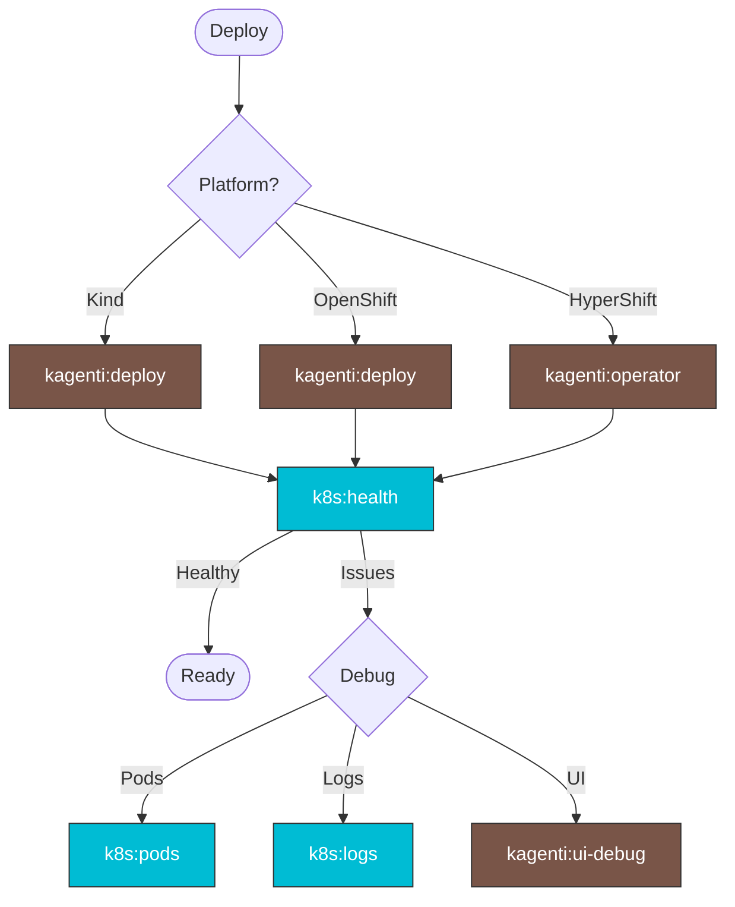

> Follow this diagram as the workflow.

# Kagenti Skills

Skills for deploying and managing the Kagenti platform.

## Available Sub-Skills

| Skill | Description |
|-------|-------------|
| `kagenti:operator` | Deploy Kagenti operator, agents, tools, run E2E tests |
| `kagenti:deploy` | Deploy Kagenti Kind cluster using Python installer |
| `kagenti:ui-debug` | Debug UI issues including 502 errors, API connectivity, nginx proxy |

## Quick Deploy (Kind)

```bash
# Deploy platform
./.github/scripts/kagenti-operator/30-run-installer.sh

# Wait for CRDs
./.github/scripts/kagenti-operator/41-wait-crds.sh
./.github/scripts/kagenti-operator/42-apply-pipeline-template.sh

# Deploy demo agents
./.github/scripts/kagenti-operator/71-build-weather-tool.sh
./.github/scripts/kagenti-operator/72-deploy-weather-tool.sh
./.github/scripts/kagenti-operator/74-deploy-weather-agent.sh
```

## Quick Deploy (OpenShift)

```bash
export KUBECONFIG=~/clusters/hcp/<cluster-name>/auth/kubeconfig
./.github/scripts/kagenti-operator/30-run-installer.sh --env ocp
```

## Run E2E Tests

```bash
export AGENT_URL="http://localhost:8000"
export KAGENTI_CONFIG_FILE=deployments/envs/dev_values.yaml
./.github/scripts/kagenti-operator/90-run-e2e-tests.sh
```

## Related Documentation

- `deployments/ansible/README.md`
- `docs/install.md`
