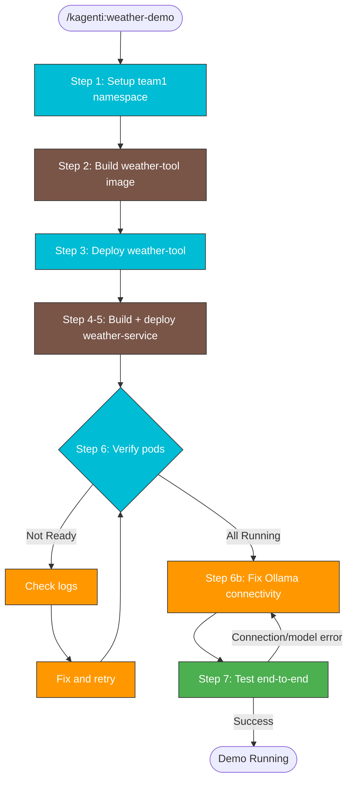

# Weather Agent Demo (CLI)

Deploy the Weather Service agent and Weather Tool without the Kagenti UI.
Uses existing CI scripts and Kubernetes manifests for a fully CLI-driven workflow.

## When to Use

- User wants to run the weather agent demo without the UI
- User asks "deploy weather demo", "deploy weather agent", or "run weather demo via CLI"
- User wants a quick end-to-end test of agent + tool deployment

## Prerequisites

- Kagenti platform deployed (via `deployments/ansible/run-install.sh --env dev` or equivalent)
- `kubectl` configured and pointing at the target cluster
- Ollama running locally with a model (e.g. `qwen2.5:3b`), OR an OpenAI API key

## Context-Safe Execution (MANDATORY)

Deploy/build commands produce large output. Always redirect to files:

```bash
export LOG_DIR=/tmp/kagenti/weather-demo
mkdir -p $LOG_DIR
```

## Workflow



> Follow this diagram as the workflow.

## Step 1: Setup team1 Namespace

Run the namespace setup script:

```bash
./.github/scripts/kagenti-operator/70-setup-team1-namespace.sh > $LOG_DIR/01-namespace.log 2>&1; echo "EXIT:$?"
```

If team1 already exists from a prior platform install, this is a no-op.

## Step 2: Build Weather Tool Image

Build the weather-tool container image using Shipwright (in-cluster build from GitHub source):

```bash
./.github/scripts/kagenti-operator/71-build-weather-tool.sh > $LOG_DIR/02-build-tool.log 2>&1; echo "EXIT:$?"
```

This creates a Shipwright Build + BuildRun that pulls from `https://github.com/kagenti/agent-examples` and pushes to the in-cluster registry.

On failure, analyze logs:

```
Agent(subagent_type='Explore'):
  "Grep $LOG_DIR/02-build-tool.log for ERROR|FAIL|error. Return first error with 3 lines of context."
```

## Step 3: Deploy Weather Tool

Deploy the weather-tool as a Deployment + Service:

```bash
./.github/scripts/kagenti-operator/72-deploy-weather-tool.sh > $LOG_DIR/03-deploy-tool.log 2>&1; echo "EXIT:$?"
```

Verify the tool pod is running:

```bash
kubectl get pods -n team1 -l app.kubernetes.io/name=weather-tool
```

Expected: `weather-tool-xxxx   1/1   Running`

## Step 4: Build Weather Service Agent Image

Build the weather-service agent image using Shipwright:

```bash
# The deploy script (Step 5) handles both the Shipwright build and deployment.
# The build is triggered first, then the deployment is applied after the image is ready.
```

## Step 5: Deploy Weather Service Agent

This script builds the agent image via Shipwright AND deploys it:

```bash
./.github/scripts/kagenti-operator/74-deploy-weather-agent.sh > $LOG_DIR/05-deploy-agent.log 2>&1; echo "EXIT:$?"
```

On failure, analyze:

```
Agent(subagent_type='Explore'):
  "Grep $LOG_DIR/05-deploy-agent.log for ERROR|FAIL|error|timeout. Return first error with context."
```

## Step 6: Verify Pods and Fix LLM Connectivity

Check all pods are running:

```bash
kubectl get pods -n team1
```

Expected:

```
NAME                               READY   STATUS    RESTARTS   AGE
weather-service-xxxxx              4/4     Running   0          2m
weather-tool-xxxxx                 1/1     Running   0          5m
```

> **Note:** weather-service shows 4/4 (agent + 3 AuthBridge sidecars: spiffe-helper,
> kagenti-client-registration, envoy-proxy).

Check agent logs:

```bash
kubectl logs deployment/weather-service -n team1 -c agent --tail=10
```

Expected: `Uvicorn running on http://0.0.0.0:8000`

### Fix Ollama Connectivity (Almost Always Needed)

The deployment manifests default to `LLM_API_BASE=http://dockerhost:11434/v1` and
`LLM_MODEL=qwen2.5:3b`, which usually need patching for local setups.

**Auto-detect the correct Ollama hostname** from inside the agent pod:

```bash
kubectl exec deployment/weather-service -n team1 -c agent -- python3 -c "
import urllib.request
for host in ['dockerhost', 'host.docker.internal', 'host.containers.internal']:
    try:
        urllib.request.urlopen(f'http://{host}:11434/v1/models', timeout=3)
        print(f'{host}: OK')
    except Exception as e:
        print(f'{host}: FAIL')
"
```

**Check which models are available** in Ollama:

```bash
curl -s http://localhost:11434/v1/models | jq '.data[].id'
```

**Patch the agent** with the correct hostname and an available model:

```bash
kubectl set env deployment/weather-service -n team1 -c agent \
  LLM_API_BASE="http://host.docker.internal:11434/v1" \
  LLM_MODEL="qwen3:4b"
kubectl rollout status deployment/weather-service -n team1 --timeout=120s
```

> Replace `host.docker.internal` with whichever hostname returned OK above.
> Replace `qwen3:4b` with a model from your `ollama list` output.

## Step 7: Test End-to-End

### 7a. Verify Agent Card

```bash
kubectl port-forward -n team1 svc/weather-service 18080:8080 &
PF_PID=$!
sleep 2
curl -s http://localhost:18080/.well-known/agent.json | jq .name
# Expected: "weather_service"
kill $PF_PID 2>/dev/null
```

### 7b. Send a Test Message (A2A JSON-RPC)

```bash
kubectl port-forward -n team1 svc/weather-service 18080:8080 &
PF_PID=$!
sleep 2

curl -s --max-time 120 -X POST http://localhost:18080/ \
  -H "Content-Type: application/json" \
  -d '{
    "jsonrpc": "2.0",
    "id": "test-1",
    "method": "message/send",
    "params": {
      "message": {
        "role": "user",
        "messageId": "msg-001",
        "parts": [{"type": "text", "text": "What is the weather in New York?"}]
      }
    }
  }' | jq

kill $PF_PID 2>/dev/null
```

The agent should respond with weather information from the Open-Meteo API.

### 7c. Chat via Kagenti UI (Optional)

If the Kagenti UI is running:

1. Open http://kagenti-ui.localtest.me:8080
2. Go to Agent Catalog, select `team1` namespace
3. Select `weather-service` and click Chat
4. Ask "What is the weather in New York?"

## LLM Configuration

The agent defaults to Ollama (`http://dockerhost:11434/v1`). To change the LLM provider after deployment:

### Switch to OpenAI

```bash
# Create the secret first
kubectl create secret generic openai-secret -n team1 \
  --from-literal=apikey="<YOUR_OPENAI_API_KEY>"

# Patch the agent
kubectl set env deployment/weather-service -n team1 -c agent \
  LLM_API_BASE="https://api.openai.com/v1" \
  LLM_MODEL="gpt-4o-mini-2024-07-18"

kubectl patch deployment weather-service -n team1 --type=json -p='[
  {"op":"add","path":"/spec/template/spec/containers/0/env/-","value":{
    "name":"LLM_API_KEY",
    "valueFrom":{"secretKeyRef":{"name":"openai-secret","key":"apikey"}}
  }},
  {"op":"add","path":"/spec/template/spec/containers/0/env/-","value":{
    "name":"OPENAI_API_KEY",
    "valueFrom":{"secretKeyRef":{"name":"openai-secret","key":"apikey"}}
  }}
]'
```

### Change Ollama Model

```bash
kubectl set env deployment/weather-service -n team1 -c agent \
  LLM_MODEL="llama3.2:3b-instruct-fp16"
```

## Cleanup

Delete in this order — the operator watches Shipwright Builds and will recreate
AgentCards and Deployments if they still exist:

```bash
# 1. Delete Shipwright Builds FIRST (operator reconciles from these)
kubectl delete builds.shipwright.io weather-service weather-tool -n team1 --ignore-not-found
kubectl delete buildruns -n team1 -l build.shipwright.io/name=weather-service --ignore-not-found
kubectl delete buildruns -n team1 -l build.shipwright.io/name=weather-tool --ignore-not-found

# 2. Delete AgentCard CRs (operator creates deployments from these)
kubectl delete agentcards -n team1 --all --ignore-not-found

# 3. Delete deployments and services
kubectl delete deployment weather-service weather-tool -n team1 --ignore-not-found
kubectl delete svc weather-service weather-tool-mcp -n team1 --ignore-not-found
```

> **Why this order matters:** The reconciliation chain is
> `Shipwright Build` -> operator creates `AgentCard` -> operator creates `Deployment + Service`.
> If you only delete the Deployment, the operator will recreate it from the AgentCard.
> If you only delete the AgentCard, the operator will recreate it from the Shipwright Build.

Or delete the entire namespace:

```bash
kubectl delete namespace team1
```

## Troubleshooting

### Shipwright Build Fails

```bash
# Check build status
kubectl get builds.shipwright.io -n team1
kubectl get buildruns -n team1

# Check build pod logs
BUILD_POD=$(kubectl get pods -n team1 -l build.shipwright.io/name=weather-tool --sort-by=.metadata.creationTimestamp -o jsonpath='{.items[-1].metadata.name}')
kubectl logs -n team1 "$BUILD_POD" --all-containers=true
```

### Agent Can't Reach Ollama

See [Step 6b: Fix Ollama Connectivity](#fix-ollama-connectivity-almost-always-needed)
for the auto-detection and patching procedure. Common hostname mappings:

| Container runtime | Hostname |
|-------------------|----------|
| Docker Desktop | `host.docker.internal` |
| Podman (macOS) | `host.containers.internal` |
| Kind default | `dockerhost` (usually doesn't resolve) |

Verify Ollama is running on the host: `curl -s http://localhost:11434/v1/models`

### Model Not Found

The deployment defaults to `LLM_MODEL=qwen2.5:3b`. Check available models with
`ollama list` and patch:

```bash
kubectl set env deployment/weather-service -n team1 -c agent LLM_MODEL="<available-model>"
```

### Agent Can't Reach Weather Tool

Check the `MCP_URL` env var points to the correct service:

```bash
kubectl get svc -n team1 | grep weather-tool
# Should show: weather-tool-mcp   ClusterIP   ...   8000/TCP
```

The default `MCP_URL` is `http://weather-tool-mcp.team1.svc.cluster.local:8000/mcp`.

## Related Skills

- `kagenti:agent` - Create custom A2A agents from scratch
- `kagenti:operator` - Deploy Kagenti platform and demo agents
- `kagenti:deploy` - Deploy Kind cluster
- `k8s:pods` - Debug pod issues
- `k8s:logs` - Query component logs
