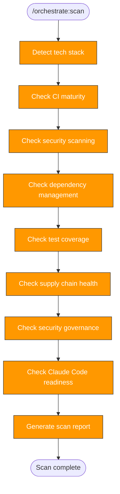

> Follow this diagram as the workflow.

# Orchestrate: Scan

Assess a target repository's current state to determine what orchestration
phases are needed. This is Phase 0 — produces artifacts only, no PRs.

## When to Use

- First step when orchestrating a new repo
- Re-run after major changes to reassess gaps
- Before running `orchestrate:plan`

## Prerequisites

Target repo cloned into `.repos/<target>/`:

```bash
git clone git@github.com:org/repo.git .repos/<target>
```

## Technology Detection

Check for marker files to identify the tech stack:

```bash
ls .repos/<target>/go.mod .repos/<target>/pyproject.toml .repos/<target>/package.json .repos/<target>/Cargo.toml .repos/<target>/requirements.yml 2>/dev/null
```

| Marker | Language | Lint Tool | Test Tool | Build Tool |
|--------|----------|-----------|-----------|------------|
| `go.mod` | Go | golangci-lint | go test | go build |
| `pyproject.toml` | Python | ruff | pytest | uv build |
| `package.json` | Node.js | eslint | jest/vitest | npm build |
| `Cargo.toml` | Rust | clippy | cargo test | cargo build |
| `requirements.yml` | Ansible | ansible-lint | molecule | — |

For multi-language repos (e.g., Go + Python + Helm), note all detected stacks.

Also check for:
- Dockerfiles: `find .repos/<target> -name "Dockerfile*" -type f`
- Helm charts: `find .repos/<target> -name "Chart.yaml" -type f`
- Shell scripts: `find .repos/<target> -name "*.sh" -type f`
- Makefiles: `ls .repos/<target>/Makefile`

## Scan Checks

### CI Status

```bash
ls .repos/<target>/.github/workflows/ 2>/dev/null
```

For each workflow found, read it and categorize:

| Category | What to Check |
|----------|---------------|
| Lint | Does a workflow run linters? Which ones? |
| Test | Does a workflow run tests? Are they commented out? |
| Build | Does a workflow build artifacts/images? |
| Security | Does a workflow run security scans? |
| Release | Does a workflow handle releases/tags? |

### Security Scanning Coverage

Check which security tools are configured in CI:

| Tool | How to Detect | Purpose |
|------|---------------|---------|
| Trivy | `trivy-action` in workflows | Filesystem/container/IaC scanning |
| CodeQL | `codeql-action` in workflows | SAST for supported languages |
| Bandit | `bandit` in workflows or pre-commit | Python SAST |
| gosec | `gosec` in workflows | Go SAST |
| Hadolint | `hadolint` in workflows or pre-commit | Dockerfile linting |
| Shellcheck | `shellcheck` in workflows or pre-commit | Shell script linting |
| Dependency review | `dependency-review-action` in workflows | PR dependency audit |
| Scorecard | `scorecard-action` in workflows | OpenSSF supply chain |
| Gitleaks | `gitleaks` in workflows or pre-commit | Secret detection |

Score: count how many of the applicable tools are present vs expected.

### Dependency Management

```bash
cat .repos/<target>/.github/dependabot.yml 2>/dev/null || echo "MISSING"
```

Check which ecosystems are covered vs what's in the repo:

| In Repo | Expected Ecosystem | Covered? |
|---------|-------------------|----------|
| `pyproject.toml` | pip | ? |
| `go.mod` | gomod | ? |
| `package.json` | npm | ? |
| `Dockerfile` | docker | ? |
| `.github/workflows/` | github-actions | ? |

### Action Pinning Compliance

```bash
grep -r "uses:" .repos/<target>/.github/workflows/ 2>/dev/null | grep -v "@[a-f0-9]\{40\}" | head -20
```

Count actions pinned to SHA vs tag-only. Report compliance percentage.

### Permissions Model

Check workflow files for:
- Top-level `permissions: {}` or `permissions: read-all` (good)
- Per-job `permissions:` blocks (good)
- No permissions declaration (bad — gets full default token permissions)

```bash
grep -l "^permissions:" .repos/<target>/.github/workflows/*.yml 2>/dev/null
```

### Test Coverage

```bash
find .repos/<target> -type d \( -name "tests" -o -name "test" -o -name "__tests__" \) 2>/dev/null
```

```bash
find .repos/<target> -type f \( -name "test_*.py" -o -name "*_test.go" -o -name "*.test.*" \) 2>/dev/null | wc -l
```

Check if tests are actually run in CI (not just present but commented out).

### Pre-commit Hooks

```bash
cat .repos/<target>/.pre-commit-config.yaml 2>/dev/null
```

If present, list which hooks are configured.

### Security Governance

```bash
ls .repos/<target>/CODEOWNERS .repos/<target>/.github/CODEOWNERS 2>/dev/null
ls .repos/<target>/SECURITY.md 2>/dev/null
ls .repos/<target>/CONTRIBUTING.md 2>/dev/null
ls .repos/<target>/LICENSE 2>/dev/null
```

### Claude Code Readiness

```bash
ls .repos/<target>/CLAUDE.md .repos/<target>/.claude/settings.json 2>/dev/null
```

```bash
ls .repos/<target>/.claude/skills/ 2>/dev/null
```

### Git Health

```bash
git -C .repos/<target> log --oneline -5
```

```bash
git -C .repos/<target> remote -v
```

## Output Format

Save scan report to `/tmp/kagenti/orchestrate/<target>/scan-report.md`:

```bash
mkdir -p /tmp/kagenti/orchestrate/<target>
```

Report template:

```markdown
# Scan Report: <target>

**Date:** YYYY-MM-DD
**Tech Stack:** <languages, frameworks>
**Maturity Score:** N/5

## CI Status
- Workflows found: [list or "none"]
- Covers: lint / test / build / security / release
- Tests in CI: running / commented out / missing

## Security Scanning
| Tool | Status | Notes |
|------|--------|-------|
| Trivy | present/missing | |
| CodeQL | present/missing/n-a | |
| Bandit/gosec | present/missing/n-a | |
| Hadolint | present/missing/n-a | |
| Shellcheck | present/missing/n-a | |
| Dependency review | present/missing | |
| Scorecard | present/missing | |
| Gitleaks | present/missing | |

## Dependency Management
- Dependabot config: yes/no
- Ecosystems covered: [list]
- Ecosystems missing: [list]

## Supply Chain Health
- Action pinning: N% SHA-pinned (N/M actions)
- Permissions model: least-privilege / default / mixed
- Unpinned actions: [list top offenders]

## Test Coverage
- Test directories: [list or "none"]
- Test file count: N
- Framework: [detected or "none"]
- Tests run in CI: yes / commented out / no

## Pre-commit
- Config found: yes/no
- Hooks: [list or "none"]

## Security Governance
- CODEOWNERS: yes/no
- SECURITY.md: yes/no
- CONTRIBUTING.md: yes/no
- LICENSE: yes/no (type if present)
- .gitignore secrets patterns: adequate/needs-review

## Claude Code Readiness
- CLAUDE.md: yes/no
- .claude/settings.json: yes/no
- Skills count: N

## Container Infrastructure
- Dockerfiles: N found [list paths]
- Multi-arch builds: yes/no
- Container registry: [ghcr.io/etc or "none"]

## Gap Summary
| Area | Status | Action Needed |
|------|--------|---------------|
| Pre-commit | missing/partial/ok | orchestrate:precommit |
| Tests | missing/partial/ok | orchestrate:tests |
| CI (lint/test/build) | missing/partial/ok | orchestrate:ci |
| CI (security scanning) | missing/partial/ok | orchestrate:ci |
| CI (dependabot) | missing/partial/ok | orchestrate:ci |
| CI (scorecard) | missing/partial/ok | orchestrate:ci |
| CI (supply chain) | missing/partial/ok | orchestrate:ci |
| Governance | missing/partial/ok | orchestrate:security |
| Skills | missing/partial/ok | orchestrate:replicate |

## Recommended Phases
1. [ordered list of phases based on gaps]
```

## Gap Analysis

Determine which phases are needed based on findings:

| Finding | Phase Needed |
|---------|-------------|
| No `.pre-commit-config.yaml` | `orchestrate:precommit` |
| No CI workflows or missing lint/test | `orchestrate:ci` |
| No security scanning in CI | `orchestrate:ci` |
| Dependabot missing or incomplete | `orchestrate:ci` |
| No scorecard workflow | `orchestrate:ci` |
| Actions not SHA-pinned | `orchestrate:ci` |
| Permissions not least-privilege | `orchestrate:ci` |
| No test directory or <5 test files | `orchestrate:tests` |
| No CODEOWNERS or SECURITY.md | `orchestrate:security` |
| No LICENSE | `orchestrate:security` |
| No `.claude/skills/` | `orchestrate:replicate` |

All repos get `orchestrate:precommit` (foundation) and `orchestrate:replicate`
(self-sufficiency). Other phases depend on the scan results.

## Related Skills

- `orchestrate` — Parent router
- `orchestrate:plan` — Next step: create phased plan from scan results
- `skills:scan` — Similar pattern for scanning skills specifically
