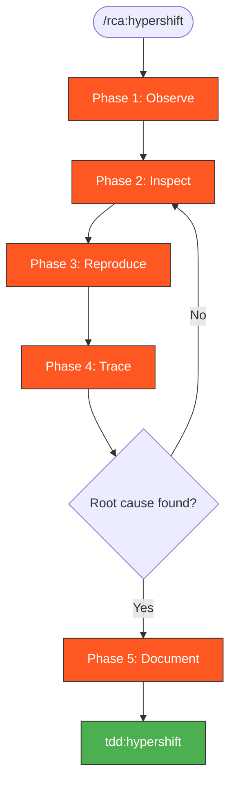

# RCA-HyperShift: Root Cause Analysis with Live Cluster



> Follow this diagram as the workflow.

Systematic root cause analysis with full cluster access for deep investigation.

## rca:hypershift vs rca:ci

| Aspect | `rca:hypershift` | `rca:ci` |
|--------|------------------|----------|
| **Access** | Full cluster (pods, logs, secrets, configs) | CI logs only |
| **Debugging** | Real-time with `k8s:*` skills | Static log analysis |
| **State** | Can inspect current state | Historical artifacts only |
| **When** | Have cluster, need deep investigation | No cluster available |

## When to Use

- `rca:ci` was inconclusive
- Need to inspect live pod state, secrets, or configs
- Want to reproduce failure with debugging enabled
- Complex multi-component issues

## Prerequisites

> **Auto-approved**: All read operations on hosted clusters are auto-approved.
> Run each command separately for auto-approve to work.

Create working directory for analysis:

```bash
mkdir -p /tmp/kagenti/rca
```

Set cluster context:
```bash
export CLUSTER=<suffix> MANAGED_BY_TAG=${MANAGED_BY_TAG:-kagenti-hypershift-custom}
export KUBECONFIG=~/clusters/hcp/$MANAGED_BY_TAG-$CLUSTER/auth/kubeconfig
```

Verify connection:
```bash
kubectl get nodes
```

## RCA Workflow

```
┌─────────────────────────────────────────────────────────────────┐
│  1. OBSERVE                                                     │
│     ├─ Check pod status                                         │
│     ├─ Get recent events                                        │
│     └─ Review current logs                                      │
├─────────────────────────────────────────────────────────────────┤
│  2. INSPECT                                                     │
│     ├─ Examine failing component                                │
│     ├─ Check configs and secrets                                │
│     └─ Verify connectivity                                      │
├─────────────────────────────────────────────────────────────────┤
│  3. REPRODUCE                                                   │
│     ├─ Run failing test with verbose output                     │
│     ├─ Watch logs in real-time                                  │
│     └─ Capture exact failure                                    │
├─────────────────────────────────────────────────────────────────┤
│  4. TRACE                                                       │
│     ├─ Follow request through components                        │
│     ├─ Identify where failure occurs                            │
│     └─ Determine root cause                                     │
├─────────────────────────────────────────────────────────────────┤
│  5. DOCUMENT                                                    │
│     ├─ Root cause with evidence                                 │
│     ├─ Reproduction steps                                       │
│     └─ Fix and verification plan                                │
└─────────────────────────────────────────────────────────────────┘
```

## Phase 1: Observe Current State

### Pod Status

Check all pods:
```bash
kubectl get pods -A
```

Find problem pods:
```bash
kubectl get pods -A --field-selector=status.phase!=Running,status.phase!=Succeeded
```

Check kagenti-system namespace:
```bash
kubectl get pods -n kagenti-system
```

Check team1 namespace:
```bash
kubectl get pods -n team1
```

### Recent Events

Cluster-wide events:
```bash
kubectl get events -A --sort-by='.lastTimestamp' | tail -30
```

Namespace events:
```bash
kubectl get events -n kagenti-system --sort-by='.lastTimestamp'
```

### Current Logs

OTEL Collector logs:
```bash
kubectl logs -n kagenti-system deployment/otel-collector --tail=100
```

MLflow logs:
```bash
kubectl logs -n kagenti-system deployment/mlflow --tail=100
```

Agent logs:
```bash
kubectl logs -n team1 deployment/weather-service --tail=100
```

Filter for errors:
```bash
kubectl logs -n kagenti-system deployment/otel-collector --tail=500 | grep -iE "error|fail|warn"
```

## Phase 2: Inspect Components

### Check Pod Details

Describe failing pod:
```bash
kubectl describe pod <pod-name> -n <namespace>
```

Check container status:
```bash
kubectl get pod <pod-name> -n <namespace> -o jsonpath='{.status.containerStatuses[*]}'
```

### Examine Configuration

List ConfigMaps:
```bash
kubectl get configmap -n kagenti-system
```

View specific ConfigMap:
```bash
kubectl get configmap otel-collector-config -n kagenti-system -o yaml
```

List Secrets (check existence, not values):
```bash
kubectl get secrets -n kagenti-system
```

Check secret keys:
```bash
kubectl get secret mlflow-oauth-secret -n kagenti-system -o jsonpath='{.data}' | jq 'keys'
```

Decode specific secret value:
```bash
kubectl get secret <secret-name> -n <namespace> -o jsonpath='{.data.<key>}' | base64 -d
```

### Verify Connectivity

Service endpoints:
```bash
kubectl get endpoints -n kagenti-system
```

Test internal connectivity:
```bash
kubectl run -it --rm debug --image=curlimages/curl -- \
  curl -v http://mlflow.kagenti-system.svc.cluster.local:5000/health
```

Check routes (OpenShift):
```bash
kubectl get routes -A
```

## Phase 3: Reproduce with Debugging

### Run Failing Test

Set environment variables:
```bash
export CLUSTER=<suffix> WORKTREE=<worktree> MANAGED_BY_TAG=${MANAGED_BY_TAG:-kagenti-hypershift-custom}
```

Run specific test with verbose output:
```bash
KUBECONFIG=~/clusters/hcp/$MANAGED_BY_TAG-$CLUSTER/auth/kubeconfig \
  .worktrees/$WORKTREE/.github/scripts/local-setup/hypershift-full-test.sh $CLUSTER \
  --include-test --pytest-filter "<test_name>" --pytest-args "-v -s"
```

### Watch Logs in Real-Time

Watch component logs (in separate terminal):
```bash
kubectl logs -f -n kagenti-system deployment/otel-collector
```

Or use stern for multiple pods:
```bash
stern -n kagenti-system .
```

## Phase 4: Trace the Failure

### Request Flow Analysis

For a typical agent request:

```
Client → Gateway → Agent → Tool → Agent → Gateway → Client
                     ↓
              OTEL Collector → MLflow
```

Check each hop:
1. Did the request reach the gateway?
2. Did the agent receive it?
3. Did the tool respond?
4. Were traces exported?
5. Did MLflow receive them?

### Component-Specific Checks

**OTEL Collector:**
```bash
kubectl logs -n kagenti-system deployment/otel-collector | grep -i "span\|trace\|export"
```

**MLflow:**
```bash
kubectl logs -n kagenti-system deployment/mlflow | grep -i "trace\|experiment\|error"
```

**Agent:**
```bash
kubectl logs -n team1 deployment/weather-service | grep -i "request\|response\|error"
```

### Auth Flow Analysis

Get Keycloak host:
```bash
KEYCLOAK_HOST=$(kubectl get route keycloak -n keycloak -o jsonpath='{.spec.host}')
```

Get OAuth client credentials:
```bash
CLIENT_ID=$(kubectl get secret mlflow-oauth-secret -n kagenti-system -o jsonpath='{.data.OIDC_CLIENT_ID}' | base64 -d)
CLIENT_SECRET=$(kubectl get secret mlflow-oauth-secret -n kagenti-system -o jsonpath='{.data.OIDC_CLIENT_SECRET}' | base64 -d)
```

Test OAuth token exchange:
```bash
curl -sk -X POST "https://$KEYCLOAK_HOST/realms/master/protocol/openid-connect/token" \
  -d "grant_type=client_credentials" \
  -d "client_id=$CLIENT_ID" \
  -d "client_secret=$CLIENT_SECRET"
```

## Phase 5: Document Findings

```markdown
## Root Cause Analysis

**Failure**: [Test name / description]
**Cluster**: [cluster suffix]
**Date**: [timestamp]

### Symptoms
- [What failed]
- [Error messages]

### Investigation Steps
1. [Step taken] → [Finding]
2. [Step taken] → [Finding]

### Root Cause
[Clear statement with evidence]

### Evidence
```
[Relevant log lines or command output]
```

### Fix
[Proposed solution]

### Verification
[How to confirm fix works]
```

## Quick Reference

| Task | Command |
|------|---------|
| Pod status | `kubectl get pods -A` |
| Pod logs | `kubectl logs -n <ns> deployment/<name>` |
| Describe pod | `kubectl describe pod <name> -n <ns>` |
| Get secret | `kubectl get secret <name> -n <ns> -o yaml` |
| Events | `kubectl get events -A --sort-by='.lastTimestamp'` |
| ConfigMap | `kubectl get configmap <name> -n <ns> -o yaml` |

## Related Skills

- `rca:ci` - RCA from CI logs only
- `tdd:hypershift` - Fix iteration after RCA
- `k8s:pods` - Pod debugging
- `k8s:logs` - Log analysis
- `k8s:health` - Platform health check
- `k8s:live-debugging` - Iterative debugging
- `auth:mlflow-oidc-auth` - MLflow OIDC auth debugging
- `openshift:debug` - Debug OpenShift-specific operators, SCCs, builds
- `openshift:routes` - Debug route/ingress issues
