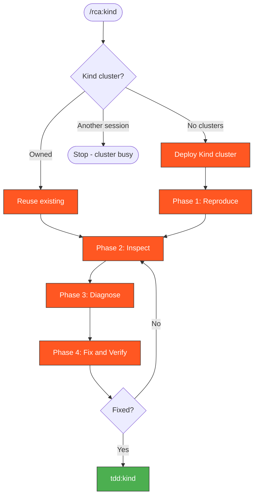

# RCA Kind

Root cause analysis workflow for failures on local Kind clusters.

## When to Use

- Kind E2E tests failed locally or in CI
- Need to reproduce and debug CI Kind failures
- Ollama/agent issues specific to the Kind environment

> **Auto-approved**: All read and debug operations on Kind clusters are auto-approved.

## Cluster Concurrency Guard

**Only one Kind cluster at a time.** Before any cluster operation, check:

```bash
kind get clusters 2>/dev/null
```

- **No clusters** → proceed normally (create cluster)
- **Cluster exists AND this session owns it** → reuse it (skip creation, inspect directly)
- **Cluster exists AND another session owns it** → **STOP**. Do not proceed. Inform the user:
  > A Kind cluster is already running (likely from another session).
  > Options: (a) wait for that session to finish, (b) switch to `rca:ci` for log-only analysis, (c) explicitly destroy the existing cluster first with `kind delete cluster --name kagenti`.

To determine ownership: if the current task list or conversation created this cluster, it's yours. Otherwise assume another session owns it.



> Follow this diagram as the workflow.

## Workflow

```
Failure → Reproduce locally → Inspect cluster → Identify root cause → Fix → Verify
```

Create working directory for analysis:

```bash
mkdir -p /tmp/kagenti/rca
```

### Phase 1: Reproduce

Deploy the cluster if not running:

```bash
./.github/scripts/local-setup/kind-full-test.sh --skip-cluster-destroy
```

### Phase 2: Inspect

Check pod status:

```bash
kubectl get pods -n kagenti-system
```

Check for crashes:

```bash
kubectl get pods -n kagenti-system --field-selector=status.phase!=Running
```

Check events:

```bash
kubectl get events -n kagenti-system --sort-by='.lastTimestamp'
```

### Phase 3: Diagnose

Check component logs:

```bash
kubectl logs -n kagenti-system deployment/kagenti-ui --tail=50
```

Check Ollama (Kind-specific):

```bash
kubectl logs -n kagenti-system deployment/ollama --tail=50
```

Check agent namespace:

```bash
kubectl get pods -n team1
```

```bash
kubectl logs -n team1 deployment/weather-service --tail=50
```

### Phase 4: Fix and Verify

After fixing, re-run the specific failing test:

```bash
uv run pytest kagenti/tests/e2e/ -v -k "test_name"
```

## Kind-Specific Issues

| Issue | Cause | Fix |
|-------|-------|-----|
| Ollama OOM | Model too large for Kind | Use smaller model or increase Docker memory |
| DNS resolution | CoreDNS not ready | Wait or restart CoreDNS pod |
| Port conflicts | 8080 already in use | `lsof -i :8080` and kill process |
| Image pull errors | Local registry not configured | Check `kind-registry` container is running |

## Escalation

If the issue can't be reproduced locally, escalate:
- **CI-only failure** → Use `rca:ci` to analyze from logs
- **Need real OpenShift** → Use `rca:hypershift` with a live cluster

## Related Skills

- `rca:ci` - RCA from CI logs only
- `rca:hypershift` - RCA with live HyperShift cluster
- `tdd:kind` - TDD workflow on Kind
- `kind:cluster` - Create/destroy Kind clusters
- `k8s:pods` - Debug pod issues
- `kagenti:ui-debug` - Debug UI issues (502, API, proxy)
