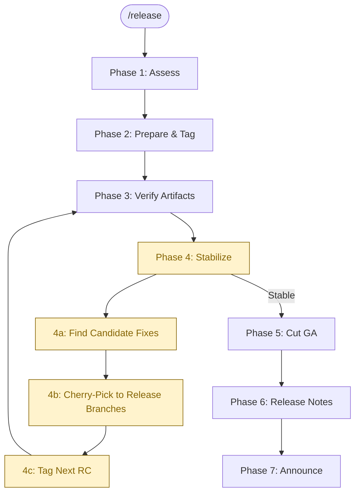

> Follow this diagram as the workflow. The yellow loop (Phase 4) repeats until
> the RC is stable. Reference `docs/releasing.md` for the full process.

# Release Kagenti

Guided workflow for creating and stabilizing releases across the Kagenti
organization. Handles the multi-repo dependency order, RC iteration loop,
cherry-pick coordination, and artifact verification.

## Table of Contents

- [When to Use](#when-to-use)
- [Invocation](#invocation)
- [Phase 1: Assess Current State](#phase-1-assess-current-state)
- [Phase 2: Prepare and Tag](#phase-2-prepare-and-tag)
- [Phase 3: Verify Artifacts](#phase-3-verify-artifacts)
- [Phase 4: Stabilize (RC Iteration Loop)](#phase-4-stabilize-rc-iteration-loop)
- [Phase 5: Cut GA](#phase-5-cut-ga)
- [Phase 6: Release Notes](#phase-6-release-notes)
- [Phase 7: Announce](#phase-7-announce)
- [Release Branch Git Workflow](#release-branch-git-workflow)
- [RC Fix Tracking](#rc-fix-tracking)
- [Quick Reference](#quick-reference)
- [Related Skills](#related-skills)

## When to Use

- Starting a new release cycle (first alpha or first RC)
- Daily stabilization work between RCs (finding fixes, cherry-picking, tagging)
- Coordinating multi-repo releases across the organization
- Cutting GA after stabilization is complete
- Patching an existing GA release

## Invocation

```
/release                          # Start from Phase 1 (full assessment)
/release status                   # Show current release state + fix tracker
/release alpha vX.Y.0-alpha.N    # Cut an alpha from main
/release rc vX.Y.0-rc.N          # Cut a release candidate
/release stabilize                # Enter Phase 4: find fixes, cherry-pick, tag next RC
/release cherry-pick <PR#|SHA>    # Cherry-pick a specific fix into the release branch
/release ga vX.Y.0               # Promote to GA
/release patch vX.Y.Z            # Cut a patch release
```

If no arguments are given, start with Phase 1 to assess and ask what to do.

---

## Phase 1: Assess Current State

Gather the current release landscape before making any changes.

### 1.1 Current tags across repos

```bash
echo "=== kagenti/kagenti ==="
gh release list --repo kagenti/kagenti --limit 5

echo "=== kagenti/kagenti-extensions ==="
gh release list --repo kagenti/kagenti-extensions --limit 5

echo "=== kagenti/kagenti-operator ==="
gh release list --repo kagenti/kagenti-operator --limit 5

echo "=== kagenti/agent-examples ==="
gh release list --repo kagenti/agent-examples --limit 5
```

### 1.2 Chart dependency versions

```bash
grep -A2 'name: kagenti-' charts/kagenti/Chart.yaml
```

### 1.3 Image tags in values.yaml

```bash
grep -n 'tag:' charts/kagenti/values.yaml charts/kagenti-deps/values.yaml
```

Flag any `tag: latest` entries — these must be pinned before any release.

### 1.4 Release branch state (if exists)

```bash
git fetch upstream
git branch -r | grep release
# For each release branch:
git log --oneline upstream/release-X.Y -5
```

### 1.5 Present summary and ask

Present the user with a summary built from live data:

```
Current state:
  kagenti:            <latest tag> | release branch: <exists/not>
  kagenti-extensions: <latest tag> | release branch: <exists/not>
  kagenti-operator:   <latest tag> | release branch: <exists/not>

Chart.yaml pins:
  kagenti-webhook-chart: <version>
  kagenti-operator-chart: <version>

Image tag issues:
  <N> images using tag: latest (must fix before RC/GA)
```

**ASK:** "What would you like to do? Options:
1. Cut a new alpha from main
2. Cut the first RC (creates release branch)
3. Stabilize an existing RC (cherry-pick fixes, tag next RC)
4. Promote to GA
5. Cut a patch release"

---

## Phase 2: Prepare and Tag

### Dependency order (MANDATORY)

All repos must be tagged in this order. Wait for CI to complete between each:

```
1. kagenti/kagenti-operator     →  first
2. kagenti/kagenti-extensions   →  second
3. kagenti/agent-examples       →  third (if applicable)
4. kagenti/kagenti              →  last (update Chart.yaml + values.yaml, then tag)
```

### 2.1 For Alpha (from `main`)

Alphas are tagged directly from `main`:

- [ ] Confirm CI passes on `main` for each repo being tagged
- [ ] Determine next alpha number
- [ ] Pin all image tags (no `tag: latest` allowed, even for alphas):

```bash
bash scripts/pin-release-tags.sh <version>
bash scripts/check-release-pins.sh
```

- [ ] Tag dependency repos first (operator → extensions → agent-examples)
- [ ] Update `charts/kagenti/Chart.yaml` with new sub-chart versions
- [ ] Run `helm dependency update charts/kagenti/`
- [ ] Commit, merge to main, then tag `kagenti/kagenti`

### 2.2 For First RC (creates release branch)

The first RC marks feature freeze. This is when release branches are created.

**Prerequisites — ASK the release manager:**
- "Are all planned features for vX.Y.0 merged to main?"
- "Are there any open P0/P1 bugs against this milestone?"
- "Has feature freeze been declared on Slack?"

**Steps:**

1. **Tag dependency repos with RC** (following dependency order):

   For each dependency repo that has changes since the last release:

   ```bash
   gh repo clone kagenti/<repo-name> /tmp/kagenti-release/<repo-name>
   cd /tmp/kagenti-release/<repo-name>

   # Verify CI
   gh run list --branch main --limit 3

   # Create release branch
   git checkout -b release-X.Y main
   git push origin release-X.Y

   # Tag from the release branch
   git tag -s vA.B.0-rc.1 -m "vA.B.0-rc.1"
   git push origin vA.B.0-rc.1

   # Wait for CI
   gh run watch
   ```

   **ASK after each:** "Tag pushed for <repo>. CI running. Shall I verify artifacts and proceed to the next repo?"

2. **Update kagenti/kagenti Chart.yaml** with new sub-chart RC versions

3. **Pin all image tags:**

   ```bash
   bash scripts/pin-release-tags.sh <version>
   bash scripts/check-release-pins.sh
   ```

4. **Create the release branch in kagenti/kagenti:**

   ```bash
   git checkout main
   git pull upstream main
   git checkout -b release-X.Y
   git push upstream release-X.Y
   ```

5. **Tag RC1:**

   ```bash
   git tag -s vX.Y.0-rc.1 -m "vX.Y.0-rc.1"
   git push upstream vX.Y.0-rc.1
   ```

6. **Initialize the fix tracker** (see [RC Fix Tracking](#rc-fix-tracking))

**After tagging RC1, tell the release manager:**

> RC1 is tagged. From now on, the stabilization cycle begins:
> - Test the RC
> - Report bugs → fix them via PRs to `main`
> - When fixes are merged, run `/release stabilize` to cherry-pick them
>   into the release branch and tag the next RC.
> - Repeat until stable, then `/release ga` to promote.

### 2.3 For Subsequent RCs (rc.2, rc.3, ...)

Subsequent RCs are cut from the release branch after cherry-picking fixes.
This is handled by [Phase 4: Stabilize](#phase-4-stabilize-rc-iteration-loop).

### 2.4 Tag a dependency repo (helper)

```bash
REPO="kagenti/<repo-name>"
VERSION="<version>"

# Clone clean
rm -rf /tmp/kagenti-release/$(basename $REPO)
gh repo clone $REPO /tmp/kagenti-release/$(basename $REPO)
cd /tmp/kagenti-release/$(basename $REPO)

# Verify CI on the target branch
gh run list --branch <main|release-X.Y> --limit 3

# Create signed tag
git tag -s $VERSION -m "$VERSION"
git push origin $VERSION

# Wait and verify
gh run watch
```

After each tag, run verification (see Phase 3) and **get explicit user
approval** before proceeding to the next repo.

---

## Phase 3: Verify Artifacts

After tagging, verify that CI produced all expected artifacts.

### 3.1 GitHub Releases

```bash
for repo in kagenti kagenti-extensions kagenti-operator; do
  echo "=== kagenti/$repo ==="
  gh release view <version> --repo kagenti/$repo --json tagName,isPrerelease,publishedAt 2>/dev/null || echo "  Not found"
done
```

### 3.2 Container images

```bash
REGISTRY="ghcr.io/kagenti"
VERSION="<version>"

# kagenti/kagenti images
for img in ui-v2 backend ui-oauth-secret agent-oauth-secret api-oauth-secret; do
  echo -n "$img:$VERSION ... "
  docker manifest inspect ghcr.io/kagenti/kagenti/$img:$VERSION >/dev/null 2>&1 \
    && echo "OK" || echo "MISSING"
done

# kagenti-extensions images
for img in envoy-with-processor proxy-init client-registration; do
  echo -n "$img:$VERSION ... "
  docker manifest inspect ghcr.io/kagenti/kagenti-extensions/$img:$VERSION >/dev/null 2>&1 \
    && echo "OK" || echo "MISSING"
done
```

### 3.3 Helm charts

```bash
helm show chart oci://ghcr.io/kagenti/kagenti-extensions/kagenti-webhook-chart --version <chart-version> 2>/dev/null \
  && echo "webhook chart OK" || echo "webhook chart MISSING"

helm show chart oci://ghcr.io/kagenti/kagenti-operator/kagenti-operator-chart --version <chart-version> 2>/dev/null \
  && echo "operator chart OK" || echo "operator chart MISSING"
```

### 3.4 Pre-release flag

```bash
gh release view <version> --repo kagenti/kagenti --json isPrerelease --jq '.isPrerelease'
# Expected: true for alpha/RC, false for GA
```

### 3.5 E2E validation (optional for RCs, mandatory for GA)

```bash
gh workflow run e2e-release-validation.yaml \
  -f version=<version> \
  --repo kagenti/kagenti
```

**ASK:** "All artifacts verified. Is this RC ready for broader testing, or do
you already know of issues to fix?"

---

## Phase 4: Stabilize (RC Iteration Loop)

This is the core loop between RCs. The release manager re-enters this phase
each time fixes need to be incorporated.

**Entry point:** `/release stabilize`

### 4a: Find Candidate Fixes

Discover PRs merged to `main` since the last RC that may need cherry-picking:

```bash
# Get the date of the last RC
LAST_RC="v0.6.0-rc.6"  # adjust to actual
LAST_RC_DATE=$(gh release view $LAST_RC --repo kagenti/kagenti --json publishedAt --jq '.publishedAt')

echo "=== PRs merged to kagenti/kagenti main since $LAST_RC ==="
gh pr list --repo kagenti/kagenti --state merged --base main \
  --search "merged:>$LAST_RC_DATE" --json number,title,labels,mergeCommit \
  --jq '.[] | "#\(.number) \(.title) [\(.mergeCommit.oid[:12])] labels:\([.labels[].name] | join(","))"'

echo ""
echo "=== PRs merged to kagenti/kagenti-extensions main since $LAST_RC ==="
gh pr list --repo kagenti/kagenti-extensions --state merged --base main \
  --search "merged:>$LAST_RC_DATE" --json number,title,mergeCommit \
  --jq '.[] | "#\(.number) \(.title) [\(.mergeCommit.oid[:12])]"'

echo ""
echo "=== PRs merged to kagenti/kagenti-operator main since $LAST_RC ==="
gh pr list --repo kagenti/kagenti-operator --state merged --base main \
  --search "merged:>$LAST_RC_DATE" --json number,title,mergeCommit \
  --jq '.[] | "#\(.number) \(.title) [\(.mergeCommit.oid[:12])]"'
```

Also check the [fix tracker](#rc-fix-tracking) for known pending items:

```bash
cat /tmp/kagenti/release/<version>/rc-fixes.md 2>/dev/null || echo "No tracker yet — will create one."
```

**ASK the release manager:**

```
These PRs were merged since the last RC. Which should be included in the next RC?

kagenti/kagenti:
  1. #1655 - fix(ocp): skip remote tag detection [bafe0d73]
  2. #1660 - fix(ui): dashboard crash on empty state [abc123]
  3. #1670 - chore(deps): bump go to 1.22 [def456]

kagenti-extensions:
  4. #89 - fix(webhook): handle nil annotations [aaa111]

kagenti-operator:
  (none)

Select PRs to cherry-pick (comma-separated numbers, e.g. "1,2,4"), or 'none':
```

### 4b: Cherry-Pick to Release Branches

For each selected fix, cherry-pick into the appropriate release branch.

**Important rules (from SOP):**
- All fixes MUST land on `main` first — never commit directly to a release branch
- Always use `git cherry-pick -x` — the `-x` flag is **mandatory** for traceability
- Follow dependency order: operator → extensions → kagenti

#### If fixes touch dependency repos (extensions or operator)

**ASK:** "PR #89 is in kagenti-extensions. Does that repo have a release-X.Y
branch yet?"

If no release branch exists for the dependency repo:

```bash
# Create release branch in the dependency repo
gh repo clone kagenti/kagenti-extensions /tmp/kagenti-release/kagenti-extensions
cd /tmp/kagenti-release/kagenti-extensions
git checkout -b release-X.Y main
git push origin release-X.Y
```

Then cherry-pick and tag:

```bash
cd /tmp/kagenti-release/kagenti-extensions
git checkout release-X.Y
git pull origin release-X.Y
git cherry-pick -x <merge-commit-sha>
git push origin release-X.Y

# Tag the dependency repo RC
git tag -s vA.B.0-rc.N -m "vA.B.0-rc.N"
git push origin vA.B.0-rc.N
gh run watch
```

**After dependency repo RC is tagged:** Update `charts/kagenti/Chart.yaml` in
the kagenti release branch to reference the new dependency version.

#### Cherry-pick into kagenti/kagenti release branch

Use the git workflow described in [Release Branch Git Workflow](#release-branch-git-workflow):

```bash
# Sync local release branch with upstream
git fetch upstream release-X.Y
git checkout release-X.Y 2>/dev/null || git checkout -b release-X.Y upstream/release-X.Y
git reset --hard upstream/release-X.Y

# Cherry-pick each fix (use merge commit SHA for squash-merged PRs)
git cherry-pick -x <sha1>
git cherry-pick -x <sha2>

# If a cherry-pick has conflicts:
#   ASK: "Cherry-pick of <sha> conflicts in <files>. Options:
#         1. I'll resolve manually (show me the conflict)
#         2. Skip this commit for now
#         3. Abort and investigate"

# Push to upstream
git push upstream release-X.Y
```

#### Update the fix tracker

After cherry-picking, update the local tracking file (see [RC Fix Tracking](#rc-fix-tracking)).

### 4c: Tag Next RC

Once all cherry-picks are on the release branch(es) and CI passes:

```bash
# Verify CI on release branch
gh run list --repo kagenti/kagenti --branch release-X.Y --limit 3

# Determine next RC number
git tag --list 'vX.Y.0-rc.*' --sort=-v:refname | head -1
```

**Pin image tags for the new RC:**

```bash
bash scripts/pin-release-tags.sh <next-rc-version>
bash scripts/check-release-pins.sh
git add charts/
git commit -s -m "chore(release): pin image tags for <next-rc-version>"
git push upstream release-X.Y
```

**ASK:** "Release branch has N new commits since rc.N. Ready to tag rc.N+1?"

```bash
git tag -s vX.Y.0-rc.N+1 -m "vX.Y.0-rc.N+1"
git push upstream vX.Y.0-rc.N+1
```

→ Return to [Phase 3: Verify Artifacts](#phase-3-verify-artifacts) for the new RC.

---

## Phase 5: Cut GA

When the latest RC has soaked with no blocking issues.

**Prerequisites — ASK:**
- "How long has it been since the last RC? (recommend 1 week minimum)"
- "Are there any open release-blocking issues?"
- "Has another maintainer signed off on this RC?"

**Steps:**

1. **Tag dependency repos with GA** (following dependency order):

   ```bash
   # For each dependency repo that had RC tags
   cd /tmp/kagenti-release/<repo>
   git checkout release-X.Y
   git tag -s vA.B.0 -m "vA.B.0"
   git push origin vA.B.0
   gh run watch
   ```

2. **Update kagenti Chart.yaml** with GA sub-chart versions

3. **Pin image tags to GA version:**

   ```bash
   bash scripts/pin-release-tags.sh vX.Y.0
   bash scripts/check-release-pins.sh
   git add charts/
   git commit -s -m "chore(release): pin image tags for vX.Y.0"
   git push upstream release-X.Y
   ```

4. **Tag GA:**

   ```bash
   git tag -s vX.Y.0 -m "vX.Y.0"
   git push upstream vX.Y.0
   ```

5. **Verify** (Phase 3) — confirm GitHub Release is marked as "Latest" (not Pre-release)

6. Mark the release as "Latest" if needed:

   ```bash
   gh release edit vX.Y.0 --repo kagenti/kagenti --latest
   ```

---

## Phase 6: Release Notes

### For Alpha

Auto-generated is sufficient:

```bash
gh release edit <version> --repo kagenti/kagenti \
  --notes "Alpha release — known issues: <list any>"
```

### For RC

Include a testing checklist and changes since last RC:

```bash
gh release edit <version> --repo kagenti/kagenti --notes-file /tmp/rc-notes.md
```

Template:
```markdown
Release candidate for vX.Y.0.

## Testing needed
- [ ] Clean Kind install
- [ ] OpenShift install
- [ ] Upgrade from previous GA
- [ ] E2E tests

## Changes since <previous-rc>
<list from fix tracker>
```

### For GA

Full release notes with component compatibility table:

```markdown
## Highlights
- Feature 1
- Feature 2

## Breaking Changes
- (list any)

## Component Versions

| Component | Version |
|-----------|---------|
| kagenti (platform) | vX.Y.0 |
| kagenti-extensions (webhook) | vA.B.0 |
| kagenti-operator | vC.D.0 |
| agent-examples | vE.F.0 |

## Upgrade Notes
- (special steps from previous GA)

## Full Changelog
<auto-generated>
```

---

## Phase 7: Announce

For GA and significant RC releases:

```bash
echo "Announce on:"
echo "  - Slack: https://ibm.biz/kagenti-slack"
echo "  - Mailing list: kagenti-maintainers@googlegroups.com"
```

---

## Release Branch Git Workflow

This section describes how to work with release branches day-to-day.

### Core Rule (from SOP)

> **No direct commits to release branches.** All fixes land on `main` first
> and are cherry-picked back. The `-x` flag is mandatory for traceability.

### Approach A: Direct push (maintainers)

Use when you have write access to the upstream repo and the cherry-picks are
straightforward:

```bash
# 1. Sync local branch with upstream
git fetch upstream release-X.Y
git checkout release-X.Y 2>/dev/null || git checkout -b release-X.Y upstream/release-X.Y
git reset --hard upstream/release-X.Y

# 2. Cherry-pick (use -x for traceability)
git cherry-pick -x <sha1>
git cherry-pick -x <sha2>
# For squash-merged PRs, use the merge commit SHA shown in the PR

# 3. Push directly to upstream
git push upstream release-X.Y
```

**When conflicts occur:**

```bash
# After a conflicting cherry-pick:
git status                    # See conflicted files
# ... resolve conflicts ...
git add <resolved-files>
git cherry-pick --continue

# If the conflict is too complex, abort and try a different approach:
git cherry-pick --abort
```

### Approach B: PR to release branch

Use when you want review on the cherry-pick, don't have direct push access,
or the cherry-pick has non-trivial conflicts:

```bash
# 1. Create a branch from the release branch
git fetch upstream release-X.Y
git checkout -b cherry-pick-<desc> upstream/release-X.Y

# 2. Cherry-pick
git cherry-pick -x <sha1>

# 3. Push to your fork
git push origin cherry-pick-<desc>

# 4. Open PR targeting the release branch
gh pr create --base release-X.Y --repo kagenti/kagenti \
  --title "fix: cherry-pick <description> for rc.N" \
  --body "Cherry-pick of #<original-PR> for the vX.Y.0-rc.N release."
```

### When to use which approach

| Scenario | Approach |
|----------|----------|
| Release manager with upstream push access, clean cherry-picks | A (direct push) |
| Cherry-pick has conflicts that need a second pair of eyes | B (PR) |
| Contributor without upstream write access | B (PR) |
| Large or risky changes being backported | B (PR) |
| Quick fix already reviewed on the main PR | A (direct push) |

### Multi-repo cherry-pick order

When fixes span multiple repos, cherry-pick and tag in dependency order:

```
1. kagenti-operator (if affected)     → cherry-pick, tag RC
2. kagenti-extensions (if affected)   → cherry-pick, tag RC
3. kagenti/kagenti                    → update Chart.yaml deps, cherry-pick fixes, tag RC
```

---

## RC Fix Tracking

Between RCs, maintain a local tracking file to keep state across sessions.

### File location

```
/tmp/kagenti/release/<version>/rc-fixes.md
```

Example: `/tmp/kagenti/release/v0.6.0/rc-fixes.md`

### Create the tracker

```bash
mkdir -p /tmp/kagenti/release/v0.6.0
cat > /tmp/kagenti/release/v0.6.0/rc-fixes.md << 'EOF'
# v0.6.0 RC Fix Tracker

## Current RC: rc.1 (tagged YYYY-MM-DD)

## Fixes for next RC

### Cherry-picked (ready to tag)
<!-- - [x] PR #NNN - description (commits: sha1, sha2) -->

### Pending (merged to main, not yet cherry-picked)
<!-- - [ ] PR #NNN - description [merge-sha] -->

### In Progress (PR open targeting main, not yet merged)
<!-- - [ ] PR #NNN - description -->

### Dependency repo fixes
<!-- - [ ] kagenti-extensions PR #NN - description -->
<!-- - [ ] kagenti-operator PR #NN - description -->

## Previous RCs

### rc.1 (initial)
- Initial release candidate
EOF
```

### Update the tracker

After each stabilization cycle:
- Move cherry-picked items to "Cherry-picked" with `[x]`
- Add newly discovered candidates to "Pending"
- After tagging, move the "Fixes for next RC" section to "Previous RCs"

### Use the tracker for release notes

The tracker provides the changelog between RCs:

```bash
grep '^\- \[x\]' /tmp/kagenti/release/v0.6.0/rc-fixes.md
```

---

## Quick Reference

### Release types

| Type | Branch | Create release branch? | Stabilization loop? |
|------|--------|----------------------|-------------------|
| Alpha | `main` | No | No |
| RC (first) | `release-X.Y` (new) | Yes — from `main` | Yes — loop until stable |
| RC (subsequent) | `release-X.Y` | Already exists | Yes — continue loop |
| GA | `release-X.Y` | Already exists | No — promote last RC |
| Patch | `release-X.Y` | Already exists | Optional (for non-trivial) |

### The stabilization cycle (daily workflow)

```
1. Test current RC
2. Report bugs → create PRs targeting main
3. Once fixes merge to main:
   /release stabilize
     → discovers candidate fixes
     → cherry-picks to release branch(es)
     → tags next RC
4. Verify new RC artifacts
5. Repeat from step 1
```

### Mandatory flags and conventions

| Rule | Reason |
|------|--------|
| `git cherry-pick -x` | Traceability between main and release branch |
| `git tag -s` (or `-a` if no GPG) | Signed/annotated tags for audit |
| `git commit -s` | DCO sign-off required by CI |
| Pin all image tags before any release | Reproducible installs |

## Related Skills

- `docs/releasing.md` — Full release process and policy
- `git:commit` — Commit format conventions
- `ci:status` — CI failure analysis
- `github:pr-review` — PR review workflow
