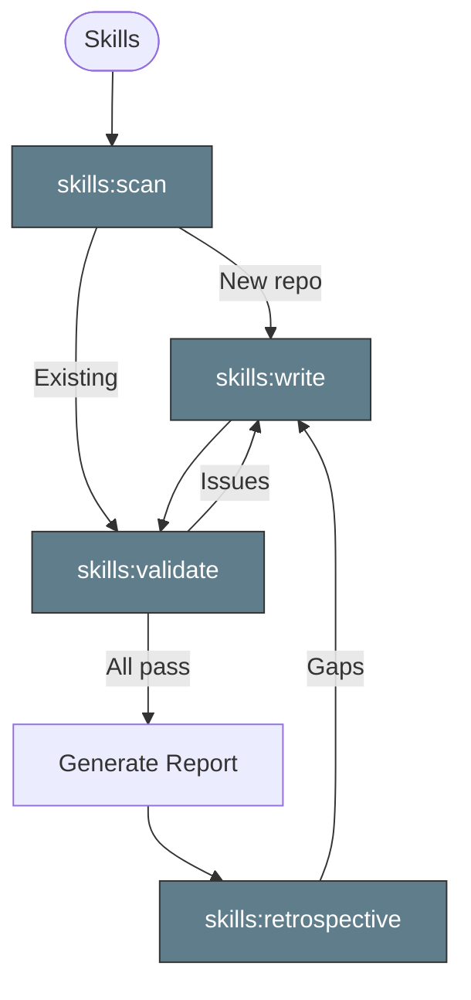

> Follow this diagram as the workflow.

# Skills Management

Skills for managing the skill system itself.

| Skill | Purpose |
|-------|---------|
| `skills:write` | Create new skills following the standard template |
| `skills:validate` | Validate skill format, naming, and structure |
| `skills:scan` | Scan a repository and generate initial skill set based on technology stack |
| `skills:retrospective` | Review session to identify skill gaps and improvements |

## Related Skills

- `tdd:ci` - TDD workflow that uses skill patterns
- `rca:ci` - RCA workflow that uses skill patterns
- `meta:write-docs` - Documentation writing guidelines
