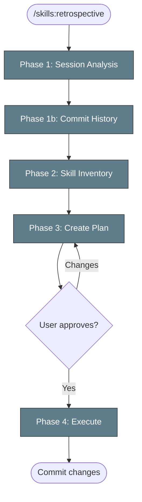

# Session Retrospective



> Follow this diagram as the workflow.

## Table of Contents

- [When to Use](#when-to-use)
- [Phase 1: Analysis](#phase-1-analysis)
- [Phase 2: Skill Inventory Review](#phase-2-skill-inventory-review)
- [Phase 3: Create Plan](#phase-3-create-plan)
- [Phase 4: Execute with Approval](#phase-4-execute-with-approval)
- [Skill Gap Patterns](#skill-gap-patterns)
- [Refactoring Patterns](#refactoring-patterns)

## When to Use

Run at the end of significant sessions:
- After debugging a complex issue
- After implementing a new feature
- After onboarding to a new area of the codebase
- When you notice repeated patterns
- Periodically (weekly/monthly) for skill hygiene

## Phase 1: Session Analysis

Review the current session for patterns. Do NOT make changes yet.

### 1.1 Repeated Commands

What commands did you run more than 3 times?

```bash
# Check bash history for patterns
history | grep -E "kubectl|helm|git" | sort | uniq -c | sort -rn | head -20
```

### 1.2 Long Debugging Cycles

What took longest to figure out?

- Did I try multiple approaches before finding the right one?
- Was there a "trick" that finally worked?
- Would a checklist have helped?

### 1.3 Repeated Lookups

What information did you search for repeatedly?

- API endpoints, configuration keys, command flags
- Error message meanings
- "How do I..." questions

### 1.4 Missing Workflows

Signs of missing workflow:
- "I wish I had known to do X first"
- "The order matters: A before B before C"
- "This only works if Y is configured"

## Phase 1b: Commit History Analysis

Analyze recent commit history to identify blind paths and wasted iterations.

### 1b.1 Review Recent Commits

```bash
git log --oneline -30
```

### 1b.2 Identify Revert/Fix Chains

Look for patterns that indicate wrong paths were taken:

```bash
git log --oneline -50 | grep -iE "revert|fix:|fixup|undo|retry|attempt"
```

### 1b.3 Classify Blind Paths

For each revert/fix chain, classify the root cause:

| Pattern | Root Cause | Skill Fix |
|---------|-----------|-----------|
| Fix → Fix → Fix same thing | Wrong initial approach | Add decision tree to skill |
| Revert then different approach | First approach was wrong | Add "don't do X" anti-pattern |
| Multiple commits changing same file | Incremental guessing | Add diagnostic steps before fix |
| Commit then immediately fix | Didn't verify before commit | Strengthen verification step |
| Applied fix that broke other tests | Didn't check impact | Add "check related tests" step |

### 1b.4 Count Wasted Iterations

```bash
# Count fix/revert commits vs feature commits in last 30
echo "Feature commits:"
git log --oneline -30 | grep -cvE "fix:|revert|fixup|undo"
echo "Fix/revert commits:"
git log --oneline -30 | grep -ciE "fix:|revert|fixup|undo"
```

A healthy ratio is 3:1 (feature:fix). Below 2:1 means the agent is taking too many blind paths.

### 1b.5 Analyze What the Agent Explored

Review the session conversation for:

- **Hypotheses tested**: How many guesses before finding the right fix?
- **Commands that returned nothing useful**: Ran a command, got no insight, tried another
- **Repeated "let me try another approach"**: Sign of missing decision guidance
- **Correct exploration**: Some unknown paths are expected — the agent should explore options when the situation is genuinely ambiguous

### 1b.6 Build Skills from Bad Paths

For each blind path identified, determine if a skill can prevent it:

| Blind Path | Preventable? | Action |
|-----------|-------------|--------|
| Tried approach A, failed, tried B, B worked | YES — add "use B when [condition]" | Update skill with decision tree |
| Explored 3 approaches, all reasonable, #3 worked | PARTIALLY — ambiguous situation | Add "try in this order" guidance |
| Guessed at fix without diagnosing first | YES — skipped diagnostic step | Add "diagnose before fixing" rule |
| Tried approach that can't work in this env | YES — env-specific constraint | Add environment check to skill |
| Novel problem, had to explore | NO — genuinely unknown | Document solution for next time |

## Phase 2: Skill Inventory Review

Review existing skills for refactoring opportunities. Do NOT make changes yet.

### 2.1 List All Skills

```bash
find .claude/skills -name "SKILL.md" | sort
```

### 2.2 Check for Duplicates

Look for skills that cover similar ground:

| Pattern | Action |
|---------|--------|
| Two skills with overlapping commands | Consider merging |
| One skill doing too many things | Consider splitting |
| Similar skills in different categories | Consider consolidating |
| Skill references outdated patterns | Update to best practices |

### 2.3 Best Practices Check

For each skill, verify:
- [ ] Frontmatter has `name` and `description`
- [ ] TOC included if over 50 lines
- [ ] Commands are copy-pasteable and tested
- [ ] Troubleshooting section exists
- [ ] Links to related skills are valid
- [ ] No outdated information

### 2.4 Identify Refactoring Candidates

Common refactoring needs:
- **Merge**: `k8s:pods` and `k8s:health` have overlapping pod checks
- **Split**: A skill covers both Kind and OpenShift but patterns differ
- **Rename**: Skill name doesn't match what it actually does
- **Restructure**: Category no longer makes sense

## Phase 3: Create Plan

Write a plan document for approval. Include all proposed changes.

### Plan Template

Create `docs/SKILL_RETROSPECTIVE_<date>.md`:

```markdown
# Skill Retrospective Plan - [Date]

## Session Context
[What was the session about?]

## Proposed Changes

### New Skills to Create
| Skill | Reason | Priority |
|-------|--------|----------|
| `category/name` | Gap identified when... | High/Medium/Low |

### Skills to Update
| Skill | Change | Reason |
|-------|--------|--------|
| `category/name` | Add X | Missing from workflow |

### Skills to Refactor
| Action | Skills | Reason |
|--------|--------|--------|
| Merge | `a`, `b` → `c` | Overlapping content |
| Split | `x` → `y`, `z` | Too broad |
| Rename | `old` → `new` | Clarity |

### Skills to Delete
| Skill | Reason |
|-------|--------|
| `category/name` | Superseded by X |

## Questions for Review
- Should X and Y be merged?
- Is category Z still relevant?

## Estimated Effort
- New skills: N
- Updates: M
- Refactors: K
```

### Present Plan

Show the plan to the user and ask:

> Here's my retrospective plan. Before I make any changes:
> 1. Do these proposed changes make sense?
> 2. Should I prioritize any specific items?
> 3. Are there changes you'd skip or modify?

## Phase 4: Execute with Approval

Only after user approves the plan, execute changes.

### 4.1 Execute in Order

1. **Refactors first** - Prevents creating skills that will be immediately restructured
2. **Updates second** - Improve existing before adding new
3. **New skills last** - Build on clean foundation

### 4.2 Checkpoint After Each Major Change

After significant changes, pause and confirm:

> Completed: [description]. Continue with next item?

### 4.3 Final Commit

Commit all changes with comprehensive message:

```
docs: Session retrospective skill updates

- Created: auth/new-skill
- Updated: k8s:health with pod debugging
- Merged: testing/a + testing/b → testing/combined
- Deleted: obsolete/skill

Based on [session context].

```

## Skill Gap Patterns

| Session Pattern | Likely Gap |
|-----------------|------------|
| "I had to google..." | Missing reference skill |
| "After trying X, Y, Z, W worked" | Missing debugging decision tree |
| "The pattern for this is..." | Missing pattern skill |
| "You need A before B" | Missing prerequisite skill |
| "Different on OpenShift vs Kind" | Missing env-specific skill |
| 401/403 errors | Missing auth skill |
| Connection/routing issues | Missing networking skill |
| Commit → revert → different approach | Missing anti-pattern in skill |
| 3+ fix commits for same issue | Missing diagnostic step in skill |
| Agent explored multiple approaches | Add "try in this order" to skill |

## Refactoring Patterns

### When to Merge Skills

- Two skills share >50% of commands
- Users always use them together
- Distinction is confusing

### When to Split Skills

- Skill has multiple "modes" or use cases
- Different audiences need different parts
- Skill is over 200 lines

### When to Rename/Move

- Name doesn't match actual purpose
- Category has changed
- Consistency with other skills

### When to Delete

- Superseded by better skill
- No longer applicable (deprecated tool/pattern)
- Never actually used

## Related Skills

- `skills:write` - Template for new skills
- `skills:scan` - Full repo audit and gap analysis
