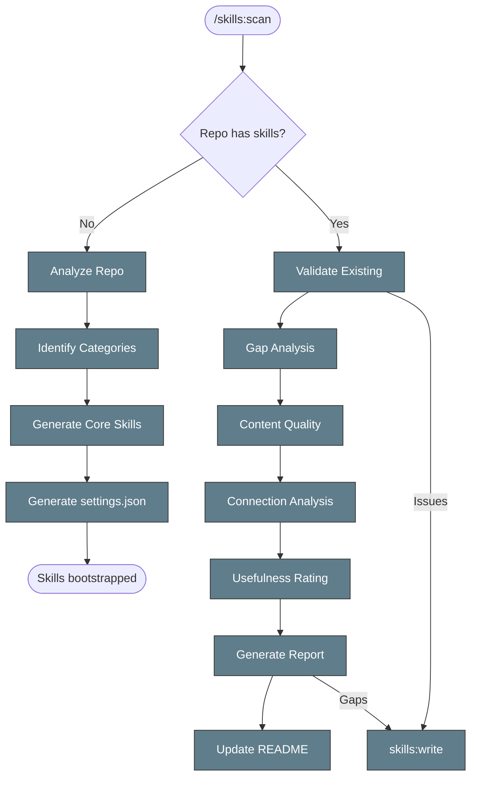

# Scan Repository for Skills

Bootstrap skills for a new repo, or audit and update skills in an existing one.



## When to Use

- Setting up Claude Code skills in a new repository
- Auditing an existing repo for skill gaps
- Updating skills after the repo's tech stack or workflows changed
- Onboarding to a new codebase

## Mode: New Repo (no `.claude/skills/` exists)

### Phase 1: Analyze Repository Structure

Scan for technology markers:

```bash
ls -la Makefile pyproject.toml package.json Cargo.toml go.mod pom.xml 2>/dev/null
```

Check CI configuration:

```bash
ls .github/workflows/ .gitlab-ci.yml Jenkinsfile .circleci/ 2>/dev/null
```

Check deployment patterns:

```bash
ls -d charts/ helm/ k8s/ kubernetes/ deployments/ docker-compose* Dockerfile 2>/dev/null
```

Check test structure:

```bash
find . -type d -name "tests" -o -name "test" -o -name "__tests__" -o -name "e2e" 2>/dev/null | head -10
```

### Phase 2: Identify Skill Categories

Based on findings, propose categories:

| Marker | Suggested Skills |
|--------|-----------------|
| `.github/workflows/` | `ci:status`, `ci:monitoring`, `tdd:ci`, `rca:ci` |
| `charts/` or `helm/` | `helm:debug` |
| `Dockerfile` | `docker:build`, `docker:debug` |
| `tests/e2e/` | `tdd:ci`, `rca:ci` |
| `deployments/ansible/` | `deploy:ansible` |
| Kubernetes manifests | `k8s:health`, `k8s:pods`, `k8s:logs` |
| Kind/minikube configs | `tdd:kind`, `rca:kind` |
| HyperShift/OpenShift | `tdd:hypershift`, `rca:hypershift` |

### Phase 3: Generate Core Skills

Every repo should have these (create with `skills:write`):

| Skill | Purpose |
|-------|---------|
| `skills:write` | How to create skills |
| `skills:validate` | How to validate skills |
| `skills:scan` | This skill (self-referential) |
| `tdd:ci` | CI-driven development loop (if CI exists) |
| `rca:ci` | Root cause analysis from CI logs (if CI exists) |
| `git:worktree` | Parallel development (if git repo) |

### Phase 4: Generate settings.json

Create `.claude/settings.json` with auto-approve patterns:
- Read operations (kubectl get, logs, describe) → auto-approve
- Sandbox write operations (kubectl apply on dev clusters) → auto-approve
- Management/destructive operations → require approval

## Mode: Existing Repo (`.claude/skills/` exists)

### Phase 1: Validate Existing Skills

Run `skills:validate` on every skill:

```bash
for f in .claude/skills/*/SKILL.md; do
  dir=$(basename $(dirname "$f"))
  name=$(grep '^name:' "$f" | sed 's/name: //' | tr -d ' ')
  [ "$dir" = "$name" ] || echo "MISMATCH: $dir != $name"
done
```

Check for issues:
- Frontmatter name/directory mismatches
- Old-style references (dashes instead of colons)
- Missing Related Skills sections
- Chained commands in sandbox skills (breaks auto-approve)

### Phase 2: Gap Analysis

Compare existing skills against the repo's actual tech stack:

1. Run Phase 1 of the "New Repo" flow to detect technology markers
2. Compare detected categories against existing skill categories
3. List categories that exist in the repo but have no skills
4. List skills that reference tools/patterns no longer in use

### Phase 3: Content Quality Review

For each existing skill, assess:

| Check | Criteria |
|-------|----------|
| Actionability | Commands are copy-pasteable, not just documentation |
| Length | 80-200 lines (300 max). Split if too long |
| Freshness | Commands and paths still match current repo structure |
| Cross-links | Related Skills use colon notation and link to real skills |
| Auto-approve | Sandbox commands match settings.json patterns |
| Mermaid diagram | Workflow/router skills have embedded diagram matching textual flow |

### Phase 4: Connection Analysis

For each skill, determine:
- **Outgoing links**: Skills referenced in Related Skills section
- **Incoming links**: Which other skills reference this one (search all files)
- **Broken refs**: References to skills that don't exist
- **Orphans**: Skills with no incoming references (only parent links)

Key metrics:
- Most connected skills (highest incoming refs) = hub skills
- Orphaned skills = may need cross-linking or deletion
- Broken refs = must fix before committing

### Phase 5: Usefulness Assessment

Rate each skill 1-5:

| Rating | Criteria |
|--------|----------|
| 5 | Decision trees, copy-paste commands, troubleshooting, used daily |
| 4 | Good reference with commands, covers edge cases |
| 3 | Useful but needs more actionability or is too long |
| 2 | Bare index or needs significant improvement |
| 1 | Redundant or too vague to help |

### Phase 6: Generate Report

Save to `/tmp/kagenti/skills-scan/`:

```bash
mkdir -p /tmp/kagenti/skills-scan
```

Output a structured report:

```markdown
## Skill Scan Report

### Inventory: X total (Y parents + Z leaves)
- Rated 5: N skills
- Rated 4: N skills
- Rated 3 or below: N skills (list)

### Validation Issues
- Failing validation: [list with specific issues]
- Broken references: [source → broken target]
- Over 300 lines: [list with line counts]

### Connection Analysis
- Most connected (hub skills): [top 5 with incoming ref count]
- Orphaned skills: [list with only parent refs]
- Workflow paths: TDD escalation, RCA escalation, Deploy chain

### Gap Analysis
- Missing skills for detected tech: [list]
- Stale skills referencing removed tech: [list]

### Diagram Coverage
- Skills with diagrams: [count]
- Skills needing diagrams: [list]

### Recommendations
1. Create: [new skills needed]
2. Update: [skills with issues]
3. Delete: [obsolete skills]
4. Merge: [overlapping skills]
5. Cross-link: [orphaned skills that should connect to workflows]
```

## Phase 7: Update Skills README

After completing the scan, update `.claude/skills/README.md`:

1. Regenerate the **Complete Skill Tree** (ASCII listing of all categories and leaves)
2. Update **Mermaid workflow diagrams** for root flows:
   - TDD workflow (tdd → tdd:ci/tdd:hypershift/tdd:kind escalation)
   - RCA workflow (rca → rca:ci/rca:hypershift/rca:kind escalation)
   - CI workflow (ci → ci:status/ci:monitoring → rca:ci → tdd:ci)
   - Skills meta workflow (skills:scan → skills:write → skills:validate → skills:retrospective)
   - Deploy & debug workflow (kagenti:deploy → k8s:health → k8s:pods/logs)
   - HyperShift lifecycle (setup → preflight → quotas → create → destroy)
3. Update the **Auto-Approve Policy** table
4. Verify all skills appear in the tree and diagrams
5. Check that no orphaned skills exist (every leaf should be reachable from a root flow)

The README is the main entry point for understanding the skills system.
It should always reflect the current state after a scan.

## Output (New Repo)

```
.claude/
├── settings.json
└── skills/
    ├── README.md              # Generated by skills:scan
    ├── skills/SKILL.md
    ├── skills:write/SKILL.md
    ├── skills:validate/SKILL.md
    ├── skills:scan/SKILL.md
    ├── tdd/SKILL.md
    ├── tdd:ci/SKILL.md
    ├── rca/SKILL.md
    ├── rca:ci/SKILL.md
    └── <detected>/SKILL.md
```

## Related Skills

- `skills:write` - Create individual skills
- `skills:validate` - Validate skill format
- `skills:retrospective` - Review and improve skills after sessions
- `tdd:ci` - Core TDD skill (always generated)
- `rca:ci` - Core RCA skill (always generated)
