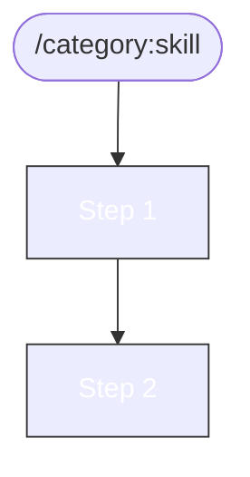

# Write Skill

## Table of Contents

- [Skill Structure](#skill-structure)
- [Frontmatter](#frontmatter)
- [Content Guidelines](#content-guidelines)
- [Task Tracking Standard](#task-tracking-standard)
- [Checklist](#checklist)
- [Template](#template)

## Skill Structure

```
.claude/skills/<category>:<skill-name>/
└── SKILL.md
```

**IMPORTANT**: Use colon notation in directory names (e.g., `auth:my-skill/`). Required for Claude Code skill discovery.

Categories: `auth`, `ci`, `genai`, `git`, `hypershift`, `istio`, `k8s`, `kagenti`, `kind`, `local`, `openshift`, `rca`, `skills`, `tdd`, `testing`

## Frontmatter

```yaml
---
name: category:skill-name
description: One-line description (what it does, not how)
---
```

Use colon notation in `name:` field. Directory name must match.

## Content Guidelines

1. **Title**: `# Skill Name`
2. **TOC**: Include for skills over 50 lines
3. **Length**: Target 80-200 lines (300 max). Split longer skills.
4. **Sections**:
   - When to Use
   - Steps/Workflow
   - Workflow Diagram (required for workflow/router skills)
   - Task Tracking (required for workflow skills)
   - Troubleshooting
   - Related Skills
5. **Style**:
   - Imperative voice ("Run X", not "You should run X")
   - Real, copy-pasteable commands
   - Include expected output where helpful

## Command Format and Auto-Approve

Skills must classify as **sandbox** or **management** to determine command format:

| Type | Target | Auto-approve? |
|------|--------|---------------|
| **Sandbox** | Kind cluster, custom HyperShift hosted cluster | YES |
| **Management** | Management cluster, AWS resources, git push, destructive ops | NO |

### Sandbox skills: One command per code block

Claude Code auto-approves commands by matching the first token against `.claude/settings.json` patterns. Chained commands (`&&`), multiline scripts, heredocs, and `for` loops break pattern matching.

**IMPORTANT**: Write each command as a separate code block:

```markdown
Check pod status:
```bash
kubectl get pods -n kagenti-system
```

Check logs:
```bash
kubectl logs -n kagenti-system deployment/mlflow
```
```

Do NOT chain: `kubectl get pods && kubectl logs ...`

For HyperShift, prefix each command individually:

```markdown
```bash
KUBECONFIG=~/clusters/hcp/kagenti-hypershift-custom-$CLUSTER/auth/kubeconfig kubectl get pods -n kagenti-system
```
```

### Management skills: Any format

Commands targeting management clusters or AWS need user approval anyway, so multiline/chained format is acceptable.

### Temporary Files

Skills that download logs, artifacts, or save analysis output should use `/tmp/kagenti/<skill-category>/` as the working directory:

```bash
mkdir -p /tmp/kagenti/rca
```

This path is auto-approved for read/write in `.claude/settings.json`.

### Update settings.json

After writing a skill, verify all sandbox commands are covered by `.claude/settings.json` patterns. If a new command prefix is used, add it:

```json
{
  "permissions": {
    "allow": [
      "Bash(new-command:*)"
    ]
  }
}
```

See `skills:validate` for the full pattern reference table.

## Workflow Diagrams

Workflow skills (skills with phases, decision trees, or routing logic) MUST include:

1. **Embedded mermaid diagram** in the SKILL.md
2. **Companion `.mmd` template file** in the skill directory (for debug mode, TDD skills only)
3. Diagram MUST match textual flow exactly
4. Use README color scheme:

| Category | classDef |
|----------|----------|
| TDD | `classDef tdd fill:#4CAF50,stroke:#333,color:white` |
| RCA | `classDef rca fill:#FF5722,stroke:#333,color:white` |
| CI | `classDef ci fill:#2196F3,stroke:#333,color:white` |
| Test | `classDef test fill:#9C27B0,stroke:#333,color:white` |
| Git | `classDef git fill:#FF9800,stroke:#333,color:white` |
| K8s | `classDef k8s fill:#00BCD4,stroke:#333,color:white` |
| Deploy | `classDef deploy fill:#795548,stroke:#333,color:white` |
| Skills | `classDef skills fill:#607D8B,stroke:#333,color:white` |
| GitHub | `classDef github fill:#E91E63,stroke:#333,color:white` |
| HyperShift | `classDef hypershift fill:#3F51B5,stroke:#333,color:white` |
| Playwright | `classDef pw fill:#8BC34A,stroke:#333,color:white` |

**Exempt** from diagram requirement: pure index parents that only list sub-skills with no routing logic (e.g., `git/`, `k8s/`, `auth/`)

## Task Tracking Standard

Every workflow skill (tdd, rca, ci, etc.) MUST include a Task Tracking section. This is the canonical reference for how Claude Code task lists work across all skills.

### Task Naming Convention

```
<worktree> | <PR> | <plan-doc> | <topic> | <phase> | <task description>
```

- **worktree**: git worktree name (e.g., `mlflow-ci`) or `kagenti` for main repo
- **PR**: PR reference (e.g., `PR#569`) or `none`
- **plan-doc**: plan filename (e.g., `calm-toast.md`) or `ad-hoc` if no plan
- **topic**: area of work (e.g., `Kind CI`, `MLflow init`, `CodeQL`)
- **phase**: from planning doc section/step, or blank if ad-hoc
- **task**: brief description

Examples:
- `mlflow-ci | PR#569 | calm-toast.md | MLflow init | Phase 2: Fix | Use parameterized SQL`
- `mlflow-ci | PR#569 | ad-hoc | Kind CI | | Bind Ollama to 0.0.0.0`
- `kagenti | none | calm-toast.md | skills | Step 1 | Create ci:status skill`

### Task Lifecycle

```
1. On skill invocation:
   - TaskList → check existing tasks for this worktree/PR
   - Update completed items
   - Create new items for discovered work

2. Task metadata:
   - plan: path to plan doc or "ad-hoc" if none
   - runner: main-session | subagent | background

3. Dependencies:
   - Use addBlockedBy for sequential tasks
   - Parallel tasks have no blockers

4. Status reporting - always show plan doc in task name:
   | # | Status | Task (includes plan doc) |
   |---|--------|-------------------------|
   | #26 | in_progress | kagenti \| none \| calm-toast.md \| skills \| Create \| ci:status |
   | #32 | completed | mlflow-ci \| PR#569 \| ad-hoc \| Kind CI \| Fix \| Ollama bind |
```

### Plan Doc Reference

Every task should reference its parent planning document:
- Tasks from a plan: `metadata.plan = "<plan-file-path>"`
- Ad-hoc tasks: `metadata.plan = "ad-hoc"`
- Tasks without a plan doc indicate work that needs retroactive documentation

## Checklist

Before committing a new skill:

- [ ] Frontmatter has `name` and `description`
- [ ] Directory uses colon notation
- [ ] Name in frontmatter matches directory name
- [ ] TOC included if over 50 lines
- [ ] Commands are copy-pasteable
- [ ] Task Tracking section present (for workflow skills)
- [ ] Troubleshooting section exists
- [ ] Related Skills section exists
- [ ] Mermaid diagram present (for workflow/router skills)
- [ ] Diagram matches textual workflow exactly
- [ ] Diagram uses classDef colors from README color legend
- [ ] Parent category SKILL.md updated with reference

## Template

```markdown
---
name: category:skill-name
description: Brief description of what this skill does
---

# Skill Name

## When to Use

- Condition 1
- Condition 2

## Workflow

1. Step one
2. Step two

## Workflow Diagram



## Task Tracking

On invocation:
1. TaskList - check existing tasks
2. TaskCreate with naming: `<worktree> | <PR> | <topic> | <phase> | <task>`
3. TaskUpdate as work progresses

## Troubleshooting

### Problem: Description
**Symptom**: What you see
**Fix**: How to resolve

## Related Skills

- `category:related-skill`
```

## Related Skills

- `skills:validate` - Check skill format compliance
- `skills:retrospective` - Identify skill gaps and improvements
- `meta:write-docs` - Documentation formatting guidelines
