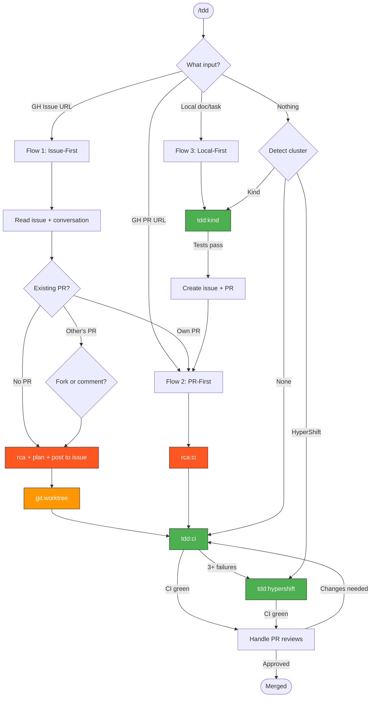

> Follow this diagram as the workflow.

# TDD Skills

Test-driven development workflows for iterative Kagenti development.

## Entry Point Router

When `/tdd` is invoked, determine the entry point:

```
What was provided?
    │
    ├─ GitHub issue URL → Flow 1: Issue-First
    ├─ GitHub PR URL    → Flow 2: PR-First
    ├─ Local doc/task   → Flow 3: Local-First
    └─ Nothing          → Detect cluster, pick tdd:ci/kind/hypershift
```

## Debug Mode (--debug)

Debug mode is **only activated** when `/tdd` is invoked as `/tdd --debug <issue|PR|doc>`.

When active, the workflow visually tracks progress through the diagram, highlighting the current node and showing edge traversal counts.

### Setup

1. Create the debug output directory:

```bash
mkdir -p /tmp/kagenti/tdd/
```

2. Initialize the state file on first invocation. The script creates `/tmp/kagenti/tdd/tdd-debug-state.json` automatically.

### At Each Phase Transition

Run the debug diagram script to update the visual:

```bash
python3 .claude/scripts/tdd-debug-diagram.py \
  --template .claude/skills/tdd/tdd-workflow.mmd \
  --current-node <NODE_ID> \
  --edge-counts '{"<FROM>-><TO>": <count>, ...}' \
  --output /tmp/kagenti/tdd/debug-diagram.mmd
```

Node IDs match the diagram: `START`, `INPUT`, `ISSUE`, `PR`, `LOCAL`, `DETECT`, `ANALYZE`, `CHECKPR`, `FORK`, `RESEARCH`, `WORKTREE`, `RCACI`, `TDDCI`, `HS`, `KIND`, `MOVETOPR`, `REVIEWS`, `DONE`.

### State Tracking

The script maintains `/tmp/kagenti/tdd/tdd-debug-state.json` with:
- `current_node` - where in the workflow we are now
- `edge_counts` - how many times each edge has been traversed
- `history` - ordered list of nodes visited with timestamps

### Propagation to Sub-Skills

When debug mode is active and the workflow enters a sub-skill (`tdd:ci`, `tdd:kind`, `tdd:hypershift`), pass the debug flag through:

1. Use the sub-skill's own `.mmd` template (e.g., `.claude/skills/tdd:ci/tdd-ci-workflow.mmd`)
2. Continue updating `/tmp/kagenti/tdd/tdd-debug-state.json` with the sub-skill's node transitions
3. When the sub-skill completes, resume tracking in the parent `tdd-workflow.mmd`

### Report Current Position

After each script invocation, report to the user:
- Current node name and description
- Number of loop iterations (from edge counts)
- Path taken so far (from history)

---

## Flow 1: `/tdd <GH issue URL>`

### Step 1: Analyze the issue

Read the issue body and full conversation thread to understand:
- What's reported, what's expected, reproduction steps
- Latest state of discussion (comments may have new info)

### Step 2: Check for existing work

```bash
gh pr list --repo kagenti/kagenti --state open --search "<issue-number>"
```

```bash
gh pr list --repo kagenti/kagenti --state closed --search "<issue-number>" --limit 5
```

### Step 3: Route based on findings

```
Existing PR found?
    │
    ├─ YES, owned by current gh user
    │   → Jump to Flow 2 (/tdd <that PR URL>)
    │
    ├─ YES, owned by someone else
    │   → Offer options:
    │     a) Start new PR taking their branch as base
    │        (cherry-pick approach — our commits can be
    │        picked by the original author)
    │     b) Comment on their PR with analysis/fix suggestions
    │        (include git commands for them to cherry-pick)
    │   → If option a: create worktree from their branch
    │
    └─ NO existing PR
        → Continue to Step 4
```

### Step 4: Research & Plan

Before writing ANY code:

1. **RCA/Research** — search codebase, trace root cause, check if tests cover this
2. **Plan** — what files change, what tests needed, approach options
3. **Create mermaid diagrams** to explain concepts (renders in GH comments)
4. **Post to the issue** (requires approval):
   - Findings and root cause
   - Questions where approach is unclear
   - Options with tradeoffs when multiple approaches exist
   - Mermaid diagrams to visualize the change
5. **Wait for response** if questions were posted

### Step 5: Create worktree and implement

```bash
git worktree add .worktrees/<name> -b fix/<slug>-<number> upstream/main
```

Then enter the TDD loop (see "TDD Code Loop" below).

---

## Flow 2: `/tdd <GH PR URL>`

### Step 1: Assess PR state

```bash
gh pr view <number> --json author,state,reviewDecision,statusCheckRollup,mergeable,body,comments
```

Check ownership:

```bash
gh api user --jq '.login'
```

### Step 2: Route based on ownership

```
PR owned by current gh user?
    │
    ├─ YES → Step 3 (work directly on the PR)
    │
    └─ NO → Offer options:
            a) Fork their branch into new PR, comment original
               with cherry-pick instructions for the fix
            b) Just comment with analysis/suggestions
            → If option a: create worktree from their branch
```

### Step 3: Fix CI failures

Run `rca:ci` on failures, then `tdd:ci` fix loop.
Escalate to `tdd:hypershift` after 3+ CI failures.

### Step 4: Handle reviews (after CI green)

1. **Fetch all review comments**:

```bash
gh api repos/kagenti/kagenti/pulls/<number>/comments
```

```bash
gh pr view <number> --json reviews
```

2. **Assess ALL comments before implementing**:
   - Copilot/bot comments → auto-fix as commits
   - Human review (clear feedback) → one commit per logical item
   - Unclear feedback → post clarification question on PR
   - Multiple options → comment with options and tradeoffs

3. **Self-review** — review your own changes and post review output as PR comment

4. **Back to Step 3** — wait for CI, check for new comments, repeat until approved

---

## Flow 3: `/tdd <local doc/task>`

### Step 1: Plan locally

Read the doc/task, plan the implementation.

### Step 2: Create worktree and implement

```bash
git worktree add .worktrees/<name> -b feat/<slug> upstream/main
```

### Step 3: Local TDD loop

Use `tdd:kind` for fast local iteration until Kind tests pass.

### Step 4: Move to CI (when local tests pass)

Offer options:
1. Review the doc — ensure no local-only paths/links
2. Create GH issue from the doc (requires approval)
3. Create PR referencing the issue
4. Switch to Flow 2 (/tdd <the new PR>)

---

## Branch Verification Gate

**MANDATORY before the first commit in any TDD flow.** Prevents pushing work to the wrong branch/PR.

### Steps

1. **Check current branch**:

```bash
git branch --show-current
```

2. **Check for open PRs on this branch**:

```bash
gh pr list --head "$(git branch --show-current)" --json number,title,url --jq '.[] | "#\(.number) \(.title) \(.url)"'
```

3. **Route based on findings**:

```
Current branch has open PR?
    │
    ├─ YES → Ask user:
    │   "You are on branch <branch> which has open PR #<N>: <title>.
    │    Is this the right target for your current work?"
    │   │
    │   ├─ YES → Continue (commit to this branch)
    │   │
    │   └─ NO → Create worktree with new branch:
    │       git worktree add .worktrees/<name> -b <new-branch> upstream/main
    │       (switch all subsequent work to the worktree)
    │
    └─ NO open PR → Check if branch is main/upstream
        │
        ├─ On main → Create worktree with new branch (never commit to main)
        │
        └─ On feature branch without PR → Ask user:
            "You are on branch <branch> with no open PR.
             Continue here or create a new worktree?"
```

4. **Record the verified branch** in task metadata so subsequent commits skip re-verification.

### Why This Exists

Without this gate, it's easy to accidentally push unrelated changes to an existing
feature branch with an open PR, polluting that PR with unrelated commits.

---

## TDD Code Loop

All three flows eventually enter this loop:

```
0. Branch verification gate — verify branch/PR association (first commit only)
1. Write/fix code
2. test:write — write or update tests
3. test:review — verify test quality (no silent skips, assertive)
4. test:run-kind or test:run-hypershift — execute tests
5. Track progress — compare test results with previous run
6. git:commit — commit with proper format (repo:commit)
7. git:rebase — rebase onto upstream/main
8. Push → ci:monitoring — wait for CI results
9. CI passes? → Handle reviews (Flow 2 Step 4). CI fails? → Back to step 1.
```

## Commit Policy

**Never revert. Never amend. Commits are permanent history.**

Only commit when:
- All tests pass, OR
- At least 1 additional test passes compared to the previous commit (forward progress)

```
Commit 1: 8 pass, 5 fail  ← baseline, acceptable
Commit 2: 10 pass, 3 fail ← good, +2 passing
Commit 3: 11 pass, 2 fail ← good, +1 passing
(no commit): 9 pass, 4 fail ← DON'T COMMIT — regression, keep iterating
```

### Rules

1. **Don't commit until tests improve** — at least 1 fewer failure than last commit
2. **Never revert** — keep the history, fix forward instead
3. **Never amend** — each commit is a checkpoint, session retrospective uses the history
4. **Don't fix too many things at once** — small focused commits are more stable
5. **If stuck for too long** — the session retrospective will catch it and improve the skill

## Available Skills

| Skill | Cluster | Auto-approve | Speed |
|-------|---------|--------------|-------|
| `tdd:ci` | None needed | N/A (CI runs remotely) | Slow (wait for CI) |
| `tdd:kind` | Local Kind | All ops auto-approved | Fast |
| `tdd:hypershift` | HyperShift hosted | All ops auto-approved | Medium |

> **Concurrency limit**: Only one `tdd:kind` session at a time (one Kind cluster fits locally).
> Before routing to `tdd:kind`, run `kind get clusters` — if a cluster exists from another session,
> route to `tdd:ci` instead or ask the user.

## Related Skills

- `rca:ci` - Root cause analysis from CI logs
- `rca:hypershift` - Root cause analysis with live cluster
- `rca:kind` - Root cause analysis on Kind
- `ci:status` - Check CI pipeline status
- `test` - Test writing, reviewing, and running
- `test:review` - Verify test quality before committing
- `git:commit` - Commit with proper format
- `git:rebase` - Rebase before pushing
- `git:worktree` - Create isolated worktrees
- `repo:commit` - Repository commit conventions
- `repo:pr` - PR creation conventions
