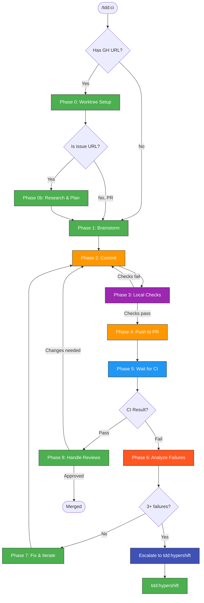

# TDD-CI Workflow

## Table of Contents

- [tdd:ci vs tdd:hypershift](#tddci-vs-tddhypershift)
- [When to Use](#when-to-use)
- [The Workflow](#the-workflow)
- [Phase 0: Worktree Setup](#phase-0-worktree-setup-when-linked-to-gh-issuepr)
- [Phase 0b: Research & Plan](#phase-0b-research--plan-when-working-from-a-gh-issue)
- [Phase 1: Brainstorm](#phase-1-brainstorm-new-features)
- [Phase 2: Commit](#phase-2-commit)
- [Phase 3: Local Checks](#phase-3-local-checks)
- [Phase 4: Push to PR](#phase-4-push-to-pr)
- [Phase 5: Wait for CI](#phase-5-wait-for-ci)
- [Phase 6: Analyze Failures](#phase-6-analyze-failures)
- [Phase 7: Fix and Iterate](#phase-7-fix-and-iterate)
- [Phase 8: Handle PR Reviews](#phase-8-handle-pr-reviews-after-ci-passes)
- [Escalation](#escalation-too-many-iterations)
- [Task Tracking](#task-tracking)
- [Anti-Patterns](#anti-patterns)
- [Related Skills](#related-skills)

Iterative development workflow using CI as the test environment. Commit changes, run local checks, push to PR, wait for CI results, and iterate on failures.

## tdd:ci vs tdd:hypershift

| Aspect | `tdd:ci` | `tdd:hypershift` |
|--------|----------|------------------|
| **Test environment** | CI pipeline (no direct access) | Your own HyperShift cluster |
| **Debugging** | Analyze CI logs after failure | Real-time debugging with `k8s:*` skills |
| **Feedback loop** | Slower (wait for CI) | Faster (immediate cluster access) |
| **Use when** | Final validation, no cluster | Active development, need to inspect state |

**Use `tdd:hypershift`** when you have a cluster and need real-time debugging.
**Use `tdd:ci`** when iterating on CI failures or for final PR validation.

## When to Use

- Iterating on CI failures (no cluster access needed)
- Final validation before merge
- When you don't have a HyperShift cluster running
- Simple changes that don't need live debugging

## The Workflow



> Follow this diagram as the workflow.

## Phase 0: Worktree Setup (when linked to GH issue/PR)

**This phase is MANDATORY when `tdd:ci` is invoked with a GitHub issue or PR URL.**

When the skill receives a GitHub URL (issue or PR), the first step is always to
set up an isolated worktree based on `upstream/main`. This ensures the fix is
developed against the latest upstream code, not against a local feature branch.

### Steps

1. **Parse the issue/PR** from the URL argument:
   - Extract repo owner/name and issue/PR number
   - Fetch the issue/PR details with `gh issue view` or `gh pr view`

2. **Fetch upstream main**:
   ```bash
   git fetch upstream main
   ```

3. **Check for existing worktree** for this issue/PR:
   ```bash
   git worktree list
   ```
   Look for branches containing the issue number (e.g. `fix/keycloak-login-652`).

4. **If no worktree exists**, ask the user for a worktree name (suggest a default
   based on the issue, e.g. `fix-652`), then create it:
   ```bash
   git worktree add .worktrees/<name> -b fix/<slug>-<number> upstream/main
   ```

5. **If a worktree already exists**, confirm with the user whether to reuse it.

6. **All subsequent phases operate inside the worktree.** File reads, edits,
   commits, and pushes all happen under `.worktrees/<name>/`.

### Branch naming convention

- Issues: `fix/<slug>-<number>` (e.g. `fix/keycloak-login-652`)
- PRs: reuse the existing PR branch

### Example: Clear fix

```
/tdd:ci https://github.com/kagenti/kagenti/issues/652

-> Fetch upstream main
-> No existing worktree for #652
-> Ask user: "Worktree name?" (default: fix-652)
-> git worktree add .worktrees/fix-652 -b fix/keycloak-login-652 upstream/main
-> Phase 0b: Research codebase, find root cause
-> Post to issue: "Root cause is X. I'll fix by Y. Creating PR."
-> Implement fix in .worktrees/fix-652/
-> Commit, push, create PR against upstream/main
```

### Example: Unclear approach — post questions and wait

```
/tdd:ci https://github.com/kagenti/kagenti/issues/678

-> Fetch upstream main, create worktree
-> Phase 0b: Research reveals two possible causes
-> Post to issue:
     "## Investigation
      I found two potential root causes:
      1. Keycloak redirect URL mismatch — backend uses external URL for JWKS
      2. Role mapping — admin role not mapped to kagenti-admin

      ## Questions
      - Should the backend use an in-cluster URL for JWKS, or fix DNS?
      - Is the admin→kagenti-admin role mapping intentional?

      Waiting for clarification before proceeding."
-> STOP — wait for issue author to respond
-> (Author replies: "Option 1 for JWKS, role mapping is a bug")
-> Resume: implement fix based on response
-> Commit, push, create PR
```

### Example: Multiple approaches — present options

```
/tdd:ci https://github.com/kagenti/kagenti/issues/700

-> Research reveals the fix can go two ways
-> Post to issue:
     "## Proposed approaches
      1. **Add KEYCLOAK_INTERNAL_URL env var** — explicit, works everywhere,
         but adds configuration surface
      2. **Auto-detect in-cluster via KUBERNETES_SERVICE_HOST** — zero config,
         but implicit and harder to debug

      Which approach do you prefer?"
-> STOP — wait for response before coding
```

## Phase 0b: Research & Plan (when working from a GH issue)

**This phase applies to ALL /tdd skills when invoked with a GH issue URL.**
Before writing any code, investigate the issue and present findings.

### Steps

1. **Read the issue** — understand what's reported, what's expected, reproduction steps

2. **Research** — investigate the codebase for the root cause:
   - Use `rca:ci` or `rca:kind` patterns to diagnose
   - Search for the affected component, trace the code path
   - Check if tests exist for this scenario

3. **Plan the fix** — determine the approach:
   - What files need to change
   - What tests need to be written or updated
   - Are there multiple valid approaches?

4. **Post to the issue** — before coding, comment on the issue (requires approval):
   ```
   ## Investigation

   **Root cause**: [what causes the issue]
   **Affected files**: [list]

   ## Proposed approach

   [If clear approach]: "I plan to fix this by [description]. Will create a PR."

   [If multiple options]:
   "I see two approaches:
    1. [approach A] — [tradeoff]
    2. [approach B] — [tradeoff]
    Which approach do you prefer?"

   [If unclear]: "I have questions about this issue:
    - [question 1]
    - [question 2]"
   ```

5. **Wait for response** if questions were posted. Proceed with coding if the approach is clear.

## Phase 1: Brainstorm (New Features)

For new features or complex changes, use the brainstorming skill first:

```
/superpowers:brainstorming
```

This helps clarify:
- What exactly needs to be done
- Edge cases and requirements
- Potential approaches

## Phase 2: Commit

### Branch verification (first commit only)

Before the first commit, run the **Branch Verification Gate** (see parent `tdd` skill):

```bash
git branch --show-current
```

```bash
gh pr list --head "$(git branch --show-current)" --json number,title,url --jq '.[] | "#\(.number) \(.title) \(.url)"'
```

If the current branch has an open PR for **different work**, stop and create a worktree:

```bash
git worktree add .worktrees/<name> -b <new-branch> upstream/main
```

### Create commit

Create a focused commit with your changes:

```bash
# Stage specific files (not git add -A)
git add <changed-files>

# Commit with sign-off
git commit -s -m "fix: description of change"
```

**Commit message conventions:**
- `fix:` - Bug fixes
- `feat:` - New features
- `docs:` - Documentation
- `refactor:` - Code refactoring
- `test:` - Test changes
- `chore:` - Maintenance

## Phase 3: Local Checks

Run local validation before pushing:

```bash
# Linting
make lint

# Pre-commit hooks
pre-commit run --all-files

# Unit tests (if applicable)
uv run pytest kagenti/tests/ -v --ignore=kagenti/tests/e2e
```

**Fix any failures before pushing.**

## Phase 4: Push to PR

```bash
# Push to remote (creates PR if needed)
git push -u origin <branch-name>

# Or if PR exists, just push
git push
```

If no PR exists yet:

```bash
gh pr create --title "fix: description" --body "## Summary
- What this changes

## Test plan
- CI will validate"
```

## Phase 5: Wait for CI

Monitor CI status:

```bash
# Watch PR checks
gh pr checks --watch

# Or check specific workflow
gh run list --branch <branch-name>
gh run view <run-id>
```

**Wait for CI to complete before making more changes.**

## Phase 6: Analyze Failures

When CI fails:

```bash
# View failed run
gh run view <run-id> --log-failed

# Or view in browser
gh run view <run-id> --web
```

**Identify root cause before fixing:**
1. Read the full error message
2. Check if it's a flaky test or real failure
3. Understand what the test expects
4. Use `superpowers:systematic-debugging` for complex failures

## Phase 7: Fix and Iterate

```bash
# Make fix
vim <file>

# Commit the fix (new commit, not amend)
git add <fixed-files>
git commit -s -m "fix: address CI failure - description"

# Push
git push

# Wait for CI again
gh pr checks --watch
```

**Repeat until all checks pass.**

## Phase 8: Handle PR Reviews (after CI passes)

When CI passes, check for review comments:

```bash
gh pr view <pr-number> --json reviews,comments --jq '.reviews[] | "\(.author.login): \(.state) - \(.body[:100])"'
```

```bash
gh api repos/kagenti/kagenti/pulls/<pr-number>/comments --jq '.[] | "#\(.id) @\(.user.login) [\(.path):\(.line)] \(.body[:100])"'
```

### For each review comment, determine:

```
Review comment received
    │
    ├─ Clear actionable feedback → Implement as a NEW commit
    │   (one commit per logical review item, not one per comment)
    │
    ├─ Ambiguous or unclear → Comment back on the PR asking
    │   for clarification with specific questions
    │
    ├─ Disagree with suggestion → Comment back explaining why,
    │   offer alternative approach with evidence
    │
    └─ Multiple options possible → Comment with options:
        "I see two approaches for this:
         1. [approach A] — [tradeoff]
         2. [approach B] — [tradeoff]
         Which do you prefer?"
```

### Commit review fixes

Each logical review item gets its own commit:

```bash
git add <files>
```

```bash
git commit -s -m "fix: address review - <what changed>"
```

After addressing all comments, push and comment on the PR:

```bash
git push
```

Then summarize what was addressed in a PR comment (requires approval):

```
Addressed review feedback:
- commit abc123: [what was changed for comment X]
- commit def456: [what was changed for comment Y]
- Replied to comment Z with question about [topic]
```

### Then wait for CI again (back to Phase 5)

After pushing review fixes, wait for CI to pass, then check for new review comments. Repeat until approved.

## Escalation: Too Many Iterations?

After **3+ failed CI iterations**, consider switching to `tdd:hypershift` for real-time debugging:

### Check for Existing Cluster

```bash
# Check if cluster exists for current worktree
WORKTREE=$(basename $(git rev-parse --show-toplevel))
ls ~/clusters/hcp/kagenti-hypershift-custom-*/auth/kubeconfig 2>/dev/null
```

### Decision Tree

```
CI failed 3+ times?
    │
    ├─ YES → Check for existing cluster
    │         │
    │         ├─ Cluster exists → Switch to `tdd:hypershift`
    │         │
    │         └─ No cluster → Ask user:
    │                         "Create HyperShift cluster for debugging?"
    │                         │
    │                         ├─ YES → Use `hypershift:cluster` to create
    │                         │        Then switch to `tdd:hypershift`
    │                         │
    │                         └─ NO → Continue with tdd:ci
    │
    └─ NO → Continue iterating
```

### Escalate to HyperShift

If user approves cluster creation:

```bash
# Create cluster (max 5 char suffix)
KUBECONFIG=~/clusters/hcp/kagenti-hypershift-custom-<suffix>/auth/kubeconfig \
  ./.github/scripts/local-setup/hypershift-full-test.sh <suffix> \
  --include-cluster-create --skip-cluster-destroy
```

Then switch to `tdd:hypershift` for real-time debugging with:
- `k8s:pods` - inspect pod state
- `k8s:logs` - check logs immediately
- `k8s:live-debugging` - iterative fixes

## Quick Reference

| Step | Command |
|------|---------|
| Stage files | `git add <files>` |
| Commit | `git commit -s -m "type: message"` |
| Lint | `make lint` |
| Pre-commit | `pre-commit run --all-files` |
| Push | `git push` |
| Watch CI | `gh pr checks --watch` |
| View failure | `gh run view <id> --log-failed` |

## Task Tracking

On invocation:
1. TaskList - check existing tasks for this worktree/issue
2. TaskCreate with naming convention:
   - `<worktree> | <PR> | <plan-doc> | <topic> | <phase> | <task>`
   - Example: `fix-652 | PR#656 | ad-hoc | Keycloak login | Phase 0 | Create worktree`
   - Example: `fix-652 | PR#656 | ad-hoc | Keycloak login | Phase 2 | Commit fix`
3. TaskUpdate as each phase completes

Typical task structure for an issue fix:
```
#1 [completed] fix-652 | none | ad-hoc | Keycloak | Phase 0 | Create worktree
#2 [completed] fix-652 | none | ad-hoc | Keycloak | Investigate | Root cause analysis
#3 [completed] fix-652 | PR#656 | ad-hoc | Keycloak | Phase 2 | Commit fix
#4 [completed] fix-652 | PR#656 | ad-hoc | Keycloak | Phase 4 | Push and create PR
#5 [completed] fix-652 | PR#656 | ad-hoc | Keycloak | Phase 5 | Wait for CI
```

## Anti-Patterns

| Don't | Do Instead |
|-------|------------|
| Commit to a branch with an unrelated open PR | Run branch verification gate, create worktree |
| Work on current branch when given an issue URL | Create a worktree from `upstream/main` |
| Push without local checks | Run `make lint` and `pre-commit` first |
| Amend after push | Create new commits |
| Push multiple times quickly | Wait for CI between pushes |
| Guess at fixes | Analyze failure logs first |
| Skip brainstorming | Use `/superpowers:brainstorming` for new features |

## Troubleshooting

### Problem: Worktree branch already exists
**Symptom**: `git worktree add` fails with "branch already exists"
**Fix**: Check if worktree already exists with `git worktree list`. Reuse it or remove with `git worktree remove`.

### Problem: Helm dependency build needed in worktree
**Symptom**: `helm template` fails with missing dependencies
**Fix**: Run `helm dependency build` in the worktree's chart directory.

### Problem: CI fails on DCO check
**Symptom**: DCO check fails on PR
**Fix**: Ensure commits use `git commit -s` for sign-off.

## UI Tests

For Playwright UI tests (login, navigation, agent chat), invoke `test:ui`.
CI runs UI tests automatically via `91-run-ui-tests.sh` after pytest E2E tests.

## Related Skills

- `test:ui` - **Write and run Playwright UI tests** (CI/Kind/HyperShift)
- `git:worktree` - Create and manage git worktrees
- `superpowers:brainstorming` - Design before implementation
- `superpowers:systematic-debugging` - Debug CI failures
- `superpowers:verification-before-completion` - Verify before claiming done
- `tdd:hypershift` - TDD with HyperShift clusters
- `git:status` - Check worktree and PR status before pushing
- `test:review` - Review test quality
- `test:write` - Write new tests
- `git:commit` - Commit format
- `git:rebase` - Rebase onto upstream main
- `repo:commit` - Repository commit conventions
