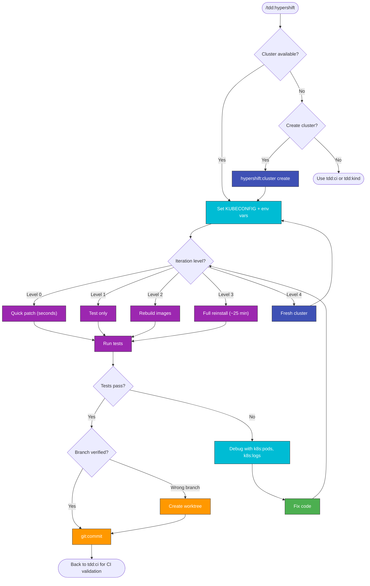

# TDD-HyperShift Workflow

Test-driven development workflow using hypershift-full-test.sh phases for Kagenti development.

## Why TDD-HyperShift?

**Full cluster access** enables real-time debugging that CI cannot provide:

| Advantage | How |
|-----------|-----|
| **Inspect pod state** | `k8s:pods`, `k8s:logs`, `k8s:health` |
| **Live debugging** | `k8s:live-debugging` |
| **Immediate feedback** | Run tests, check logs, fix, repeat |
| **Access secrets/configs** | `kubectl get secret/configmap` |

**Use `tdd:ci`** when you don't have a cluster or for final CI validation.

## Cluster Availability

Before starting, check for an existing HyperShift cluster:

```bash
ls ~/clusters/hcp/kagenti-hypershift-custom-*/auth/kubeconfig 2>/dev/null
```

If no cluster exists, ask the user:

> No HyperShift cluster found. Create one for debugging?
> - Cluster creation takes ~15-20 minutes and requires approval
> - Use `hypershift:cluster` to create
> - Alternatively, use `tdd:ci` or `tdd:kind` which don't need a cluster

If approved, create with (requires user approval):
```bash
./.github/scripts/hypershift/create-cluster.sh <suffix>
```

> **Auto-approved**: All operations on hosted clusters (read + write) are auto-approved.
> Cluster create/destroy targets the management cluster and requires user approval.



> Follow this diagram as the workflow.

## Key Pattern

**Always run from main repo**, pointing to worktree scripts:

```bash
export CLUSTER=mlflow WORKTREE=mlflow-ci MANAGED_BY_TAG=${MANAGED_BY_TAG:-kagenti-hypershift-custom}
KUBECONFIG=~/clusters/hcp/$MANAGED_BY_TAG-$CLUSTER/auth/kubeconfig \
  .worktrees/$WORKTREE/.github/scripts/local-setup/hypershift-full-test.sh $CLUSTER \
  --include-test [--pytest-filter "filter"]
```

## TDD Iterations (fastest first)

**Prefer quick targeted changes over full reinstall.** Full reinstall takes ~25 min. Targeted changes take ~30 seconds.

### Iteration 0: Quick patch (seconds)

Patch a ConfigMap, restart a pod, or update a deployment directly:

```bash
KUBECONFIG=~/clusters/hcp/$MANAGED_BY_TAG-$CLUSTER/auth/kubeconfig kubectl rollout restart deployment/otel-collector -n kagenti-system
```

```bash
KUBECONFIG=~/clusters/hcp/$MANAGED_BY_TAG-$CLUSTER/auth/kubeconfig kubectl rollout restart deployment/mlflow -n kagenti-system
```

```bash
KUBECONFIG=~/clusters/hcp/$MANAGED_BY_TAG-$CLUSTER/auth/kubeconfig kubectl delete pod -n team1 -l app.kubernetes.io/name=weather-service
```

### Iteration 1: Test only (auto-approved)

```bash
KUBECONFIG=~/clusters/hcp/$MANAGED_BY_TAG-$CLUSTER/auth/kubeconfig \
  .worktrees/$WORKTREE/.github/scripts/local-setup/hypershift-full-test.sh $CLUSTER \
  --include-test --pytest-filter "test_agent or test_mlflow"
```

### Iteration 2: Rebuild agent images (minutes)

Use OpenShift Builds or Shipwright to rebuild images from dependency repos directly on the cluster:

```bash
KUBECONFIG=~/clusters/hcp/$MANAGED_BY_TAG-$CLUSTER/auth/kubeconfig oc start-build weather-tool -n team1 --follow
```

Or trigger a Shipwright BuildRun for the weather-service:

```bash
KUBECONFIG=~/clusters/hcp/$MANAGED_BY_TAG-$CLUSTER/auth/kubeconfig kubectl create -f .worktrees/$WORKTREE/kagenti/examples/agents/weather_agent_shipwright_buildrun.yaml
```

After rebuild, delete the pod to pick up the new image:

```bash
KUBECONFIG=~/clusters/hcp/$MANAGED_BY_TAG-$CLUSTER/auth/kubeconfig kubectl delete pod -n team1 -l app.kubernetes.io/name=weather-service
```

### Iteration 3: Full reinstall (last resort, ~25 min)

Only when chart values or CRDs change:

```bash
KUBECONFIG=~/clusters/hcp/$MANAGED_BY_TAG-$CLUSTER/auth/kubeconfig \
  .worktrees/$WORKTREE/.github/scripts/local-setup/hypershift-full-test.sh $CLUSTER \
  --include-uninstall --include-install --include-agents --include-test
```

### Iteration 4: Fresh cluster (requires permission)

Only when the cluster itself is broken:

```bash
./.github/scripts/hypershift/create-cluster.sh $CLUSTER
```

## Building Custom Images from Dependency Repos

When debugging issues in agent-examples or kagenti-extensions, build custom images directly on the cluster using Shipwright/OpenShift Builds:

```bash
# Point build spec to your fork/branch
# Edit the source in weather_agent_shipwright_build_ocp.yaml:
#   url: https://github.com/YourFork/agent-examples
#   revision: your-branch

# Apply and trigger build
KUBECONFIG=~/clusters/hcp/$MANAGED_BY_TAG-$CLUSTER/auth/kubeconfig kubectl apply -f .worktrees/$WORKTREE/kagenti/examples/agents/weather_agent_shipwright_build_ocp.yaml
```

```bash
KUBECONFIG=~/clusters/hcp/$MANAGED_BY_TAG-$CLUSTER/auth/kubeconfig kubectl create -f .worktrees/$WORKTREE/kagenti/examples/agents/weather_agent_shipwright_buildrun.yaml
```

Watch the build:

```bash
KUBECONFIG=~/clusters/hcp/$MANAGED_BY_TAG-$CLUSTER/auth/kubeconfig kubectl get buildrun -n team1 -w
```

After build succeeds, restart the deployment:

```bash
KUBECONFIG=~/clusters/hcp/$MANAGED_BY_TAG-$CLUSTER/auth/kubeconfig kubectl rollout restart deployment/weather-service -n team1
```

## Observability Tests Need Fresh Traces

**Important:** Always run agent tests before observability tests to generate fresh traces:

```bash
# CORRECT: Run agent + observability together
--pytest-filter "test_agent or test_mlflow"

# WRONG: Observability alone may find stale traces
--pytest-filter "test_mlflow"  # May give false positives
```

## Development Loop

```bash
export CLUSTER=mlflow WORKTREE=mlflow-ci MANAGED_BY_TAG=${MANAGED_BY_TAG:-kagenti-hypershift-custom}

# 1. Make changes in worktree
vim .worktrees/$WORKTREE/kagenti/tests/e2e/common/test_mlflow_traces.py

# 2. Run specific tests
KUBECONFIG=~/clusters/hcp/$MANAGED_BY_TAG-$CLUSTER/auth/kubeconfig \
  .worktrees/$WORKTREE/.github/scripts/local-setup/hypershift-full-test.sh $CLUSTER \
  --include-test --pytest-filter "test_agent or TestRootSpanAttributes"

# 3. Fix issues, repeat step 2
```

## Quick kubectl Commands

```bash
export CLUSTER=mlflow MANAGED_BY_TAG=${MANAGED_BY_TAG:-kagenti-hypershift-custom}
export KUBECONFIG=~/clusters/hcp/$MANAGED_BY_TAG-$CLUSTER/auth/kubeconfig

kubectl get pods -n kagenti-system
kubectl logs -n kagenti-system -l app=mlflow --tail=50
kubectl get pods -n team1
```

## Iteration Tracking

Keep a log of test iterations in a TODO file for debugging:

```markdown
## Iteration Log

| DateTime | Cluster | mlflow-ci Commit | agent-examples Commit | Pass | Fail | Skip | Notes |
|----------|---------|------------------|----------------------|------|------|------|-------|
| 2026-02-05 14:30:15 | mlfl1 | 8dbaee15 | 3524675 | 33 | 2 | 8 | Baseline |
| 2026-02-05 15:45:22 | mlfl1 | abc1234 | def5678 | 35 | 0 | 8 | Fixed X |
```

**Create iteration tracker:**
```bash
# Add to TODO file after each test run
echo "| $(date '+%Y-%m-%d %H:%M:%S') | $CLUSTER | $(git -C .worktrees/$WORKTREE rev-parse --short HEAD) | $(git -C .worktrees/agent-examples rev-parse --short HEAD) | PASS | FAIL | SKIP | Notes |" >> .worktrees/$WORKTREE/TODO_ITERATION_LOG.md
```

## When Done: Back to CI

Once the issue is fixed with real-time debugging, return to `tdd:ci` for final CI validation:

1. Commit the fix
2. Push to PR
3. Use `tdd:ci` to verify CI passes

## UI Tests

For Playwright UI tests (login, navigation, agent chat), invoke `test:ui`.
Set `KAGENTI_UI_URL` to the OpenShift route and run against the live cluster.

## Related Skills

- **`test:ui`** - **Write and run Playwright UI tests**
- **`tdd:ci`** - CI-driven TDD (escalates here after 3+ failures)
- **`local:full-test`** - Complete testing reference
- **`k8s:live-debugging`** - Debug issues on running cluster
- **`k8s:pods`** - Debug pod issues
- **`k8s:logs`** - Query component logs
- **`hypershift:cluster`** - Create/destroy clusters
- `test:run-hypershift` - Run tests on HyperShift
- `test:review` - Review test quality
- `git:commit` - Commit format
