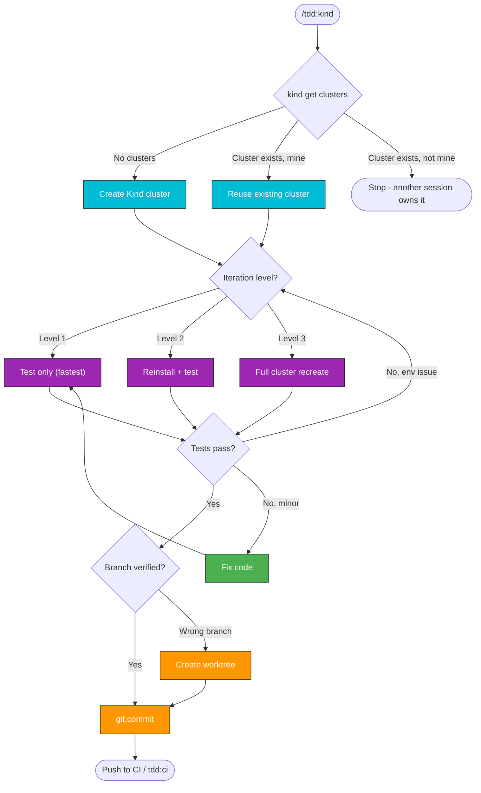

# TDD-Kind Workflow

Test-driven development workflow using a local Kind cluster for fast iteration.

## When to Use

- Reproducing CI Kind failures locally
- Testing changes before pushing to CI
- Fast feedback loop without HyperShift cluster overhead
- Debugging Ollama/agent issues in Kind environment

> **Auto-approved**: All operations on Kind clusters (read + write, deploy, test) are auto-approved.
> Cluster create/destroy is also auto-approved for Kind.

## Cluster Concurrency Guard

**Only one Kind cluster at a time.** Before any cluster operation, check:

```bash
kind get clusters 2>/dev/null
```

- **No clusters** → proceed normally (create cluster)
- **Cluster exists AND this session owns it** → reuse it (skip creation, run tests)
- **Cluster exists AND another session owns it** → **STOP**. Do not proceed. Inform the user:
  > A Kind cluster is already running (likely from another session).
  > Options: (a) wait for that session to finish, (b) switch to `tdd:ci` for CI-only iteration, (c) explicitly destroy the existing cluster first with `kind delete cluster --name kagenti`.

To determine ownership: if the current task list or conversation created this cluster, it's yours. Otherwise assume another session owns it.



> Follow this diagram as the workflow.

## Key Principle

**Match CI exactly**: Kind tests must use the same packages as CI to avoid version mismatches. CI uses `pip install` (gets latest versions), local uses `uv` (locked versions). Always verify package versions match.

## Quick Start

```bash
# Create Kind cluster and deploy (first time)
./.github/scripts/local-setup/kind-full-test.sh --skip-cluster-destroy

# Run tests only (cluster already exists)
./.github/scripts/local-setup/kind-full-test.sh --include-test

# Run specific tests
./.github/scripts/local-setup/kind-full-test.sh --include-test --pytest-filter "test_agent"

# Run from worktree
.worktrees/my-feature/.github/scripts/local-setup/kind-full-test.sh --include-test
```

## TDD Iterations

### Iteration 1: Test only (fastest)

```bash
./.github/scripts/local-setup/kind-full-test.sh --include-test
```

### Iteration 2: Reinstall + test

```bash
./.github/scripts/local-setup/kind-full-test.sh \
  --include-uninstall --include-install --include-agents --include-test
```

### Iteration 3: Full cluster recreate

```bash
./.github/scripts/local-setup/kind-full-test.sh --skip-cluster-destroy
```

## Reproducing CI Failures

### Step 1: Check CI package versions

```bash
# Get the CI run logs and find installed versions
gh run view <run-id> --log 2>/dev/null | grep "Successfully installed" | tr ',' '\n' | sort
```

### Step 2: Compare with local

```bash
# Check local locked version
grep '<package-name>' uv.lock | head -3

# Check what uv uses
uv run pip show <package-name> | grep Version
```

### Step 3: Pin if mismatched

If CI has a different version than local:
```bash
# Option A: Pin in pyproject.toml
# Change: "a2a-sdk>=0.2.5" to "a2a-sdk==0.3.19"

# Option B: Update uv.lock to match CI
uv lock --upgrade-package a2a-sdk
```

### Step 4: Run locally like CI

```bash
# Run with pip (like CI) instead of uv to reproduce exactly
python -m venv /tmp/ci-test-env
source /tmp/ci-test-env/bin/activate
pip install -e ".[test]"
pytest kagenti/tests/e2e/common -v --timeout=300
deactivate
```

## Kind Environment Details

| Component | Value |
|-----------|-------|
| LLM | Ollama `qwen2.5:3b` via dockerhost:11434 |
| Agent URL | http://localhost:8000 (port-forward) |
| Backend URL | http://localhost:8002 (port-forward) |
| Keycloak | http://keycloak.localtest.me:8080 |
| MLflow | Disabled in Kind (dev_values.yaml) |
| Phoenix | http://phoenix.localtest.me:8080 |
| Kiali | http://kiali.localtest.me:8080 |

## Show Services

```bash
./.github/scripts/local-setup/show-services.sh         # compact
./.github/scripts/local-setup/show-services.sh --verbose # full details
```

## Debugging Agent Issues

```bash
# Check agent pod
kubectl get pods -n team1

# Agent logs
kubectl logs -n team1 -l app.kubernetes.io/name=weather-service --tail=50

# Check Ollama
curl http://localhost:11434/api/tags  # list models
curl http://localhost:11434/api/generate -d '{"model":"qwen2.5:3b","prompt":"hi"}'

# Check port-forward
ps aux | grep port-forward
```

## Common Issues

### Agent empty response
- Check Ollama model is loaded: `curl http://localhost:11434/api/tags`
- Check model supports tool calling (need >= 3B for qwen2.5)
- Check agent logs for LLM errors

### Package version mismatch with CI
- CI uses `pip install` (latest versions)
- Local uses `uv` (locked versions)
- Pin versions in pyproject.toml or update uv.lock

### MLflow tests skipped
- MLflow is disabled in Kind (dev_values.yaml)
- MLflow trace tests are OpenShift-only

## UI Tests

For Playwright UI tests (login, navigation, agent chat), invoke `test:ui`.
Tests run against the Vite dev server which proxies `/api` to `localhost:8000` (backend port-forward).

## Related Skills

- **`test:ui`** - **Write and run Playwright UI tests**
- **`tdd:ci`** - CI-driven TDD (wait for CI results)
- **`tdd:hypershift`** - TDD with HyperShift cluster
- **`kind:cluster`** - Create/destroy Kind clusters
- **`k8s:live-debugging`** - Debug on running cluster
- `test:run-kind` - Run tests on Kind
- `test:review` - Review test quality
- `git:commit` - Commit format
