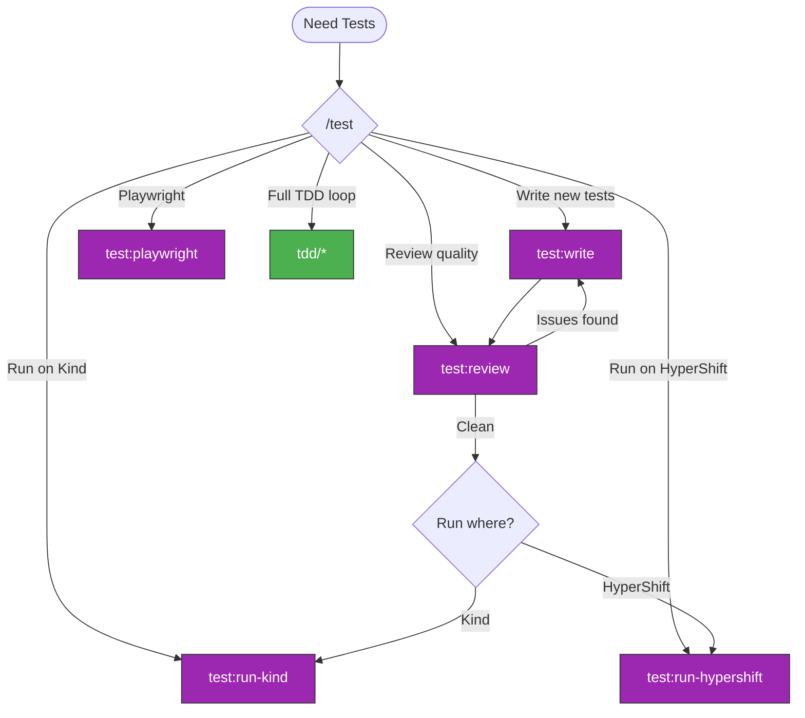

> Follow this diagram as the workflow.

# Test Skills

Test management for Kagenti: write, review, and run tests.

## Auto-Select Sub-Skill

```
What do you need?
    │
    ├─ Write pytest E2E/unit tests
    │   → test:write
    │
    ├─ Write Playwright demo tests
    │   → test:playwright
    │
    ├─ Review existing tests for quality
    │   → test:review
    │
    ├─ Run tests on Kind cluster
    │   → test:run-kind
    │
    ├─ Run tests on HyperShift cluster
    │   → test:run-hypershift
    │
    └─ Full TDD loop (write + run + iterate)
        → tdd (which links back here for test quality)
```

## Available Skills

| Skill | Purpose | Framework |
|-------|---------|-----------|
| `test:write` | Write pytest E2E/unit tests | pytest |
| `test:playwright` | Write Playwright demo tests (markStep, assertions, narration) | Playwright |
| `test:review` | Review test quality, catch bad patterns | Any |
| `test:run-kind` | Run tests on Kind cluster | pytest |
| `test:run-hypershift` | Run tests on HyperShift cluster | pytest |

## Test Workflow in TDD

```
tdd:* → Write/fix code → test:write (if new tests needed)
                        → test:review (verify test quality)
                        → test:run-kind or test:run-hypershift
                        → Pass? → git:commit → git:rebase → Push
```

## Related Skills

- `tdd:ci` - CI-driven TDD loop
- `tdd:kind` - TDD on Kind
- `tdd:hypershift` - TDD on HyperShift
- `git:commit` - Commit after tests pass
