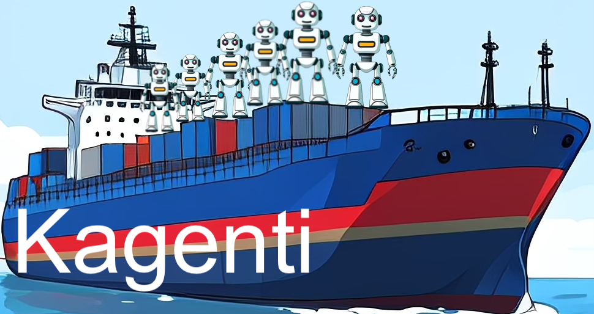

# Kagenti

[](LICENSE)


**Kagenti** is a cloud-native middleware providing a *framework-neutral*, *scalable*, and *secure* platform for deploying and orchestrating AI agents through standardized agent communication protocols (A2A, MCP).

| Included Services: |  |
|--------------------|--------|
| - Zero-Trust Security Architecture<br>- Authentication and Authorization<br>- Trusted workload identity (SPIRE)<br>- Deployment and Configuration<br>- Scaling and Fault-tolerance<br>- Discovery of agents and tools<br>- State Persistence |  |

## Why Kagenti?

Despite the extensive variety of frameworks available for developing agent-based applications (LangGraph, CrewAI, AG2, etc.), there is a distinct lack of standardized methods for deploying and operating agent code in production environments. Agents are adept at reasoning, planning, and interacting with tools, but their full potential is often limited by:

- **Deployment Complexity** - Each framework requires custom deployment scripts and infrastructure
- **Security Gaps** - No standardized approach to authentication, authorization, and workload identity
- **Protocol Fragmentation** - Agents and tools use different communication patterns
- **Operational Overhead** - Scaling, monitoring, and lifecycle management require custom solutions

Kagenti addresses these challenges by enhancing existing agent frameworks with production-ready, framework-neutral infrastructure.

## Architecture

The goal of Kagenti is to provide a pluggable agentic platform blueprint. Key functionalities are currently organized into four key pillars:
1. Lifecycle Orchestration
2. Networking
3. Security
4. Observability

Under each of these pillars are logical components that support the workload runtime.

```
┌─────────────────────────────────────────────────────────────────────────────────────┐
│                                    KAGENTI PLATFORM                                 │
├─────────────────────────────────────────────────────────────────────────────────────┤
│                                                                                     │
│  ┌───────────────────────────────────────────────────────────────────────────────┐  │
│  │                              KAGENTI UI*                                      │  │
│  │      (Dashboard: Deploy, Test, Monitor Agents & Tools + Backend API)          │  │
│  └───────────────────────────────────────────────────────────────────────────────┘  │
│                                        │                                            │
│                                        ▼                                            │
│  ┌───────────────────────────────────────────────────────────────────────────────┐  │
│  │                          WORKLOAD RUNTIME                                     │  │
│  │      ┌─────────────────────────────┐    ┌─────────────────────────────┐       │  │
│  │      │          AGENTS             │    │           TOOLS             │       │  │
│  │      │  (A2A - LangGraph, CrewAI   │    │   (MCP Protocol Servers)    │       │  │
│  │      │   Marvin, Autogen, etc.)    │    │                             │       │  │
│  │      └─────────────────────────────┘    └─────────────────────────────┘       │  │
│  └───────────────────────────────────────────────────────────────────────────────┘  │
│                                        │                                            │
├────────────────────────────────────────┼────────────────────────────────────────────┤
│                                PLATFORM PILLARS                                     │
│                                        │                                            │
│  ┌──────────────────┐ ┌──────────────────┐ ┌──────────────────┐ ┌────────────────┐  │
│  │    LIFECYCLE     │ │    NETWORKING    │ │     SECURITY     │ │  OBSERVABILITY │  │
│  │  ORCHESTRATION   │ │                  │ │                  │ │                │  │
│  ├──────────────────┤ ├──────────────────┤ ├──────────────────┤ ├────────────────┤  │
│  │                  │ │                  │ │                  │ │                │  │
│  │   Agents/Tools   │ │   Tool Routing   │ │  Identity & Auth │ │    Tracing     │  │
│  │   Lifecycle &    │ │    & Policy      │ │   (AuthBridge*)  │ │(MLflow,Langflow│  │
│  │   Discovery      │ │  (MCP Gateway*)  │ │                  │ │ Phoenix)       │  │
│  │ (k8s workloads,  │ │                  │ │                  │ │                │  │
│  │ labels,          │ ├──────────────────┤ ├──────────────────┤ ├────────────────┤  │
│  │  AgentCard CRD*) │ │                  │ │                  │ │                │  │
│  │                  │ │  Service Mesh    │ │    OAuth/OIDC    │ │   Network      │  │
│  │                  │ │ (Istio/Ambient)  │ │    (Keycloak)    │ │ Visualization  │  │
│  │                  │ │                  │ │                  │ │   (Kiali)│     │  │
│  │   Container      │ ├──────────────────┤ ├──────────────────┤ │                │  │
│  │     Builds       │ │                  │ │                  │ │                │  │
│  │  (Shipwright)    │ │ Ingress/Routing  │ │ Workload Identity│ │                │  │
│  │                  │ │ (Gateway API)    │ │ (SPIFFE/SPIRE)   │ │                │  │
│  │                  │ │                  │ │                  │ │                │  │
│  └──────────────────┘ └──────────────────┘ └──────────────────┘ └────────────────┘  │
│                                                                                     │
├─────────────────────────────────────────────────────────────────────────────────────┤
│                               KUBERNETES / OPENSHIFT                                │
└─────────────────────────────────────────────────────────────────────────────────────┘
* Built by Kagenti 
```

## Core Components

Kagenti provides a set of components and assets that make it easier to manage AI agents and tools and integrate their fine-grained authorization into modern cloud-native environments.

| Component | Description |
|-----------|-------------|
| **[Kagenti UI](./kagenti/ui-v2/)** | Dashboard for deploying agents/tools as Kubernetes Deployments, interactive testing, and monitoring |
| **[Identity & Auth Bridge](./docs/identity-guide.md)** | Identity pattern assets that capture common authorization scenarios and provide reusable building blocks for implementing consistent authorization across services |
| **[Agent Lifecycle Operator](https://github.com/kagenti/kagenti-extensions/tree/main/kagenti-webhook)** | Kubernetes admission webhook for building agents from source, managing lifecycle, and coordinating platform services |
| **[MCP Gateway](https://github.com/Kuadrant/mcp-gateway/blob/main/README.md)** | Unified gateway for Model Context Protocol (MCP) servers and tools. It acts as the entry point for policy enforcement, handling requests and routing them through the appropriate authorization patterns |
| **[Plugins adapter](https://github.com/kagenti/plugins-adapter)** | Adapter for security and safety plugins for Envoy-based gateways |

## Quick Start

### Prerequisites

- Python ≥3.9 with [uv](https://docs.astral.sh/uv/getting-started/installation) installed
- Docker Desktop, Rancher Desktop, or Podman (16GB RAM, 4 cores recommended)
- [Kind](https://kind.sigs.k8s.io), [kubectl](https://kubernetes.io/docs/tasks/tools/), [Helm](https://helm.sh/docs/intro/install/)
- [Ollama](https://ollama.com/download) for local LLM inference

### Install

```bash
# Clone the repository
git clone https://github.com/kagenti/kagenti.git
cd kagenti

# Copy and configure secrets
cp deployments/envs/secret_values.yaml.example deployments/envs/.secret_values.yaml
# Edit deployments/envs/.secret_values.yaml with your values

# Run the Ansible-based installer
deployments/ansible/run-install.sh --env dev
```

Use `deployments/ansible/run-install.sh --help` for options. For more detailed installation instructions including OpenShift refer to [Installation Guide](./docs/install.md).

### Access the UI

```bash
open http://kagenti-ui.localtest.me:8080
# Login: admin / admin
```

From the UI you can:
- Import and deploy A2A agents from any framework
- Deploy MCP tools directly from source
- Test agents interactively
- Monitor traces and network traffic

## Documentation

| Topic | Link |
|-------|------|
| **Installation** | [Installation Guide](./docs/install.md) (Kind & OpenShift) |
| **Components** | [Component Details](./docs/components.md) |
| **Demos & Tutorials** | [Demo Documentation](./docs/demos/README.md) |
| **Import Your Own Agent** | [New Agent Guide](./docs/new-agent.md) |
| **Import Your Own Tool** | [New Tool Guide](./docs/new-tool.md) |
| **Architecture Details** | [Technical Details](./docs/tech-details.md) |
| **Identity, Security, and Auth Bridge** | [Identity and Auth Bridge](./docs/identity-guide.md) |
| **Developer Guide** | [Contributing](./docs/dev-guide.md) |
| **Troubleshooting** | [Troubleshooting Guide](./docs/troubleshooting.md) |
| **Blog Posts** | [Kagenti Blog](./docs/blogs.md) |

## Supported Protocols

- **[A2A (Agent-to-Agent)](https://google.github.io/A2A)** — Standard protocol for agent communication
- **[MCP (Model Context Protocol)](https://modelcontextprotocol.io)** — Protocol for tool/server integration

## Contributing

We welcome contributions! See [CONTRIBUTING.md](./CONTRIBUTING.md) for guidelines.

## License

[Apache 2.0](./LICENSE)

## QR Code for Kagenti.io

This QR Code links to <http://kagenti.io>


