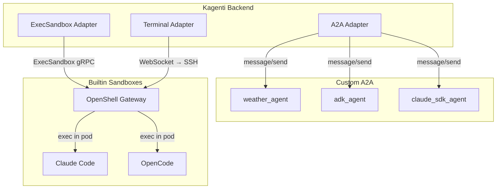

# Agent Integration Catalog

> Back to [main doc](../openshell-integration.md)

This directory contains one document per agent type/framework describing its
capabilities, Kagenti integration points, and testing status.

## Agent Classification

| Category | Description | Examples |
|----------|------------|---------|
| **Custom A2A** | Agents built with specific SDKs, deployed as K8s Deployments, accessed via A2A JSON-RPC | weather, ADK, Claude SDK |
| **OpenShell Builtin** | Pre-installed CLI agents in the OpenShell base sandbox image, accessed via SSH/exec | Claude Code, OpenCode, Codex, Copilot |
| **Future** | Agents and frameworks planned for integration | LangGraph, CrewAI, AutoGen, Cursor |

## Current Agents

### Deployed in PoC (tested)

| Agent Doc | Type | Framework | LLM | Supervisor | Status |
|-----------|------|-----------|-----|------------|--------|
| [weather-agent.md](weather-agent.md) | Custom A2A | LangGraph | No | No | Deployed, tested |
| [adk-agent.md](adk-agent.md) | Custom A2A | Google ADK | LiteMaaS | No | Deployed, tested |
| [claude-sdk-agent.md](claude-sdk-agent.md) | Custom A2A | Anthropic SDK | LiteMaaS | No | Deployed, tested |
| [weather-supervised.md](weather-supervised.md) | Custom A2A | LangGraph | No | Yes | Deployed, tested |
| [openshell-claude.md](openshell-claude.md) | Builtin | Claude Code CLI | Anthropic | Yes | Sandbox CR tested |
| [openshell-opencode.md](openshell-opencode.md) | Builtin | OpenCode CLI | OpenAI-compat | Yes | Sandbox CR tested |

### Future agents (planned — docs not yet written)

| Agent | Type | Framework | Notes |
|-------|------|-----------|-------|
| openshell_codex | Builtin | OpenAI Codex | Needs real OpenAI key |
| openshell_copilot | Builtin | GitHub Copilot | Needs GitHub subscription |
| langgraph_complex | Custom A2A | LangGraph (multi-node) | Multi-node graph agents |
| crewai_crew | Custom A2A | CrewAI | Multi-agent crew orchestration |

## Standard Document Format

Every agent doc MUST follow this structure. This ensures consistency and makes
the capability matrix scannable across agents.

```markdown
# {Agent Name}

> **Type:** Custom A2A | Builtin Sandbox
> **Framework:** {framework name}
> **LLM:** {provider} | None
> **Supervisor:** Yes | No
> **Status:** Deployed | Planned | Blocked

## 1. Overview
One paragraph: what the agent does and why it exists.

## 2. Architecture
Mermaid diagram showing: agent pod → LLM → tools/APIs.

## 3. Files
List of deployment files with paths.

## 4. Deployment
Commands to build, deploy, and configure on Kind and OCP.

## 5. Capabilities
Table of agent capabilities with status:

| Capability | Supported | Notes |
|-----------|-----------|-------|
| A2A protocol | Yes/No | |
| Multi-turn context | Yes/No/Partial | How context is managed |
| Tool calling | Yes/No | Which tools |
| Subagent delegation | Yes/No | |
| Memory/knowledge | Yes/No | What persists |
| Skill execution | Native/Prompt/No | How kagenti skills are loaded |
| HITL approval | L0-L3 | Which HITL level |

## 6. Kagenti Integration
How this agent connects to Kagenti platform services:

### 6.1 Communication Adapter
How the Kagenti backend talks to this agent:
- A2A JSON-RPC (custom agents)
- ExecSandbox gRPC (builtin sandboxes)
- kubectl exec (fallback)

### 6.2 Session Management
How conversation history is stored and resumed:
- Backend PostgreSQL (A2A agents)
- Workspace PVC (builtin sandboxes)
- Agent-side storage (if any)

### 6.3 Observable Events
What data the agent produces that Kagenti can display:

| Event | Source | Kagenti UI Component | Phase |
|-------|--------|---------------------|-------|
| LLM request/response | Agent SDK | PromptInspector | Phase 2 |
| Tool call result | Agent framework | EventsPanel | Phase 2 |
| Subagent dispatch | Agent framework | SubSessionsPanel | Phase 3 |
| File modification | Workspace PVC | FileBrowser | Phase 2 |
| Budget usage | LiteLLM/Budget Proxy | LlmUsagePanel | Phase 2 |
| HITL approval request | Supervisor OPA | HitlApprovalCard | Phase 3 |

### 6.4 FileBrowser Integration
What workspace files the agent creates that FileBrowser can display:

| Path | Content | Browsable |
|------|---------|-----------|
| /workspace/.claude/ | Session transcripts | Yes |
| /workspace/project/ | Agent-modified code | Yes |

## 7. LLM Compatibility
Which LLM providers work with this agent:

| Provider | Protocol | Works? | Notes |
|----------|----------|--------|-------|
| LiteMaaS | OpenAI-compat | Yes/No | |
| Anthropic API | Claude messages | Yes/No | |
| Ollama | OpenAI-compat | Yes/No | |

## 8. Policy Configuration
OPA/Rego policy for this agent:

| Policy | Value | Notes |
|--------|-------|-------|
| Filesystem read-only | /usr, /etc | |
| Filesystem read-write | /tmp, /app | |
| Network egress | *.svc.cluster.local | |

## 9. Testing Status
Which E2E tests cover this agent:

| Test File | Tests | Pass | Skip | Fail |
|-----------|-------|------|------|------|
| test_02_a2a_connectivity | 2 | 2 | 0 | 0 |
| test_07_skill_execution | 3 | 1 | 2 | 0 |
```
```

## Capability Comparison Matrix

Quick cross-agent comparison of key capabilities:

| Capability | weather | adk | claude_sdk | supervised | openshell_claude | openshell_opencode |
|-----------|---------|-----|------------|------------|-----------------|-------------------|
| **A2A protocol** | Yes | Yes | Yes | Yes (exec) | No (SSH/exec) | No (SSH/exec) |
| **LLM calls** | No | Yes | Yes | No | Yes | Yes |
| **Tool calling** | MCP | ADK tools | Prompt | MCP | Native | Native |
| **Multi-turn** | Stateless | contextId | Stateless | Stateless | Terminal session | Terminal session |
| **Subagents** | No | No | No | No | Yes (native) | No |
| **Memory** | No | In-memory | No | No | Disk (.claude/) | Disk (.opencode/) |
| **Skill execution** | No | Via prompt | Via prompt | No | Native (.claude/skills/) | Via prompt |
| **HITL** | N/A | L0 | L0 | L0 (OPA) | L0-L3 | L0-L3 |
| **Workspace PVC** | No | No | No | No | Yes | Yes |
| **FileBrowser** | N/A | N/A | N/A | N/A | .claude/ sessions | .opencode/ sessions |
| **OTel traces** | No | Partial | Partial | No | No | No |
| **Budget tracking** | N/A | LiteLLM | LiteLLM | N/A | Gateway | Gateway |

## A2A Adapter Architecture

For agents that don't natively speak A2A, Kagenti needs an adapter:



| Agent Type | Adapter | Protocol | Implemented? |
|-----------|---------|----------|-------------|
| Custom A2A | A2A Adapter | JSON-RPC over HTTP | Yes (current) |
| Builtin sandbox | ExecSandbox Adapter | gRPC streaming | Phase 2 |
| Interactive sandbox | Terminal Adapter | WebSocket → SSH | Phase 3 |
