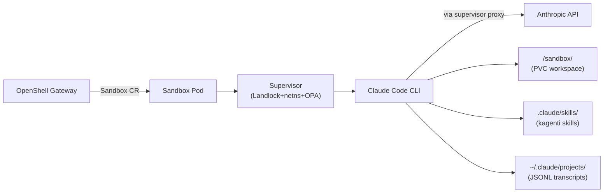
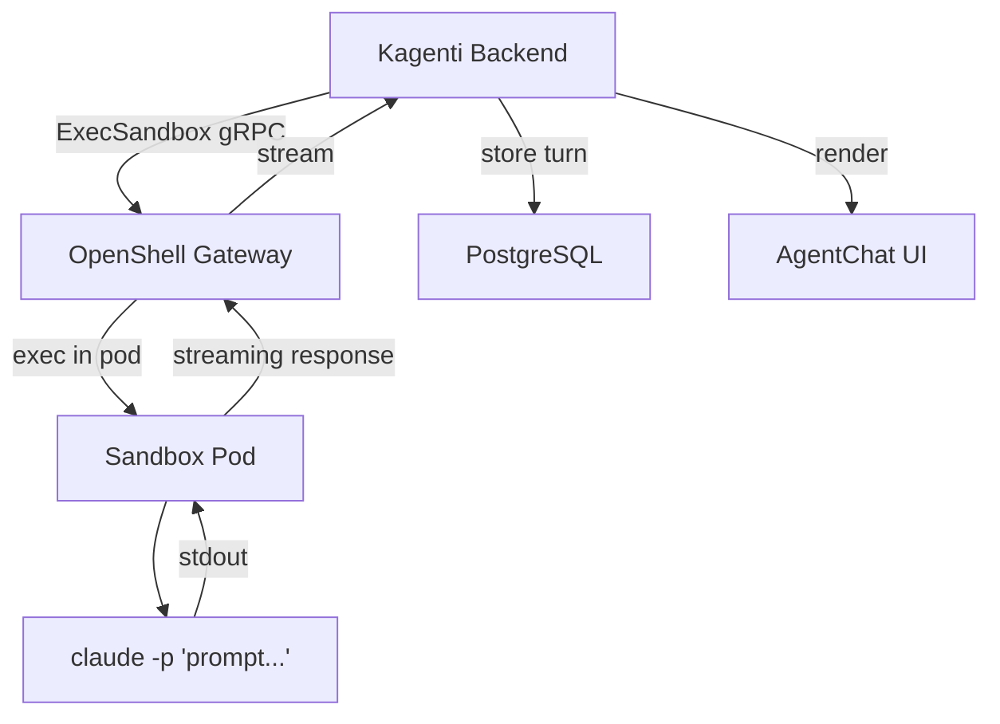

# OpenShell Claude Code Sandbox

> Back to [agent catalog](README.md) | [main doc](../openshell-integration.md)

> **Type:** Builtin Sandbox
> **Framework:** Claude Code CLI (Anthropic)
> **LLM:** Anthropic API (requires real API key)
> **Supervisor:** Yes (all protection layers active)
> **Sandbox Model:** Tier 1 (OpenShell Sandbox CR, full supervisor)
> **Status:** Sandbox CR tested, LLM execution blocked (needs Anthropic key)

## 1. Overview

Pre-installed Claude Code CLI in the OpenShell base sandbox image. Claude Code
is the **highest-value integration target** because it natively reads
`.claude/skills/` — no prompt injection needed for kagenti skill execution.
Session transcripts are stored as JSONL files on disk, enabling rich session
browsing via the Kagenti FileBrowser.

## 2. Architecture



## 3. Files

```
# No custom files — uses upstream OpenShell base image
# Image: ghcr.io/nvidia/openshell-community/sandboxes/base:latest (~1.1GB)
# CRD: agents.x-k8s.io/v1alpha1 Sandbox
```

## 4. Deployment

```bash
kubectl apply -f - <<EOF
apiVersion: agents.x-k8s.io/v1alpha1
kind: Sandbox
metadata:
  name: claude-sandbox
  namespace: team1
spec:
  podTemplate:
    spec:
      containers:
      - name: sandbox
        image: ghcr.io/nvidia/openshell-community/sandboxes/base:latest
        volumeMounts:
        - name: workspace
          mountPath: /sandbox
      volumes:
      - name: workspace
        persistentVolumeClaim:
          claimName: claude-workspace-pvc
EOF
```

### LLM Provider Configuration
```bash
kubectl set env statefulset/openshell-gateway -n openshell-system \
  ANTHROPIC_API_KEY=<real-anthropic-key>
```

## 5. Capabilities

| Capability | Supported | Notes |
|-----------|-----------|-------|
| A2A protocol | **No** | CLI agent, accessed via SSH or ExecSandbox gRPC |
| Multi-turn context | **Yes** | Terminal session maintains full conversation context |
| Tool calling | **Yes** | Native: file edit, bash, web fetch, LSP, MCP servers |
| Subagent delegation | **Yes** | Native subagent dispatch (Task system) |
| Memory/knowledge | **Yes** | `.claude/agent-memory/` persistent across sessions |
| Skill execution | **Native** | Reads `.claude/skills/` directly — best skill support |
| HITL approval | **L0-L3** | Permission prompts for destructive actions |

### Claude Code-Specific Features

| Feature | Storage | Format | Kagenti Exposure |
|---------|---------|--------|-----------------|
| **Session transcripts** | `~/.claude/projects/{uuid}.jsonl` | JSONL (append-only) | FileBrowser + SessionSidebar |
| **Task system** | `~/.claude/tasks/` | JSON DAGs | SubSessionsPanel |
| **Agent memory** | `.claude/agent-memory/*/MEMORY.md` | Markdown | FileBrowser (read-only) |
| **Skills** | `.claude/skills/*/SKILL.md` | Markdown | Skill catalog |
| **Settings** | `.claude/settings.json` | JSON | Config panel |
| **Keybindings** | `.claude/keybindings.json` | JSON | N/A (terminal-only) |
| **Tool calls** | Embedded in JSONL transcripts | Part objects | AgentLoopCard |
| **Thinking blocks** | Embedded in JSONL transcripts | Content blocks | LoopDetail (collapsible) |

## 6. Kagenti Integration

### 6.1 Communication Adapter
**ExecSandbox gRPC** (Phase 2) — Kagenti backend calls `ExecSandbox` RPC on the
OpenShell gateway to send prompts to Claude Code running in the sandbox.

Alternative: **Terminal Adapter** (Phase 3) — WebSocket → SSH tunnel for
interactive browser-based terminal via xterm.js.

### 6.2 Session Management

| Data | Storage | Survives Restart? | Kagenti Access |
|------|---------|-------------------|---------------|
| Conversation transcript | `/sandbox/.claude/projects/*.jsonl` | Yes (PVC) | FileBrowser |
| Task list | `/sandbox/.claude/tasks/` | Yes (PVC) | SubSessionsPanel |
| Agent memory | `/sandbox/.claude/agent-memory/` | Yes (PVC) | FileBrowser |
| In-memory context | Process memory | No (lost on restart) | N/A |
| Workspace files | `/sandbox/project/` | Yes (PVC) | FileBrowser |

### 6.3 Observable Events

| Event | Source | Kagenti UI Component | Phase |
|-------|--------|---------------------|-------|
| Session transcript | JSONL on PVC | FileBrowser, SessionSidebar | Phase 2 |
| Task creation/completion | `~/.claude/tasks/` | SubSessionsPanel | Phase 2 |
| Subagent dispatch | Task metadata | SubSessionsPanel | Phase 2 |
| Tool calls (bash, edit) | JSONL content blocks | AgentLoopCard, EventsPanel | Phase 2 |
| Thinking blocks | JSONL content blocks | LoopDetail (collapsible) | Phase 2 |
| File modifications | Workspace PVC diff | FileBrowser | Phase 2 |
| Permission prompts | Hook events | HitlApprovalCard | Phase 3 |
| Memory updates | `.claude/agent-memory/` | FileBrowser | Phase 2 |
| Token usage | Session metadata | LlmUsagePanel | Phase 2 |
| Git operations | `.git/` in workspace | FileBrowser | Phase 2 |

### 6.4 FileBrowser Integration

| Path | Content | Browsable | Preview |
|------|---------|-----------|---------|
| `/sandbox/.claude/projects/*.jsonl` | Session transcripts | Yes | JSONL → Markdown conversion |
| `/sandbox/.claude/tasks/` | Task DAGs | Yes | JSON tree view |
| `/sandbox/.claude/agent-memory/` | Persistent knowledge | Yes | Markdown rendering |
| `/sandbox/.claude/skills/*/SKILL.md` | Kagenti skills | Yes | Markdown rendering |
| `/sandbox/.claude/settings.json` | Permissions config | Yes | JSON syntax highlight |
| `/sandbox/project/` | Agent-modified code | Yes | Full syntax highlight |

## 7. LLM Compatibility

| Provider | Protocol | Works? | Notes |
|----------|----------|--------|-------|
| Anthropic API | Claude messages | **Yes** | Native — required |
| LiteMaaS | OpenAI-compat | **No** | Claude CLI validates model names against Anthropic catalog |
| Ollama | OpenAI-compat | **No** | Same validation issue |
| OpenRouter | Multi-provider | Partial | Can route to Claude models |

**Key limitation:** Claude CLI requires a real Anthropic API key. It cannot
use OpenAI-compatible proxies because it validates the model name against
Anthropic's model catalog at startup.

## 8. Policy Configuration

All supervisor protection layers are active in the base image:

| Layer | Mechanism | Config |
|-------|-----------|--------|
| Filesystem | Landlock LSM | read-only: `/usr`, `/etc`; read-write: `/sandbox`, `/tmp` |
| Network | netns + OPA proxy | HTTP CONNECT via 10.200.0.1:3128 |
| Process | Seccomp BPF | Dangerous syscalls blocked |
| Inference | Credential stripping | Gateway injects Anthropic key |

## 9. Testing Status

| Test File | Tests | Pass | Skip | Notes |
|-----------|-------|------|------|-------|
| test_04_sandbox_lifecycle | 1 | 1 | 0 | Sandbox CR created |
| test_07_skill_execution | 3 | 0 | 3 | Needs real Anthropic key |
| test_10_workspace_persistence | 2 | 1 | 1 | PVC write passes; sandbox creation skips |

## 10. Sandbox Deployment Models

| Model | Supported | Notes |
|-------|-----------|-------|
| Mode 1: Kagenti Deployment | Not applicable | CLI agent, not a standalone service |
| Mode 2: Sandbox CR | **Current** | Gateway creates pod from base image |
| Mode 2 + PVC | **Supported** | Workspace persists via PVC |
| Mode 2 + dtach | **Planned** | Session survives CLI disconnect |

### A2A Adapter Design for Claude Code

Claude Code is not an A2A service. To integrate with the Kagenti backend:



The `-p` flag sends a single prompt to Claude Code in non-interactive mode.
The response streams back via ExecSandbox's `stdout` event stream.

For multi-turn, the backend includes conversation history in the prompt:
```bash
claude -p "Previous conversation: ... \n\nNew message: ..."
```

Claude Code's session files on the PVC provide an alternative history source.
