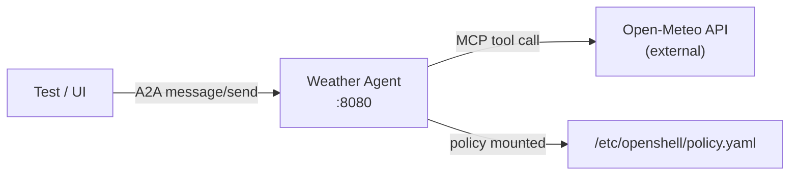

# Weather Agent

> Back to [agent catalog](README.md) | [main doc](../openshell-integration.md)
>
> **Type:** Custom A2A
> **Framework:** LangGraph + MCP
> **LLM:** None (pure tool-calling)
> **Supervisor:** No
> **Sandbox Model:** Tier 3 (plain Deployment, no supervisor)
> **Status:** Deployed, tested (Kind + HyperShift)

## 1. Overview

Stateless weather query agent using the Open-Meteo API via MCP weather-tool.
No LLM required — demonstrates the pure tool-calling A2A pattern where the
agent directly invokes an MCP server without LLM reasoning.

## 2. Architecture



## 3. Files

```
deployments/openshell/agents/weather-agent.yaml  # Deployment + Service + AgentRuntime CR + policy ConfigMap
```

Uses upstream image: `ghcr.io/kagenti/agent-examples/weather_service:latest`

## 4. Deployment

```bash
kubectl apply -f deployments/openshell/agents/weather-agent.yaml
```

No build step required — uses a public pre-built image.

## 5. Capabilities

| Capability | Supported | Notes |
|-----------|-----------|-------|
| A2A protocol | **Yes** | JSON-RPC 2.0 message/send |
| Multi-turn context | No | Stateless — each request independent |
| Tool calling | **Yes** | MCP weather-tool (Open-Meteo API) |
| Subagent delegation | No | Single-purpose agent |
| Memory/knowledge | No | No persistent state |
| Skill execution | No | No LLM to follow skill instructions |
| HITL approval | N/A | No actions requiring approval |

## 6. Kagenti Integration

### 6.1 Communication Adapter
**A2A JSON-RPC** — standard adapter, already implemented. Backend sends
`message/send` requests and parses A2A response artifacts.

### 6.2 Session Management
None — stateless. Backend stores conversation turns in PostgreSQL but the
agent has no memory between requests.

### 6.3 Observable Events

| Event | Source | Kagenti UI Component | Phase |
|-------|--------|---------------------|-------|
| MCP tool call result | Agent response text | EventsPanel | Current |
| Weather data | Response artifacts | AgentChat | Current |

### 6.4 FileBrowser Integration
N/A — no workspace, no persistent files.

## 7. LLM Compatibility

N/A — no LLM used.

## 8. Policy Configuration

```yaml
network_policies:
  internal:
    endpoints:
      - host: "*.svc.cluster.local"
        port: 8080
      - host: "*.svc.cluster.local"
        port: 443
  weather_api:
    endpoints:
      - host: "api.open-meteo.com"
        port: 443
```

## 9. Testing Status

| Test File | Tests | Pass | Skip | Notes |
|-----------|-------|------|------|-------|
| test_02_a2a_connectivity | 2 | 2 | 0 | Hello + agent card |
| test_05_multiturn | 2 | 2 | 0 | Sequential messages + isolation |
| test_07_skill_execution | 3 | 0 | 3 | No LLM (by design) |
| test_01_platform_health | 4 | 4 | 0 | Pod running, ready |
| test_03_credential_security | 3 | 3 | 0 | No hardcoded keys, policy mounted |

## 10. Sandbox Deployment Models

| Model | Supported | Notes |
|-------|-----------|-------|
| Mode 1: Kagenti Deployment | **Current** | Standard Deployment + Service |
| Mode 1 + Supervisor | Possible | Add supervisor as entrypoint (like weather-supervised) |
| Mode 2: Sandbox CR | Not applicable | Not a builtin CLI agent |
