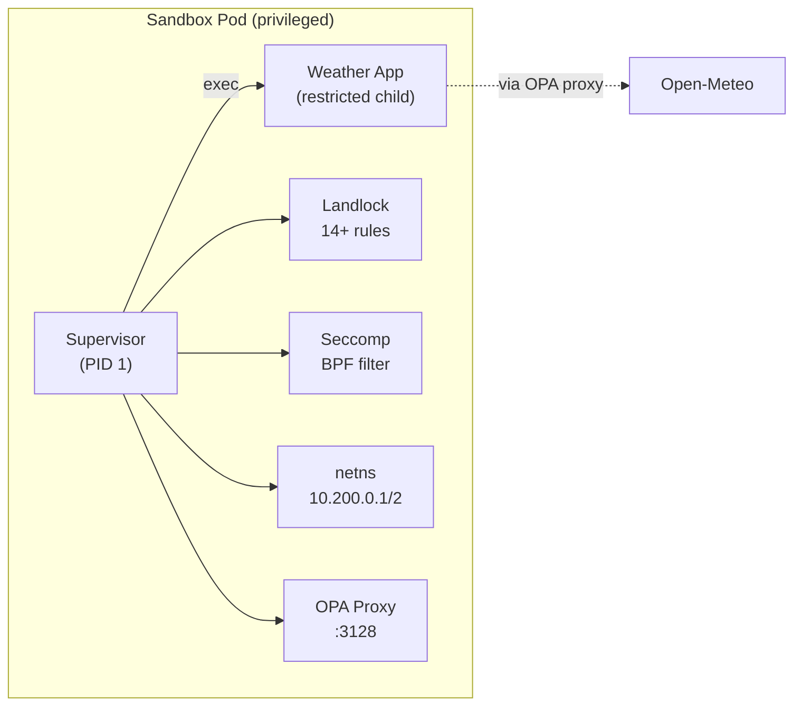
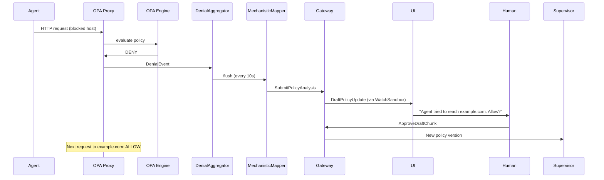

# Weather Agent (Supervised)

> Back to [agent catalog](README.md) | [main doc](../openshell-integration.md)

> **Type:** Custom A2A
> **Framework:** LangGraph + OpenShell Supervisor
> **LLM:** None
> **Supervisor:** Yes (Landlock + seccomp + netns + OPA)
> **Sandbox Model:** Tier 2 (Deployment with supervisor — reference implementation)
> **Status:** Deployed, tested — all 4 protection layers verified

## 1. Overview

Weather agent running inside the OpenShell supervisor. Same weather functionality
as the non-supervised variant, but with all four sandboxing layers active. This
agent proves that the supervisor works on native K8s without modifications.

The supervisor is the container entrypoint — it applies Landlock filesystem
restrictions, seccomp BPF syscall filtering, network namespace isolation (veth
pair), and OPA/Rego policy enforcement before exec-ing the weather app.

## 2. Architecture



## 3. Files

```
deployments/openshell/agents/weather-agent-supervised/
├── Dockerfile            # Multi-stage: supervisor + weather image
├── deployment.yaml       # Deployment (privileged: true, SA: openshell-supervisor)
├── policy-data.yaml      # Filesystem + network policy
└── sandbox-policy.rego   # OPA Rego rules
```

## 4. Deployment

```bash
docker build -t weather-agent-supervised:latest \
  deployments/openshell/agents/weather-agent-supervised/
kind load docker-image weather-agent-supervised:latest --name kagenti
kubectl apply -f deployments/openshell/agents/weather-agent-supervised/deployment.yaml

# OCP: dedicated service account with privileged SCC
kubectl create serviceaccount openshell-supervisor -n team1
oc adm policy add-scc-to-user privileged -z openshell-supervisor -n team1
```

## 5. Capabilities

| Capability | Supported | Notes |
|-----------|-----------|-------|
| A2A protocol | **Yes** (via kubectl exec) | netns blocks port-forward |
| Multi-turn context | No | Stateless |
| Tool calling | **Yes** | MCP weather-tool via OPA proxy |
| Subagent delegation | No | |
| Memory/knowledge | No | |
| Skill execution | No | No LLM |
| HITL approval | **L0 (OPA)** | Unauthorized egress blocked by OPA proxy |

### Supervisor Enforcement (Verified by Tests)

| Layer | Status | Evidence |
|-------|--------|----------|
| Landlock ABI V3 | **Active** | `CONFIG:APPLYING`, `rules_applied:14+` in logs |
| Seccomp BPF | **Active** | Dangerous syscalls blocked |
| Network namespace | **Active** | veth pair 10.200.0.1/10.200.0.2 |
| OPA proxy | **Active** | Listening on 10.200.0.1:3128 |
| TLS MITM | **Active** | Ephemeral CA for L7 inspection |

## 6. Kagenti Integration

### 6.1 Communication Adapter
**kubectl exec** — netns blocks port-forward. Tests use `kubectl exec` to
verify supervisor logs and OPA enforcement. Future: ExecSandbox gRPC adapter
in Kagenti backend.

### 6.2 Observable Events

| Event | Source | Kagenti UI Component | Phase |
|-------|--------|---------------------|-------|
| Landlock setup | Supervisor logs | EventsPanel | Current (logs) |
| OPA deny/allow | Supervisor OPA proxy | HitlApprovalCard | Phase 2 |
| Network namespace | Supervisor logs | EventsPanel | Current |
| Seccomp filter | Pod spec | PodStatusPanel | Current |
| Policy draft chunks | Gateway DenialAggregator | HitlApprovalCard | Phase 3 |

### 6.3 HITL: Policy Advisor Integration

The supervised agent is the **only agent with live HITL** in the PoC:



## 7. Testing Status

| Test File | Tests | Pass | Skip | Notes |
|-----------|-------|------|------|-------|
| test_08_supervisor_enforcement | 12 | 12 | 0 | All protection layers verified |
| test_09_hitl_policy | 3 | 1-2 | 1 | OPA deny/allow tested |
| test_02_a2a_connectivity | 1 | 1 | 0 | kubectl exec hello |
| test_05_multiturn | 2 | 1 | 1 | exec-based multi-turn |

## 8. Sandbox Deployment Models

| Model | Supported | Notes |
|-------|-----------|-------|
| Mode 1 + Supervisor | **Current** | Deployment with supervisor as entrypoint |
| Mode 1 (no supervisor) | Yes | Fallback: plain weather-agent |
| Mode 2: Sandbox CR | Not applicable | Not a builtin CLI agent |
