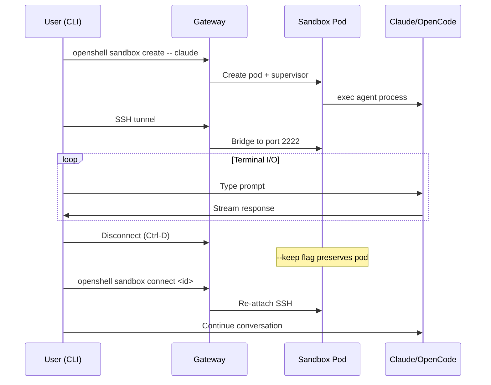
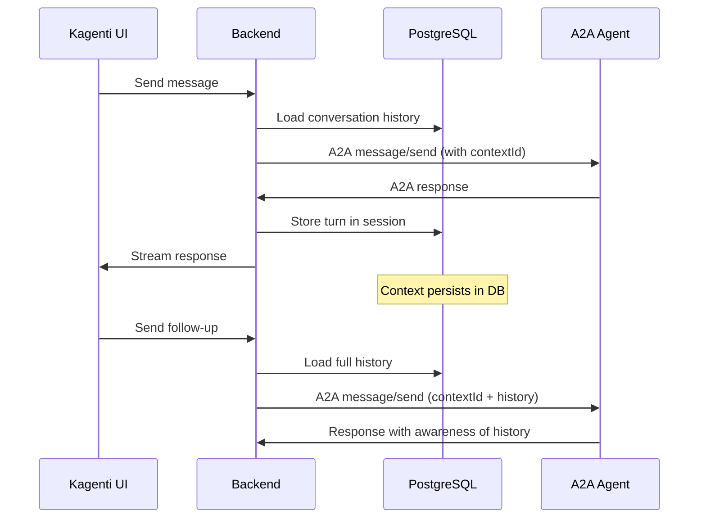
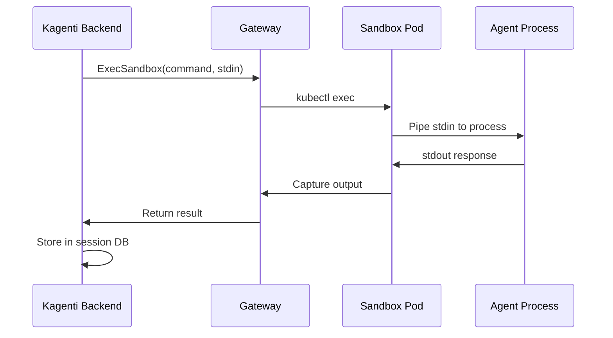
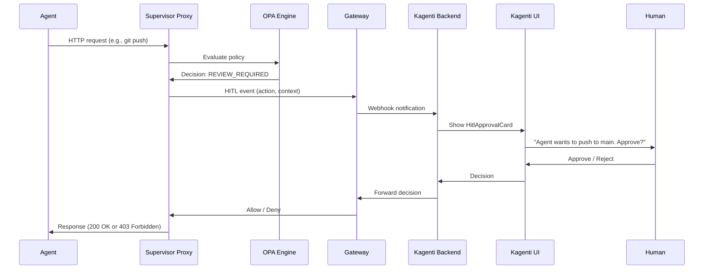

# Conversation Lifecycle and Human-in-the-Loop

> Back to [main doc](openshell-integration.md)

## Conversation Models

OpenShell and Kagenti support three distinct conversation models. Each agent
type uses one or more of these models.

### Model 1: Terminal Session (OpenShell native)



- **Agents:** openshell_claude, openshell_opencode
- **Context storage:** Agent process memory (lost on pod restart)
- **Session persistence:** dtach + PVC for workspace files
- **Multi-turn:** Natural — continuous terminal I/O

### Model 2: A2A Request-Response (Kagenti native)



- **Agents:** weather_agent, adk_agent, claude_sdk_agent
- **Context storage:** Kagenti backend PostgreSQL
- **Session persistence:** Database-backed (survives pod restart)
- **Multi-turn:** Backend reconstructs context from DB each turn

### Model 3: Exec-Based Interaction (Hybrid)



- **Agents:** weather_supervised (via kubectl exec), builtin sandboxes (via ExecSandbox gRPC)
- **Context storage:** Kagenti backend PostgreSQL + workspace PVC
- **Session persistence:** Backend manages context, PVC preserves files
- **Multi-turn:** Backend sends accumulated context with each exec

## Current Agent Context Capabilities

| Agent | Context Source | Multi-Turn | Persist Across Restart | Conversation Model |
|-------|---------------|-----------|----------------------|-------------------|
| weather_agent | None | Stateless | No | Model 2 (A2A) |
| adk_agent | ADK in-memory | contextId returned but not preserved | No | Model 2 (A2A) |
| claude_sdk_agent | None | Stateless | No | Model 2 (A2A) |
| weather_supervised | None | Stateless | No | Model 3 (exec) |
| openshell_claude | Agent process memory | Terminal session | With dtach + --keep | Model 1 (terminal) |
| openshell_opencode | Agent process memory | Terminal session | With dtach + --keep | Model 1 (terminal) |

## How to Enable Multi-Turn for Each Agent

### A2A Agents (weather, ADK, Claude SDK)

**Option A: Backend-managed context (recommended)**
The Kagenti backend stores conversation history in PostgreSQL. Each turn,
the backend loads the full history and includes it in the A2A request as
additional context. The agent itself remains stateless.

```python
# Backend pseudo-code
history = session_db.get_history(session_id)
prompt = f"Previous conversation:\n{history}\n\nNew message: {user_message}"
response = await a2a_send(agent_url, prompt, context_id=session_id)
session_db.append_turn(session_id, user_message, response)
```

**Option B: Agent-side session store**
Add a PVC to the agent deployment and store conversation state on disk.
The agent loads state from disk on each request using a session ID.

**Option C: ADK contextId fix**
Wait for upstream Google ADK to support client-sent contextId in `to_a2a()`.
This would enable native multi-turn without backend involvement.

### Builtin Sandboxes (Claude, OpenCode)

**Option A: Terminal session (native)**
The CLI+SSH model provides natural multi-turn. The agent process maintains
context in memory. With dtach, the session survives disconnects.

**Option B: ExecSandbox + backend context**
The Kagenti backend calls ExecSandbox gRPC to send prompts. The backend
maintains conversation history in PostgreSQL and reconstructs context
for each exec call.

## Human-in-the-Loop (HITL) Design

### What HITL means in the sandbox context

HITL is when an agent needs human approval before performing a sensitive
action. Examples:
- Agent wants to push code to a git branch → needs approval
- Agent wants to install a package → needs policy review
- Agent wants to access a restricted API → needs credential approval
- Agent wants to delete files → needs confirmation

### Current HITL support

| Layer | HITL Support | How |
|-------|-------------|-----|
| **OpenShell OPA policy** | Implicit deny | Policy blocks disallowed actions; agent gets error |
| **OpenShell proxy** | Implicit deny | HTTP CONNECT denied for blocked hosts |
| **Kagenti UI** | `HitlApprovalCard` component | UI component exists for approval workflows |
| **Kagenti backend** | Session events | Can intercept and hold agent actions |

### HITL Architecture



### HITL Levels

| Level | Description | Implementation | Phase |
|-------|------------|---------------|-------|
| **L0: Implicit deny** | Policy blocks action, agent gets error | OPA Rego `default allow = false` | Current (PoC) |
| **L1: Log and allow** | Action allowed, event logged for audit | Supervisor proxy + OCSF events | Phase 2 |
| **L2: Async review** | Action allowed, human reviews after the fact | Backend event stream + UI | Phase 2 |
| **L3: Sync approval** | Action blocked until human approves | Proxy hold + gateway webhook + UI card | Phase 3 |

### HITL Use Cases Per Agent

| Use Case | weather | adk | claude_sdk | supervised | openshell_claude | openshell_opencode |
|----------|---------|-----|------------|------------|-----------------|-------------------|
| Approve LLM call | N/A | L1 | L1 | L1 | L1 | L1 |
| Approve external API call | N/A | L0 | L0 | L0/L3 | L3 | L3 |
| Approve file write | N/A | N/A | N/A | L0 | L3 | L3 |
| Approve git push | N/A | N/A | N/A | N/A | L3 | L3 |
| Approve package install | N/A | N/A | N/A | L0 | L3 | L3 |
| Budget limit reached | N/A | L2 | L2 | N/A | L2 | L2 |

### What's needed for each HITL level

| Level | Components | Status |
|-------|-----------|--------|
| L0 | OPA policy + supervisor proxy | **Implemented** in weather_supervised |
| L1 | L0 + OCSF event export + OTel | Requires supervisor OTLP exporter |
| L2 | L1 + backend event ingestion + UI display | Requires backend webhook + EventsPanel |
| L3 | L2 + proxy request hold + gateway webhook + HitlApprovalCard | Requires upstream OpenShell support for policy `REVIEW_REQUIRED` decision |

## E2E Test Use Cases

### Multi-Turn Conversation Tests

| Test | Agent | Status | What it validates |
|------|-------|--------|-------------------|
| Sequential messages (3 turns) | weather, adk, claude_sdk | PASS | Agent handles sequential A2A requests |
| Sequential messages (supervised) | weather_supervised | SKIP (netns) | exec-based multi-turn |
| Context isolation | weather, adk, claude_sdk | PASS | Independent conversations don't share state |
| Context continuity (agent-side) | weather, adk, claude_sdk | SKIP | Agent doesn't preserve contextId |
| Context continuity (backend-managed) | ALL | TODO Phase 2 | Backend reconstructs context from DB |
| Conversation survives restart | ALL | SKIP (destructive) | Context persists via backend DB |

### Skill Execution Tests

| Test | Agent | Status | What it validates |
|------|-------|--------|-------------------|
| PR review skill | adk, claude_sdk | PASS | LLM follows skill instructions |
| RCA skill | claude_sdk | PASS | LLM applies RCA methodology |
| Security review skill | claude_sdk | PASS | LLM identifies vulnerabilities |
| Real GitHub PR review | adk, claude_sdk | PASS | End-to-end skill with real data |
| Native skill execution | openshell_claude | TODO Phase 2 | Claude reads .claude/skills/ directly |
| Skill via ExecSandbox | openshell_opencode | TODO Phase 2 | Backend injects skill into exec prompt |
| Skill (no LLM agents) | weather, supervised | SKIP (by design) | N/A |

### HITL Tests

| Test | Agent | Status | What it validates |
|------|-------|--------|-------------------|
| L0: OPA blocks egress | weather_supervised | PASS | Disallowed host rejected by proxy |
| L0: policy deny logged | weather_supervised | TODO Phase 2 | Deny event appears in logs |
| L1: LLM call logged | adk, claude_sdk | TODO Phase 2 | Token usage event exported via OTel |
| L2: budget exceeded event | adk, claude_sdk | TODO Phase 2 | Backend receives budget alert |
| L3: approve external API | openshell_claude | TODO Phase 3 | UI shows approval card, human approves |
| L3: reject file write | openshell_claude | TODO Phase 3 | Agent gets 403 after human rejects |

### Workspace Persistence Tests

| Test | Agent | Status | What it validates |
|------|-------|--------|-------------------|
| Session written to PVC | openshell_generic, _claude, _opencode | PASS | Data persists on PVC |
| PVC survives sandbox deletion | ALL sandbox types | PASS | PVC independent of CR |
| Workspace restore after restart | openshell_* | TODO Phase 2 | Backend loads workspace + DB history |
| File browser reads PVC | openshell_* | TODO Phase 2 | Kagenti UI FileBrowser browses PVC |
