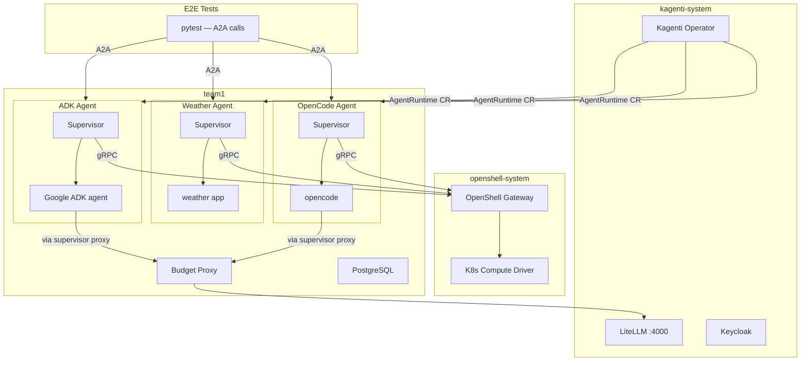
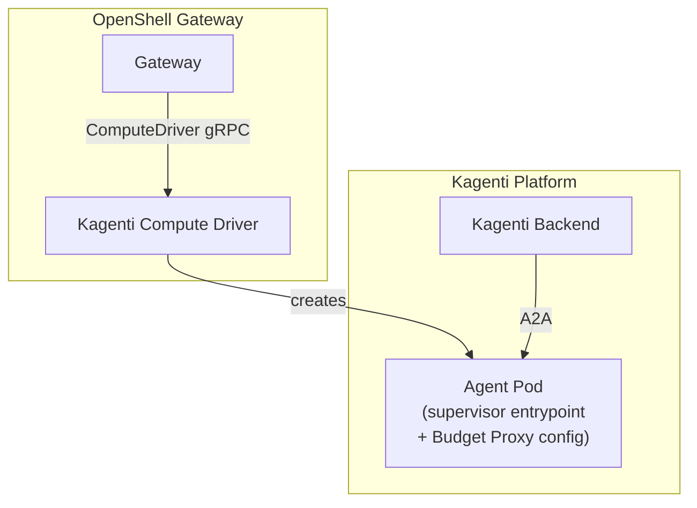

# OpenShell Integration with Kagenti

> **Status:** PoC (experimental)
> **Source:** [NVIDIA/OpenShell](https://github.com/NVIDIA/OpenShell) (Apache 2.0)

---

## 1. Overview

[OpenShell](https://github.com/NVIDIA/OpenShell) is a sandbox runtime for autonomous AI agents
providing kernel-level isolation (Landlock, seccomp, network namespaces) with OPA/Rego policy
enforcement and zero-secret credential isolation. Kagenti integrates OpenShell to provide
agent process isolation alongside its existing platform services (identity, budget, observability).

## 2. Current PoC Architecture

The PoC deploys OpenShell (upstream, with K8s compute driver) alongside Kagenti Operator.
No UI or Backend API — E2E tests call agents directly via A2A.

### Components

| Component | Namespace | Purpose |
|-----------|-----------|---------|
| OpenShell Gateway | `openshell-system` | Sandbox control plane |
| K8s Compute Driver | `openshell-system` | Creates sandbox pods via K8s API |
| Kagenti Operator | `kagenti-system` | AgentRuntime CRs, webhook injection |
| Keycloak | `keycloak` | OIDC provider |
| SPIRE | `spire-system` | Workload identity (SPIFFE) |
| Istio Ambient | `istio-system` | mTLS mesh |
| LiteLLM | `kagenti-system` | LLM model routing |
| Budget Proxy | `team1` | LLM token budget enforcement |
| PostgreSQL | `team1` | Sessions + budget databases |

## 3. Supervisor as Container Entrypoint

Each agent pod uses the OpenShell supervisor as the container entrypoint:

1. Supervisor starts (`ENTRYPOINT`)
2. Connects to OpenShell Gateway via `OPENSHELL_GATEWAY` env var
3. Reads OPA/Rego policy
4. Applies Landlock (filesystem restrictions) + custom seccomp (syscall filtering)
5. Drops all capabilities
6. Execs the agent process as a restricted child

The agent inherits kernel-enforced isolation for its entire lifetime. Normal pod
networking is preserved (no network namespace in PoC), so Istio mesh works unchanged.

## 4. Credential Isolation

OpenShell implements zero-secret credential isolation. Agent env vars contain
**placeholder tokens** (`openshell:resolve:env:API_KEY`), not real secrets. The
supervisor proxy resolves placeholders to real credentials at the HTTP layer
via TLS termination before forwarding upstream.

For LLM calls, the supervisor's inference router strips agent-supplied auth
headers entirely and injects backend API keys from the gateway's credential store.

## 5. Target Architecture (Phase 2)

Phase 2 introduces Kagenti as an OpenShell compute driver, implementing the
`ComputeDriver` gRPC interface ([PR #817](https://github.com/NVIDIA/OpenShell/pull/817),
merged). OpenShell gateway manages sandbox lifecycle; Kagenti provisions pods
with platform infrastructure (Budget Proxy, AgentRuntime CR, workspace PVC).

## 6. OpenShell RFC 0001

OpenShell is being rearchitected via [RFC 0001](https://github.com/NVIDIA/OpenShell/pull/836)
into a composable, driver-based system with four pluggable subsystems:

| Subsystem | Purpose | Kagenti Mapping |
|-----------|---------|-----------------|
| **Compute** | Sandbox lifecycle (K8s, Podman, VM) | Kagenti as compute driver (phase 2) |
| **Credentials** | Secret resolution (Vault, K8s Secrets) | Delivers secrets to supervisor proxy |
| **Control-plane identity** | User/operator auth (mTLS, OIDC) | Keycloak OIDC |
| **Sandbox identity** | Workload identity (SPIFFE) | SPIRE |

## 7. Related PRs

Key upstream PRs relevant to integration:

| PR | Status | Impact |
|----|--------|--------|
| [#817](https://github.com/NVIDIA/OpenShell/pull/817) | Merged | K8s compute driver extraction |
| [#836](https://github.com/NVIDIA/OpenShell/pull/836) | Open | RFC 0001 — core architecture |
| [#858](https://github.com/NVIDIA/OpenShell/pull/858) | Open | VM compute driver (proves out-of-process driver) |
| [#822](https://github.com/NVIDIA/OpenShell/pull/822) | Merged | L7 deny rules in policy schema |
| [#860](https://github.com/NVIDIA/OpenShell/pull/860) | Open | Incremental policy updates |
| [#861](https://github.com/NVIDIA/OpenShell/pull/861) | Open | Supervisor session relay |
