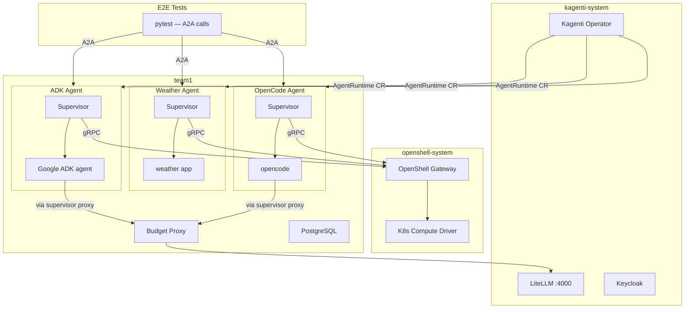
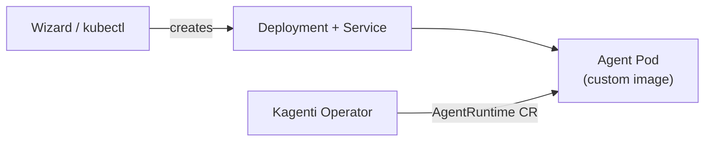
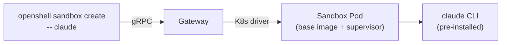
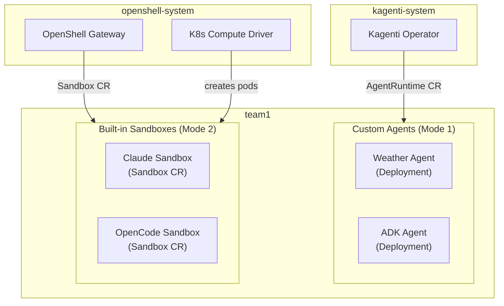
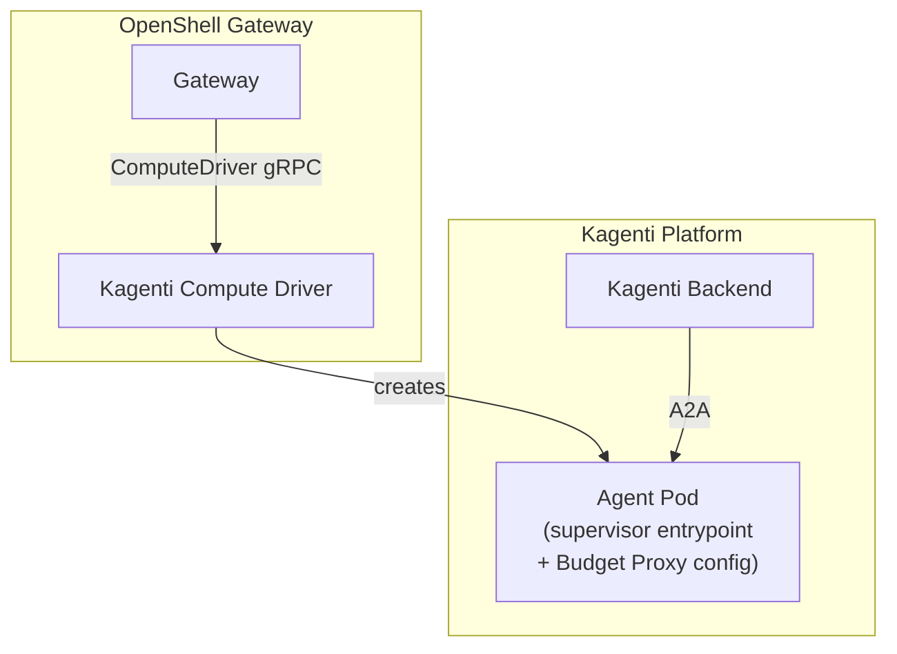
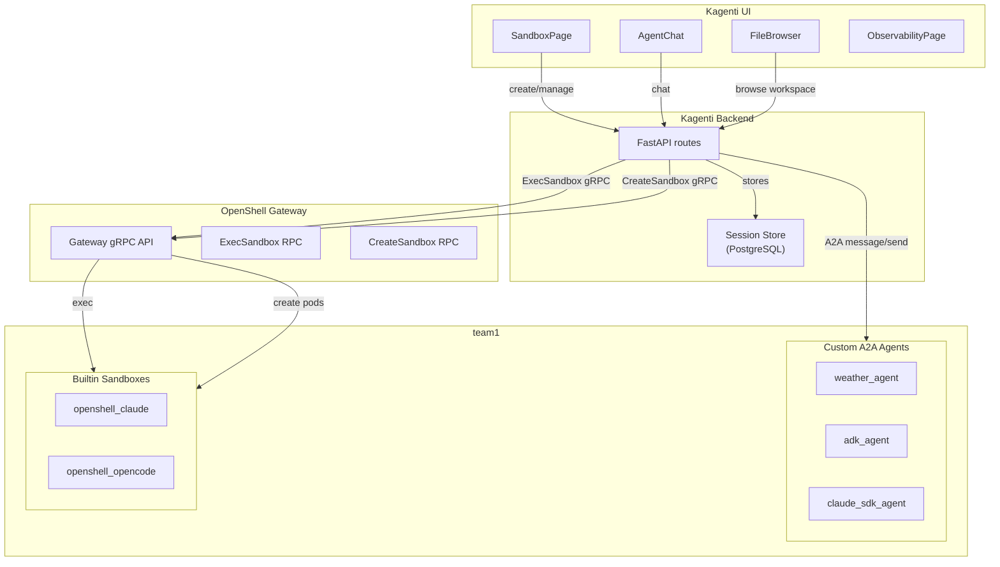

# OpenShell Integration with Kagenti

> **Status:** PoC (experimental)
> **Source:** [NVIDIA/OpenShell](https://github.com/NVIDIA/OpenShell) (Apache 2.0)

---

## 1. Overview

[OpenShell](https://github.com/NVIDIA/OpenShell) is a sandbox runtime for autonomous AI agents
providing kernel-level isolation (Landlock, seccomp, network namespaces) with OPA/Rego policy
enforcement and zero-secret credential isolation. Kagenti integrates OpenShell to provide
agent process isolation alongside its existing platform services (identity, budget, observability).

## 2. Current PoC Architecture

The PoC deploys OpenShell (upstream, with K8s compute driver) alongside Kagenti Operator.
No UI or Backend API — E2E tests call agents directly via A2A.



### Components

| Component | Namespace | Purpose |
|-----------|-----------|---------|
| OpenShell Gateway | `openshell-system` | Sandbox control plane |
| K8s Compute Driver | `openshell-system` | Creates sandbox pods via K8s API |
| Kagenti Operator | `kagenti-system` | AgentRuntime CRs, webhook injection |
| Keycloak | `keycloak` | OIDC provider |
| SPIRE | `spire-system` | Workload identity (SPIFFE) |
| Istio Ambient | `istio-system` | mTLS mesh |
| LiteLLM | `kagenti-system` | LLM model routing |
| Budget Proxy | `team1` | LLM token budget enforcement |
| PostgreSQL | `team1` | Sessions + budget databases |

## 3. Agent Deployment Tiers

> **Detail:** [sandboxing-models.md](sandboxing-models.md) | **Per-agent:** [agents/README.md](agents/README.md) (detailed) | [agents.md](agents.md) (deployment quick-ref)
> **Open questions:** [questions.md](questions.md) Q1.1 — 3-tier architecture, Q2.3 — credential models, Q8.1 — port bridge

Kagenti supports three deployment tiers for agents, from simplest to most secure.
The upgrade path is additive — Tier 3 agents work today and can be upgraded to
Tier 2/1 incrementally without breaking existing functionality.

| Tier | Deployment | Supervisor | Credentials | OPA Egress | Agent Access | Example |
|------|-----------|-----------|-------------|-----------|-------------|---------|
| **Tier 3** | K8s Deployment | No | K8s Secrets (secretKeyRef) | Policy mounted, not enforced | A2A direct | weather, adk, claude_sdk |
| **Tier 2** | Deployment + supervisor + port bridge | Yes (all layers) | Gateway provider injection | Yes (netns + OPA proxy) | A2A via port bridge | weather_supervised |
| **Tier 1** | Sandbox CR via gateway | Yes (all layers) | Gateway provider injection | Yes (netns + OPA proxy) | SSH / ExecSandbox | openshell_claude, openshell_opencode |

The three tiers coexist in the same namespace:

### Mode 1: Custom Agents (Kagenti-managed)

Custom A2A agents deployed as K8s Deployments. Used for production agents
with custom code, frameworks (LangGraph, ADK), and A2A protocol.



- **Image:** Custom Dockerfile per agent
- **Interaction:** A2A JSON-RPC 2.0 (programmatic)
- **Lifecycle:** Long-running Deployment
- **Examples:** Weather agent, ADK agent, Claude SDK agent

### Mode 2: Built-in Sandboxes (OpenShell-managed)

Pre-installed CLI agents created via OpenShell gateway. The base sandbox
image (`ghcr.io/nvidia/openshell-community/sandboxes/base:latest`, ~1.1GB)
includes Claude CLI, OpenCode, Codex, Copilot, Python, Node.js, git.



- **Image:** `ghcr.io/nvidia/openshell-community/sandboxes/base:latest` (all CLIs pre-installed)
- **Interaction:** SSH exec (interactive terminal) or `openshell sandbox exec`
- **Lifecycle:** Ephemeral sandbox (TTL, on-demand create/destroy)
- **CRD:** Sandbox CR (`agents.x-k8s.io`)

### Pre-installed CLIs in Base Image

| CLI | LLM Protocol | Works with LiteLLM? | Required Key |
|-----|-------------|---------------------|-------------|
| **claude** | Anthropic `/v1/messages` | Yes (inference router) | Anthropic or LiteLLM virtual key |
| **opencode** | OpenAI `/v1/chat/completions` | Yes (native format) | OpenAI-compatible key |
| **codex** | OpenAI-specific | Partial | OpenAI API key |
| **copilot** | GitHub Copilot API | No (proprietary) | GitHub Copilot subscription |

### Architecture with Both Modes



Both modes share the same namespace, Budget Proxy, PostgreSQL, and Istio mesh.
Custom agents use A2A protocol; built-in sandboxes use SSH/exec.

---

## 4. Sandboxing Layers

> **Detail:** [sandboxing-layers.md](sandboxing-layers.md) — supervisor, Landlock, seccomp, netns, OPA, credential isolation, LLM compatibility
> **Conversations & HITL:** [conversation-and-hitl.md](conversation-and-hitl.md) — multi-turn models, session persistence, HITL levels
> **Pending questions:** [questions.md](questions.md) — 28 questions with investigation paths and test impact

Each agent pod uses the OpenShell supervisor as the container entrypoint:

1. Supervisor starts (`ENTRYPOINT`)
2. Connects to OpenShell Gateway via `OPENSHELL_GATEWAY` env var
3. Reads OPA/Rego policy
4. Applies Landlock (filesystem restrictions) + custom seccomp (syscall filtering)
5. Drops all capabilities
6. Execs the agent process as a restricted child

The agent inherits kernel-enforced isolation for its entire lifetime.
Non-supervised agents preserve normal pod networking (Istio mesh works unchanged).
The `weather-agent-supervised` agent enables all layers including network namespace
isolation (veth pair 10.200.0.1/10.200.0.2).

## 5. Credential Isolation

OpenShell implements zero-secret credential isolation. Agent env vars contain
**placeholder tokens** (`openshell:resolve:env:API_KEY`), not real secrets. The
supervisor proxy resolves placeholders to real credentials at the HTTP layer
via TLS termination before forwarding upstream.

For LLM calls, the supervisor's inference router strips agent-supplied auth
headers entirely and injects backend API keys from the gateway's credential store.

## 6. Target Architecture (Phase 2)

Phase 2 introduces Kagenti as an OpenShell compute driver, implementing the
`ComputeDriver` gRPC interface ([PR #817](https://github.com/NVIDIA/OpenShell/pull/817),
merged). OpenShell gateway manages sandbox lifecycle; Kagenti provisions pods
with platform infrastructure (Budget Proxy, AgentRuntime CR, workspace PVC).



## 7. OpenShell RFC 0001

OpenShell is being rearchitected via [RFC 0001](https://github.com/NVIDIA/OpenShell/pull/836)
into a composable, driver-based system with four pluggable subsystems:

| Subsystem | Purpose | Kagenti Mapping |
|-----------|---------|-----------------|
| **Compute** | Sandbox lifecycle (K8s, Podman, VM) | Kagenti as compute driver (phase 2) |
| **Credentials** | Secret resolution (Vault, K8s Secrets) | Delivers secrets to supervisor proxy |
| **Control-plane identity** | User/operator auth (mTLS, OIDC) | Keycloak OIDC |
| **Sandbox identity** | Workload identity (SPIFFE) | SPIRE |

## 8. Security: Init Container Pattern (TODO)

The PoC uses `privileged: true` on the supervised agent container because
the OpenShell supervisor needs `CAP_SYS_ADMIN` + `CAP_NET_ADMIN` for
network namespace creation (`unshare CLONE_NEWNET` + `mount --make-shared`).

**Current (PoC):** Single container with `privileged: true`. The supervisor
applies Landlock + seccomp after startup, but there is a window before
isolation is applied where the process has full host access.

**Target (production):** Use an **init container** for the supervisor:

```yaml
initContainers:
- name: supervisor-init
  image: ghcr.io/nvidia/openshell/supervisor:latest
  securityContext:
    privileged: true   # Only init container is privileged
  command: ["/usr/local/bin/openshell-sandbox", "--setup-only"]
  # Sets up netns, Landlock, seccomp, then exits

containers:
- name: agent
  image: agent:latest
  securityContext:
    allowPrivilegeEscalation: false
    capabilities:
      drop: [ALL]      # Agent has zero capabilities
```

The init container runs with elevated privileges for ~2 seconds (netns setup),
then terminates. The agent container starts with `drop: [ALL]` and inherits
the isolation. This eliminates the privileged window.

**Requires:** Upstream OpenShell support for `--setup-only` mode (supervisor
sets up isolation and exits, leaving the netns/Landlock for the next container).

## 9. LLM Compatibility Matrix

| Agent / CLI | LiteMaaS (llama-scout, deepseek) | Anthropic API | OpenAI API |
|-------------|----------------------------------|---------------|------------|
| **Claude CLI** (base image) | **No** — validates model name against Anthropic API | **Yes** (native) | No |
| **Claude SDK agent** (custom) | **Yes** — uses httpx with OpenAI-compatible format | Yes (native SDK) | Yes (via format switch) |
| **ADK agent** (Google ADK) | **Yes** — uses OpenAI-compatible format via LiteLLM | N/A | Yes |
| **OpenCode** (base image) | **Yes** — uses OpenAI-compatible format | N/A | Yes |
| **Codex** (base image) | Partial — may need real OpenAI key | N/A | Yes |
| **Copilot** (base image) | No — proprietary GitHub API | N/A | N/A |

**Key limitation:** Claude CLI requires a real Anthropic API key. It cannot
use LiteMaaS or other OpenAI-compatible endpoints because it validates the
model name against Anthropic's model catalog. For skill execution tests
(`claude /review`, `claude /rca:kind`), a real Anthropic API key is required.

Our custom Claude SDK agent works with LiteMaaS because it uses httpx
directly with the OpenAI chat/completions format, bypassing Claude CLI's
model validation.

## 10. Egress Policy Enforcement Status

| Agent | Supervisor? | OPA Enforced? | Egress |
|-------|------------|---------------|--------|
| weather-agent | No | No | **Open** (plain K8s pod) |
| weather-agent-supervised | **Yes** | **Yes** | Restricted to `*.svc.cluster.local` + LiteMaaS |
| adk-agent | No | No (policy mounted but not enforced) | **Open** |
| claude-sdk-agent | No | No (policy mounted but not enforced) | **Open** |

Non-supervised agents have OPA policy files mounted at `/etc/openshell/policy.yaml`
as preparation for supervisor integration. The policies are NOT enforced until the
supervisor binary is the container entrypoint. Only `weather-agent-supervised`
enforces egress control through the supervisor's HTTP CONNECT proxy + OPA engine.

**Blocker for full enforcement:** The supervisor creates a network namespace
that blocks `kubectl port-forward` and K8s readiness probes. A2A tests
require port-forward to reach agents from the test runner. Solutions:
1. Upstream: supervisor exposes agent port through the proxy (not yet supported)
2. Workaround: run tests from inside the cluster (e.g., test runner pod)
3. Workaround: use a sidecar that bridges the netns port to the pod network

## 11. Phase 1 PoC Results

> **Detail:** [e2e-test-matrix.md](e2e-test-matrix.md) — complete test matrix with per-agent results, future tests

The PoC validates that OpenShell runs on native Kubernetes (Kind and OpenShift/HyperShift)
with all security layers active. Key results:

| Metric | Kind | HyperShift (OCP) |
|--------|------|------------------|
| E2E tests total | 117 | 117 |
| E2E tests passed | 78-82 | 75-76 |
| E2E tests failed | 0-5 (rollout timing) | 0-4 (rollout timing) |
| E2E tests skipped | 34 | 38 |
| Agent types tested | 7 (4 A2A + 3 builtin) | 7 |
| LiteLLM model proxy | Deployed (model aliases) | Deployed (model aliases) |
| Platforms | Kind with Istio | HyperShift (OCP 4.20) |

Failures are intermittent — all caused by rollout timing after LLM env var
patching. On a clean run with stable rollouts: 0 failures on both platforms.

### Agent taxonomy (all tested)

| Agent ID | Type | Framework | LLM | Protocol | Supervisor |
|----------|------|-----------|-----|----------|------------|
| `weather_agent` | Custom A2A | LangGraph | No | A2A JSON-RPC | No |
| `adk_agent` | Custom A2A | Google ADK | LiteMaaS | A2A JSON-RPC | No |
| `claude_sdk_agent` | Custom A2A | Anthropic SDK | LiteMaaS | A2A JSON-RPC | No |
| `weather_supervised` | Custom A2A | LangGraph | No | A2A JSON-RPC | Yes (Landlock+netns+OPA) |
| `openshell_claude` | Builtin sandbox | Claude Code CLI | Anthropic | SSH / kubectl exec | Yes |
| `openshell_opencode` | Builtin sandbox | OpenCode CLI | OpenAI-compat | SSH / kubectl exec | Yes |
| `openshell_generic` | Builtin sandbox | None (base image) | N/A | kubectl exec | Yes |

### Test categories

| Category | Tests | What it validates |
|----------|-------|-------------------|
| Platform health | 7 | Gateway, operator, agent pods, deployments |
| Credential isolation | 18 | secretKeyRef, no hardcoded keys, no K8s token leak, policy mounted |
| A2A conversations | 6 | Weather queries, PR review, code review with real LLM |
| Multi-turn conversations | 12 | Sequential messages, context isolation, context continuity (all agents) |
| Conversation survives restart | 8 | Scale-down/up + context check, pod UID changes (all agents) |
| PVC workspace persistence | 4 | Session state written to PVC (generic, Claude, OpenCode sandboxes) |
| Sandbox status observability | 5 | Gateway, deployment, pod, sandbox CR status queryable |
| Agent service persistence | 3 | Responds across connections, stable after delay, no restarts |
| Supervisor enforcement | 12 | Landlock, netns, seccomp, OPA (weather-agent-supervised) |
| Skill discovery | 5 | Skills ConfigMap, agent card awareness |
| Skill execution | 6 | PR review, RCA, security review with real LLM |
| Builtin sandboxes | 5 | Sandbox CR CRUD, base image, Claude/OpenCode sandbox creation |
| Sandbox lifecycle | 4 | List, create, delete, gateway processing |

## 12. Phase 2: Kagenti Backend and UI Integration

Phase 2 connects OpenShell sandboxes to the Kagenti management plane. The backend
API and UI provide session management, observability, and lifecycle control that
the OpenShell gateway does not have.

### Communication architecture



### A2A adapters per agent type

Each agent type needs a different adapter in the Kagenti backend to enable
unified session management via the UI:

| Agent Type | Backend Adapter | How it works |
|-----------|----------------|-------------|
| Custom A2A (weather, ADK, Claude SDK) | **A2A adapter** (already implemented) | Backend sends A2A `message/send` JSON-RPC, stores response in session DB |
| OpenShell builtin (Claude, OpenCode) | **ExecSandbox adapter** (Phase 2) | Backend calls gateway's `ExecSandbox` gRPC to send prompts, captures stdout, stores in session DB |
| OpenShell builtin (interactive SSH) | **Terminal adapter** (Phase 3) | Backend bridges WebSocket (xterm.js in UI) to SSH tunnel via gateway gRPC |

### Session persistence architecture

**Context lives in the Kagenti backend, not in the agent.** This is the key
architectural insight: agents can be stateless because the backend manages
conversation history.

| Data | Where it lives | Survives pod restart? |
|------|---------------|----------------------|
| Conversation history | Kagenti backend PostgreSQL | Yes |
| Workspace files (code, configs) | PVC mounted at `/workspace` | Yes |
| Agent in-memory state | Pod memory | No — lost on restart |
| Agent process (dtach socket) | Pod filesystem | No — lost on restart |

For custom A2A agents, the backend sends `contextId` with each request. For
builtin sandboxes, the backend re-establishes the session by creating a new
sandbox with the same PVC and replaying context from PostgreSQL.

### What PR #1318 contributes

[PR #1318](https://github.com/kagenti/kagenti/pull/1318) adds Sandbox CR support
to the Kagenti backend router (`agents.py`):
- `_build_sandbox_manifest()` — creates Sandbox CRs with `spec.podTemplate` layout
- `_is_sandbox_ready()` — status helpers for Sandbox CR state
- Sandbox as 4th workload type in `list_agents`, `get_agent`, `delete_agent`, `create_agent`

This enables the Kagenti UI (SandboxWizard, SandboxPage) to create and manage
OpenShell sandboxes through the same API used for Deployment-backed agents.

### What the Kagenti UI already provides (OpenShell has none)

| Capability | Kagenti UI Component | OpenShell Status |
|-----------|---------------------|-----------------|
| Sandbox creation wizard | `SandboxWizard` | CLI only |
| Session graph visualization | `SessionGraphPage`, `TopologyGraphView` | Not available |
| Agent catalog/discovery | `AgentCatalogPage`, `AgentDetailPage` | Not available |
| Interactive agent chat | `AgentChat` (A2A) | SSH terminal only |
| LLM usage tracking | `LlmUsagePanel` | Not available |
| Pod status monitoring | `PodStatusPanel` | `kubectl` only |
| Prompt inspection | `PromptInspector` | Not available |
| Workspace file browsing | `FileBrowser`, `FilePreview` | SSH only |
| Human-in-the-loop approval | `HitlApprovalCard` | Not available |
| Build progress tracking | `BuildProgressPage` | Not available |

## 13. TODO: Production Readiness

| Item | Priority | Description |
|------|----------|-------------|
| Init container pattern | HIGH | Replace `privileged: true` with init container (see section 9) |
| Enable TLS + auth on gateway | HIGH | Remove `--disable-tls --disable-gateway-auth`, mount TLS certs |
| Push agent images to registry | HIGH | Use Shipwright on-cluster builds for OCP (manifests in `shipwright-build.yaml`) |
| Namespace-scoped NetworkPolicy | MEDIUM | Restrict gateway access to agent namespaces only |
| Audit logging | MEDIUM | Enable OCSF event logging on the supervisor |
| Vault integration | MEDIUM | Replace K8s Secrets with Vault dynamic credentials |
| Supervisor-managed A2A port | LOW | Expose agent port through supervisor proxy for netns-compatible testing |
| Multi-namespace support | LOW | Add RoleBindings for team2, team3, etc. |

## 14. Related PRs

Key upstream PRs relevant to integration:

| PR | Status | Impact |
|----|--------|--------|
| [#817](https://github.com/NVIDIA/OpenShell/pull/817) | Merged | K8s compute driver extraction |
| [#836](https://github.com/NVIDIA/OpenShell/pull/836) | Open | RFC 0001 — core architecture |
| [#858](https://github.com/NVIDIA/OpenShell/pull/858) | Open | VM compute driver (proves out-of-process driver) |
| [#822](https://github.com/NVIDIA/OpenShell/pull/822) | Merged | L7 deny rules in policy schema |
| [#860](https://github.com/NVIDIA/OpenShell/pull/860) | Open | Incremental policy updates |
| [#861](https://github.com/NVIDIA/OpenShell/pull/861) | Open | Supervisor session relay |
