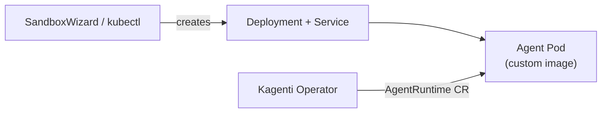
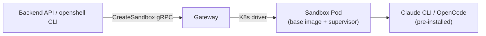
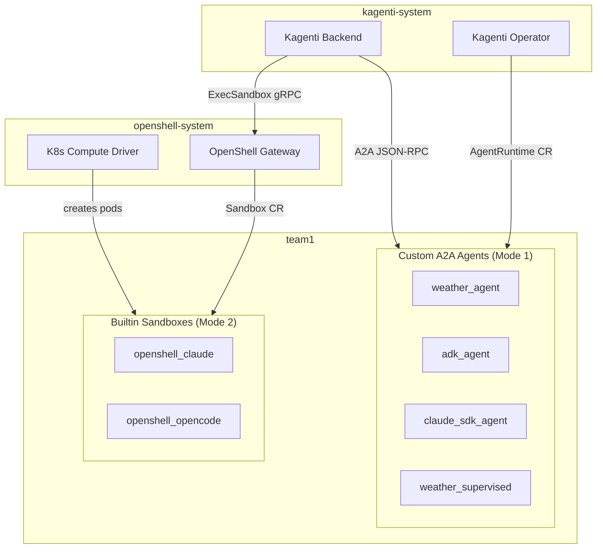

# Agent Deployment Modes

> Back to [main doc](openshell-integration.md)

Kagenti supports two agent deployment modes that coexist in the same cluster.

## Mode 1: Custom A2A Agents (Kagenti-managed)

Custom agents deployed as K8s Deployments with A2A JSON-RPC 2.0 protocol.
Used for production agents with custom code and frameworks.

- **Image:** Custom Dockerfile per agent
- **Interaction:** A2A JSON-RPC 2.0 (programmatic)
- **Lifecycle:** Long-running Deployment
- **Session management:** Kagenti backend PostgreSQL

### Custom agent types in the PoC

| Agent ID | Framework | LLM | Supervisor | A2A Skills |
|----------|-----------|-----|------------|------------|
| `weather_agent` | LangGraph | No (MCP weather tool) | No | N/A |
| `adk_agent` | Google ADK + LiteLLM | LiteMaaS (llama-scout) | No | PR review via tool |
| `claude_sdk_agent` | Anthropic SDK / OpenAI-compat | LiteMaaS (llama-scout) | No | Code review via prompt |
| `weather_supervised` | LangGraph | No (MCP weather tool) | Yes (Landlock+netns+OPA) | N/A |

## Mode 2: Built-in Sandboxes (OpenShell-managed)

Pre-installed CLI agents created via OpenShell gateway Sandbox CRs. The base
image includes Claude Code, OpenCode, Codex, Copilot, Python, Node.js, git.

- **Image:** `ghcr.io/nvidia/openshell-community/sandboxes/base:latest` (~1.1GB)
- **Interaction:** SSH exec or `ExecSandbox` gRPC (Kagenti backend adapter in Phase 2)
- **Lifecycle:** Ephemeral sandbox (Sandbox CR, on-demand create/destroy)
- **Session management:** Workspace PVC + Kagenti backend PostgreSQL

### Builtin sandbox types in the PoC

| Sandbox ID | CLI Agent | LLM | Works with LiteMaaS? | Kagenti Skill Support |
|-----------|-----------|-----|---------------------|----------------------|
| `openshell_claude` | Claude Code CLI | Anthropic API | No (needs real key) | Native (`.claude/skills/`) |
| `openshell_opencode` | OpenCode CLI | OpenAI-compat | Yes | Via tool/prompt system |
| `openshell_generic` | None (bare sandbox) | N/A | N/A | No agent to run skills |

### Pre-installed CLIs in base image

| CLI | Binary | LLM Protocol | Notes |
|-----|--------|-------------|-------|
| claude | Claude Code | Anthropic `/v1/messages` | Best for kagenti skills (native `.claude/skills/` support) |
| opencode | OpenCode | OpenAI `/v1/chat/completions` | Good with LiteMaaS |
| codex | OpenAI Codex | OpenAI-specific | Needs real OpenAI key |
| copilot | GitHub Copilot | Proprietary | Needs GitHub subscription |

## Architecture with Both Modes

Both modes share the same namespace, LLM routing (LiteMaaS/Budget Proxy),
and Istio mesh. Custom agents use A2A protocol; builtin sandboxes use
SSH/exec, with the Kagenti backend serving as the unified session manager.
