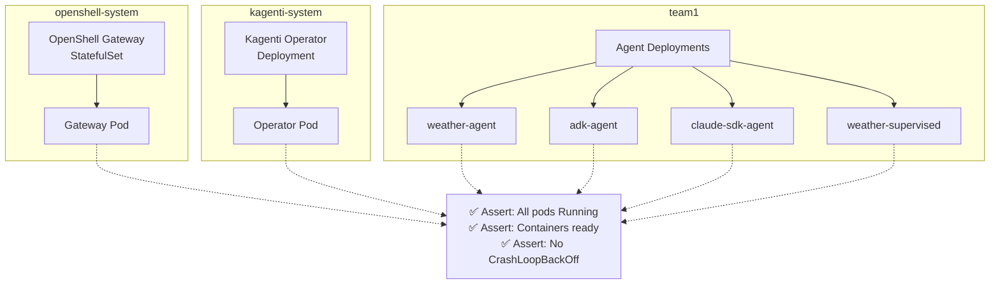

# Platform Health

> **Test file:** `kagenti/tests/e2e/openshell/test_01_platform_health.py`
> **Tests:** 7 | **Pass:** 7 | **Skip:** 0 (Kind, fresh cluster)

## What This Tests

Validates that core OpenShell platform components (gateway, operator, agent pods) are healthy and running. This is the foundation test that verifies the cluster is in a deployable state before running capability tests.

## Architecture Under Test



## Test Matrix

| Test | Gateway | Operator | weather_agent | adk_agent | claude_sdk_agent | weather_supervised |
|------|---------|----------|---------------|-----------|------------------|-------------------|
| Pods exist | ✅ | ✅ | ✅ | ✅ | ✅ | ✅ |
| Pods Running | ✅ | ✅ | ✅ | ✅ | ✅ | ✅ |
| Containers ready | ✅ | — | ✅ | ✅ | ✅ | ✅ |
| Deployments ready | — | — | ✅ | ✅ | ✅ | ✅ |
| No CrashLoopBackOff | — | — | ✅ | ✅ | ✅ | ✅ |

## Test Details

### test_gateway_pod_running

- **What:** At least one openshell-gateway pod must be Running
- **Asserts:** Pod phase == "Running"
- **Debug points:** Pod name, phase
- **Agent coverage:** Gateway (openshell-system namespace)

### test_gateway_containers_ready

- **What:** All containers in gateway pod must have ready=true
- **Asserts:** containerStatuses[*].ready == true
- **Debug points:** Container names, ready status
- **Agent coverage:** Gateway (openshell-system namespace)

### test_operator_pod_running

- **What:** At least one kagenti-operator pod must be Running
- **Asserts:** Pod phase == "Running"
- **Debug points:** Pod name, phase
- **Agent coverage:** Operator (kagenti-system namespace)
- **Skip condition:** No operator pods found (operator may not be deployed)

### test_all_agent_pods_exist

- **What:** Each expected agent must have at least one pod
- **Asserts:** Pod exists for each discovered agent deployment
- **Debug points:** Agent deployment names, pod names
- **Agent coverage:** ALL agents (dynamically discovered via label selector)

### test_all_agent_pods_running

- **What:** Every agent pod must be in Running phase
- **Asserts:** Pod phase == "Running" for all agent pods
- **Debug points:** Pod name, phase
- **Agent coverage:** ALL agents (dynamically discovered)

### test_agent_deployments_ready

- **What:** Every agent deployment must have all replicas ready
- **Asserts:** readyReplicas >= spec.replicas
- **Debug points:** Deployment name, ready/desired replica counts
- **Agent coverage:** ALL agents (dynamically discovered)

### test_no_crashlooping_agent_pods

- **What:** No agent pod container should be in CrashLoopBackOff
- **Asserts:** containerStatuses[*].state.waiting.reason != "CrashLoopBackOff"
- **Debug points:** Container name, restart count, waiting reason
- **Agent coverage:** ALL agents (dynamically discovered)

## Discovery Mechanism

Tests use dynamic agent discovery instead of hardcoded names:

```python
def _discover_agents(namespace: str) -> list[str]:
    """Discover agent Deployments with readyReplicas > 0."""
    result = kubectl get deploy -n {ns} -l kagenti.io/type=agent -o json
    return [d["metadata"]["name"] for d in items if d.status.readyReplicas > 0]
```

This allows the same tests to work on:
- **Kind** — all 4 agents (custom images available locally)
- **HyperShift** — only weather-agent (other agents skip if images not in registry)

## Future Expansion

No expansion needed — this test is complete and covers all deployment scenarios.

## Common Failure Modes

| Symptom | Cause | Fix |
|---------|-------|-----|
| Gateway pod not Running | Image pull failure | Check gateway image availability |
| Operator pod not found | Operator not deployed | Deploy kagenti operator |
| Agent pod CrashLoopBackOff | Missing LLM secret | Verify LiteLLM virtual keys |
| Agent deployment not ready | Image pull pending | Wait for image pull or push to registry |
