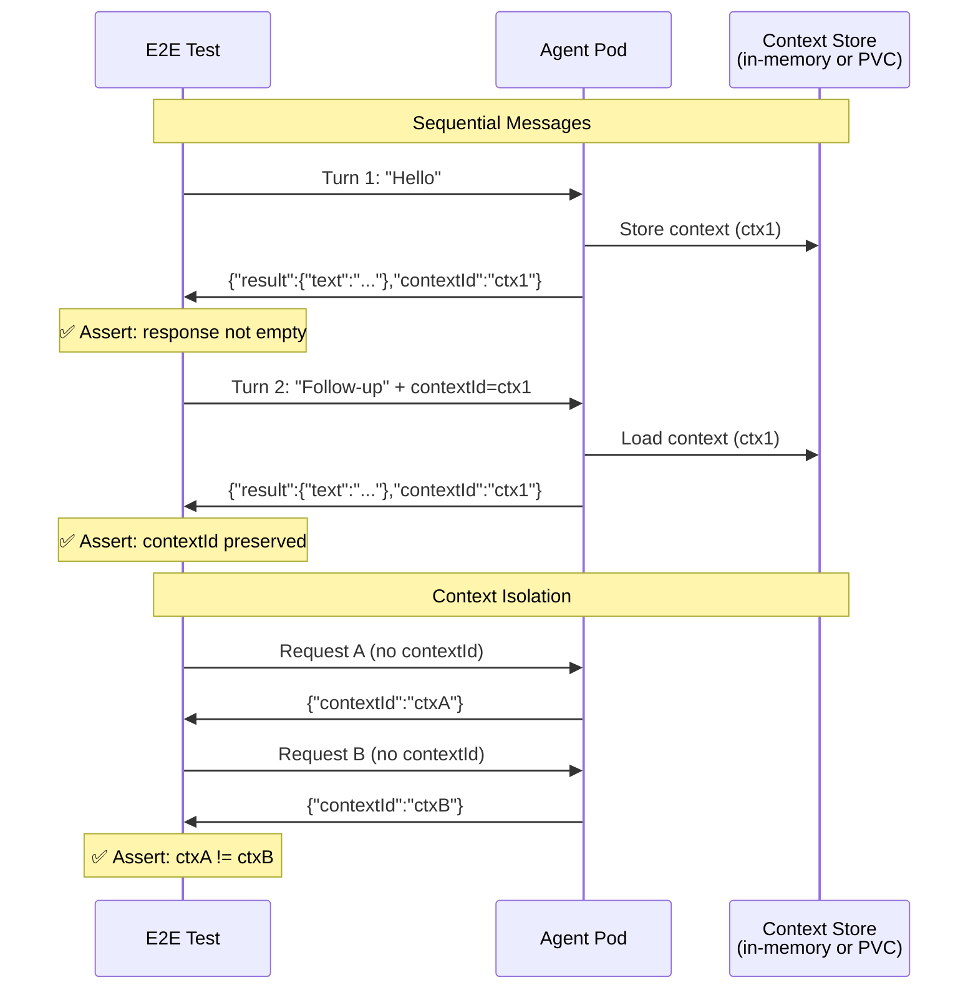

# Multi-Turn Conversation

> **Test file:** `kagenti/tests/e2e/openshell/test_05_multiturn_conversation.py`
> **Tests:** 12 | **Pass:** 9 | **Skip:** 3 (Kind, fresh cluster)

## What This Tests

Validates that agents handle sequential A2A messages with context continuity, isolation between independent conversations, and service persistence across delayed requests.

## Architecture Under Test



## Test Matrix

| Test | weather_agent | adk_agent | claude_sdk_agent | weather_supervised | os_claude | os_opencode | os_generic |
|------|--------------|-----------|-----------------|-------------------|----------|------------|-----------|
| 3 sequential messages | ✅ | ✅ | ✅ | ✅ (exec) | — | — | — |
| Context isolation | ✅ | ✅ | ✅ | ⏭️ needs A2A | — | — | — |
| Context continuity | ⏭️ stateless | ⏭️ ADK gap | ⏭️ stateless | ⏭️ Phase 2 | — | — | — |
| Service persistence | ✅ | ✅ | ✅ | — | — | — | — |

**Skip reasons:**
- **stateless** — Agent doesn't return contextId (Kagenti backend will manage context externally)
- **ADK gap** — ADK to_a2a() doesn't support client-sent contextId (upstream limitation)
- **needs A2A** — Supervised agent netns blocks port-forward; ExecSandbox gRPC needed for multi-turn
- **Phase 2** — Requires PVC-backed session store + Kagenti backend integration
- **—** — Builtin sandboxes use terminal sessions (persistent by nature), not A2A

## Test Details

### test_multiturn__agent__responds_to_3_sequential_messages (parametrized: 3 A2A agents)

- **What:** Send 3 sequential messages and verify responses
- **Asserts:** 
  - Each turn has "result" in response
  - Text not empty for each turn
  - contextId extracted and passed to next turn
- **Debug points:** Response structure, text length, contextId
- **Agent coverage:** weather_agent, adk_agent, claude_sdk_agent
- **Skip condition:** LLM agents skip if OPENSHELL_LLM_AVAILABLE != true

### test_multiturn__weather_supervised__kubectl_exec

- **What:** Supervised agent: test via kubectl exec (netns blocks port-forward)
- **Asserts:** exec succeeds, stdout contains "alive"
- **Debug points:** exec returncode, stderr
- **Agent coverage:** weather_supervised
- **Note:** Basic liveness test only; multi-turn requires ExecSandbox gRPC

### test_context_isolation__agent__independent_requests_isolated (parametrized: 3 A2A agents)

- **What:** Two independent requests should have different contextIds
- **Asserts:** contextId from request A != contextId from request B
- **Debug points:** contextIds, response text
- **Agent coverage:** weather_agent, adk_agent, claude_sdk_agent
- **Skip condition:** Agent doesn't return contextId OR LLM not available

### test_context_isolation__weather_supervised__netns_blocks_test

- **What:** Supervised agent: context isolation test requires A2A
- **Asserts:** N/A (always skips)
- **Agent coverage:** weather_supervised
- **Skip reason:** netns blocks port-forward; TODO: ExecSandbox gRPC integration

### test_context_continuity__agent__context_preserved_across_turns (parametrized: 3 A2A agents)

- **What:** If agent returns contextId, it should persist across turns
- **Asserts:** 
  - Turn 1 returns contextId
  - Turn 2 with same contextId returns same or related contextId
- **Debug points:** contextId values across turns
- **Agent coverage:** weather_agent, adk_agent, claude_sdk_agent
- **Skip condition:** 
  - Agent is stateless (no contextId)
  - ADK upstream doesn't preserve client-sent contextId
  - TODO: Kagenti backend session store will manage context externally

### test_context_continuity__weather_supervised__requires_grpc

- **What:** Supervised agent: context continuity requires ExecSandbox gRPC
- **Asserts:** N/A (always skips)
- **Agent coverage:** weather_supervised
- **Skip reason:** Phase 2 integration needed

### test_service_persistence__agent__responds_after_delay (parametrized: 3 A2A agents)

- **What:** Send message, wait 10s, send again — agent should still respond
- **Asserts:** 
  - First request succeeds
  - Second request (after delay) succeeds
- **Debug points:** Response text, delay duration
- **Agent coverage:** weather_agent, adk_agent, claude_sdk_agent
- **Note:** Validates that agents are long-running services (not ephemeral pods)

## Context Management Models

| Agent Type | Context Storage | contextId Support | Future State |
|------------|----------------|------------------|--------------|
| `weather_agent` | None (stateless) | No | Kagenti backend session store |
| `adk_agent` | In-memory | Returns contextId, ignores client's | Upstream PR or backend override |
| `claude_sdk_agent` | None (stateless) | No | Kagenti backend session store |
| `weather_supervised` | None (stateless) | No | Backend + ExecSandbox gRPC |
| `openshell_claude` | PVC `/workspace/.claude/` | Native (via Claude API) | Phase 2 provider integration |
| `openshell_opencode` | PVC `/workspace/` | Via LiteLLM | Phase 2 provider integration |

## Agent-Specific Prompts

Tests use type-appropriate prompts for each agent:

```python
AGENT_PROMPTS = {
    "weather-agent": [
        "What's the weather in Seattle?",
        "What about New York?",
        "And in Tokyo?",
    ],
    "adk-agent": [
        "Hello, who are you?",
        "What can you help with?",
        "Thank you!",
    ],
    "claude-sdk-agent": [
        "Hello, who are you?",
        "What capabilities do you have?",
        "Goodbye!",
    ],
}
```

## Future Expansion

| Agent Type | When Added | What's Needed |
|------------|-----------|---------------|
| `openshell_claude` | Phase 2 | ExecSandbox gRPC adapter for terminal session → A2A translation |
| `openshell_opencode` | Phase 2 | ExecSandbox gRPC adapter for terminal session → A2A translation |
| Context continuity | Phase 2 | Kagenti backend session store (PVC-backed PostgreSQL + checkpointer) |
| ADK context | Upstream PR | ADK to_a2a() must respect client contextId |

## Common Failure Modes

| Symptom | Cause | Fix |
|---------|-------|-----|
| Empty response | Agent initialization delay | Add retry with exponential backoff |
| contextId changes | Agent restarts between turns | Add PVC-backed checkpointer |
| Connection refused | Port-forward killed | Reestablish port-forward between turns |
| Timeout on turn 3 | Agent resource exhaustion | Check pod memory/CPU limits |
