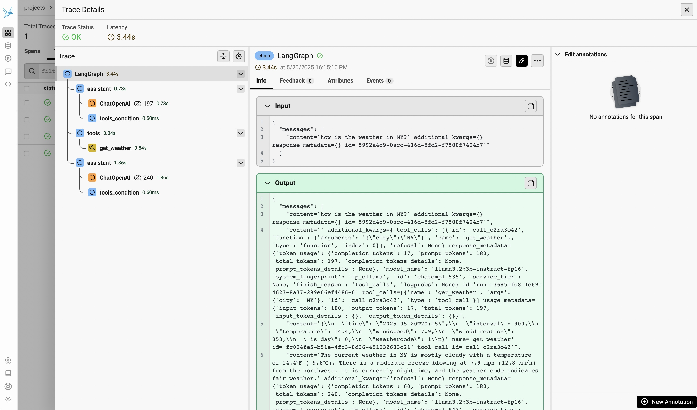
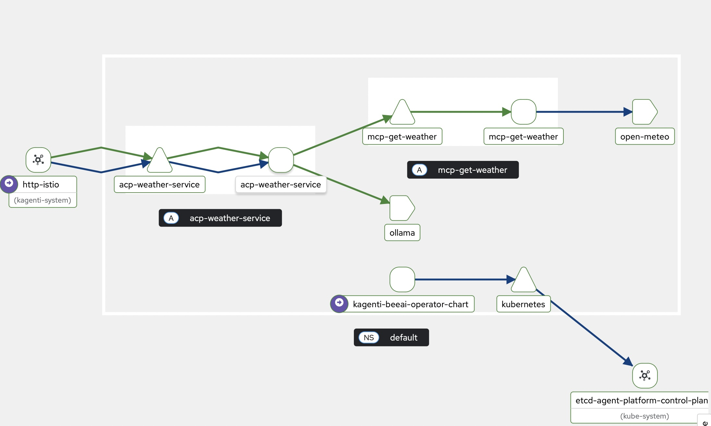

# Cloud Native Proof-Of-Concepts

The following proof on concepts apply Cloud Native technologies to manage agentic workloads.
A diagram and description of the demo architecture is provided [here](./tech-details.md#cloud-native-agent-platform-demo)

## Installation

### Prerequisites

Before running the demo setup script, ensure you have the following prerequisites in place:

* **Docker:** Docker Desktop, Rancher Desktop or Podman Machine. 
* **Kind:** A [tool](https://kind.sigs.k8s.io) to run a Kubernetes cluster in docker.
* **kubectl:** The Kubernetes command-line tool.
* **GitHub Token:** Your [GitHub token](https://docs.github.com/en/authentication/keeping-your-account-and-data-secure/managing-your-personal-access-tokens#creating-a-personal-access-token-classic) to allow fetching source and then to push docker image to ghcr.io repository. 
* **[ollama](https://ollama.com/download)** to run LLMs locally.

At this time the demo has only been tested on MacOS with M1 processor.

####  Setup

Clone this project:

```shell
git clone https://github.com/kagenti/kagenti.git
cd kagenti
```

Setup your env variables as follows:

```shell
cp examples/scripts/.env_template examples/scripts/.env
```

Edit the file `examples/scripts/.env` to fill in the following:

```shell
REPO_USER=<Your public Github User ID>
OPENAI_API_KEY=<This is required only for A2A agents, if only using the ACP agents can just put a placeholder>
TOKEN=<Your GitHub Token, as explained above>
```

Run the following script:

```shell
examples/scripts/install-cnai-demo.sh 
```

It may take several minutes to complete, at the end you should have several agents and tools deployed.

## Run the demo

Exercise some of the agents:

### ACP Weather Service (with MCP/sse tool)

```shell
uv run --directory examples/clients/acp client.py --url http://acp-weather-service.localtest.me:8080 --name acp_weather_service
```

### ACP Ollama Deep Researcher

```shell
uv run --directory examples/clients/acp client.py --url http://acp-ollama-researcher.localtest.me:8080 --name ollama_deep_researcher
```

### A2A Currency Agent

```shell
uv run --directory examples/clients/a2a . --agent http://a2a-currency-agent.localtest.me:8080
```

### A2A Contact Extractor

```shell
uv run --directory examples/clients/a2a . --agent http://a2a-contact-extractor-agent.localtest.me:8080 
```

### Analyze Traces

Open the Arize Phoenix dashboard:

```shell
open http://phoenix.localtest.me:8080
```

Select the "Traces" tab and open one trace, you should be able to see a screen similar to the following:



### Analyze Traffic with Kiali

Run the followimg client to generate traffic and keep it going:

```shell
uv run --directory examples/clients/acp batch_client.py --url http://acp-weather-service.localtest.me:8080 --name ollama_weather_service --iterations 100 --user-message "how is the weather in NY?"
```

Open the Kiali dashboard:

```shell
open http://kiali.localtest.me:8080
```

Go to "Traffic Graph", select Namespace "default" and "App Graph" - you should be able to view 
a graph similar to the following:




## Troubleshoting

### Agent stops responding through gateway 

Restart the following daemonset

```shell
kubectl rollout restart daemonset -n istio-system  istio-cni-node 
kubectl rollout restart daemonset -n istio-system  ztunnel
```