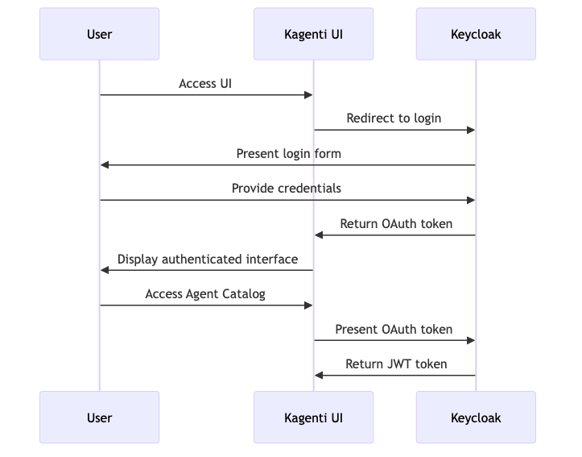
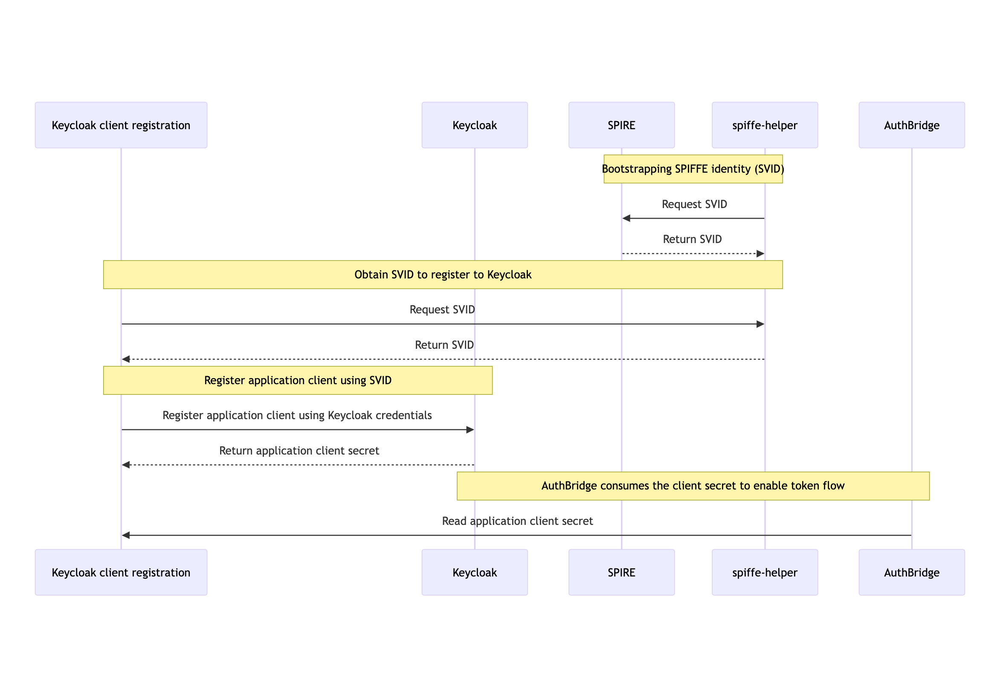
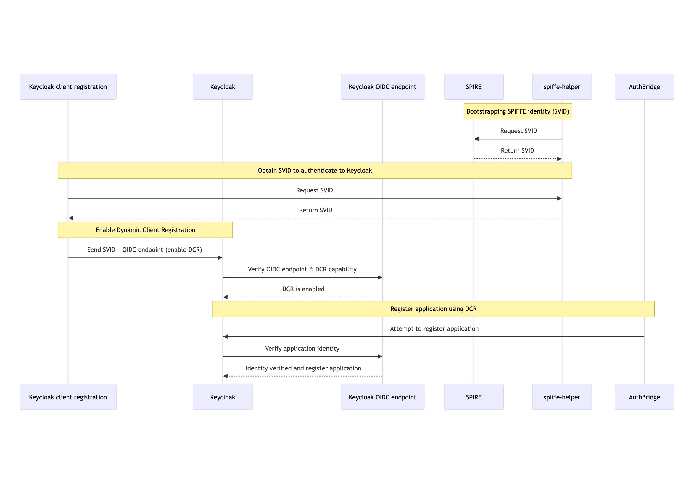
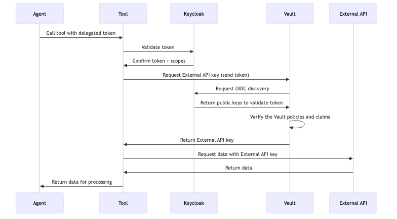

# Kagenti Identity, Authentication, & Authorization Guide

This comprehensive guide covers all aspects of identity, authentication, and authorization in the Kagenti platform. Kagenti implements a **Zero-Trust Architecture** that combines SPIFFE/SPIRE workload identity, OAuth2 token exchange, and Keycloak identity management to provide secure, scalable, and dynamic authentication for cloud-native AI agents.

In practice, the Authorization Pattern within the Agentic Platform enables:

- Machine Identity Management – replacing static credentials with SPIRE-issued JWTs.
- Secure Delegation – enforcing token exchange to propagate identity across services without excessive permissions.
- Continuous Verification – ensuring authentication and authorization at each step, preventing privilege escalation.

## 📚 Related Documentation

- **[Kagenti Identity Overview](./2025-10.Kagenti-Identity.pdf)** - High-level architectural concepts
- **[Token Exchange Deep Dive](../kagenti/examples/identity/token_exchange.md)** - Detailed OAuth2 token exchange flows
- **[Client Registration Examples](../kagenti/examples/identity/keycloak_token_exchange/README.md)** - Practical integration examples
- **[Personas and Roles](../PERSONAS_AND_ROLES.md#23-security-and-identity-specialist)** - Security and identity specialist persona

---

## 🏗️ Architecture Overview

### Zero-Trust Identity Foundation

Kagenti's identity architecture is built on three core principles:

1. **No Implicit Trust** - Every request requires explicit authentication and authorization
2. **Least Privilege Access** - Users and workloads receive minimum necessary permissions
3. **Continuous Verification** - Identity and permissions are validated at every interaction

### Key Components

| Component | Purpose | Technology |
|-----------|---------|------------|
| **SPIFFE/SPIRE** | Workload Identity & Attestation | Industry-standard workload identity framework |
| **Keycloak** | Identity Provider & Access Management | OAuth2/OIDC compliant identity server |
| **OAuth2 Token Exchange** | Secure Token Delegation | RFC 8693 token exchange protocol |
| **MCP Gateway** | Protocol-Level Authentication | Envoy-based authentication proxy |
| **Kubernetes RBAC** | Container-Level Authorization | Native Kubernetes access controls |

---

## 🔐 SPIFFE/SPIRE Workload Identity

### What is SPIFFE/SPIRE?

**SPIFFE** (Secure Production Identity Framework For Everyone) provides a universal identity control plane for distributed systems. **SPIRE** is the production-ready implementation that issues and manages SPIFFE identities.

### SPIFFE Identity Format

In Kagenti, workloads receive SPIFFE identities in the following format:

```console
spiffe://{trust-domain}/ns/{namespace}/sa/{service-account}
```

**Examples:**

```bash
# Slack Research Agent
spiffe://localtest.me/ns/team/sa/slack-researcher

# Weather Tool
spiffe://localtest.me/ns/team/sa/weather-tool

# GitHub Issue Agent  
spiffe://apps.cluster-swkz5.dynamic.redhatworkshops.io/ns/team/sa/github-issue-agent

# MCP Gateway Service
spiffe://apps.cluster-swkz5.dynamic.redhatworkshops.io/ns/gateway-system/sa/mcp-gateway
```

### SVID Types

SPIRE issues **SPIFFE Verifiable Identity Documents (SVIDs)** in two formats:

1. **X.509 SVID** - Certificate-based identity for mTLS
2. **JWT SVID** - Token-based identity for HTTP APIs

**JWT SVID Structure:**

```json
{
  "sub": "spiffe://localtest.me/ns/team/sa/slack-researcher",
  "aud": "kagenti",
  "exp": 1735689600,
  "iat": 1735686000,
  "iss": "https://spire-server.spire.svc.cluster.local:8443"
}
```

### SPIRE Environment Validation

To verify SPIRE is properly configured:

#### 1. OIDC Discovery Endpoint

```bash
# Check SPIRE OIDC service
curl http://spire-oidc.localtest.me:8080/.well-known/openid-configuration

# Verify JWT signing keys
curl http://spire-oidc.localtest.me:8080/keys
```

#### 2. Tornjak Management Interface

```bash
# Test Tornjak API
curl http://spire-tornjak-api.localtest.me:8080/
# Expected: "Welcome to the Tornjak Backend!"

# Access Tornjak UI
open http://spire-tornjak-ui.localtest.me:8080/
```

#### 3. Workload SVID Validation

```bash
# Check if agent has received SVID
kubectl exec -n team deployment/slack-researcher -- ls -la /opt/
# Should show: svid.pem, svid_key.pem, svid_bundle.pem, jwt_svid.token

# Inspect JWT SVID content
kubectl exec -n team deployment/slack-researcher -- cat /opt/jwt_svid.token

# Decode JWT SVID (requires jq)
kubectl exec -n team deployment/slack-researcher -- cat /opt/jwt_svid.token | \
  cut -d'.' -f2 | base64 -d | jq .
```

---

## 🎫 Keycloak Identity Management

### Keycloak Architecture in Kagenti

Keycloak serves as the central identity provider that:

- Manages user identities and authentication
- Issues OAuth2/OIDC tokens
- Enforces role-based access control (RBAC)
- Facilitates token exchange between services
- Validates SPIFFE identities for workload authentication

### Realm Configuration

**Master Realm** is configured with:

- **Users**: Demo users with different access levels
- **Clients**: Each agent/tool is a Keycloak client
- **Roles**: Granular permissions (e.g., `slack-full-access`, `github-partial-access`)
- **Scopes**: Define token audiences and permissions

### Client Types

| Client Type | Authentication | Purpose | Example |
|-------------|----------------|---------|----------|
| **Public Client** | No secret | Frontend applications | `kagenti-ui` |
| **Confidential Client** | Client secret | Backend services | Traditional services |
| **SPIFFE Client** | JWT SVID | Workload identity | `spiffe://localtest.me/ns/team/sa/slack-researcher` |

### Demo Users and Access Levels

```yaml
# Full Access Users
slack-full-access-user:
  password: "password"
  roles: ["slack-full-access", "slack-partial-access"]
  permissions:
    - channels:read
    - channels:history
    - messages:write

# Partial Access Users
slack-partial-access-user:
  password: "password"
  roles: ["slack-partial-access"]
  permissions:
    - channels:read

# GitHub Users
github-full-access-user:
  password: "password"
  roles: ["github-full-access", "github-partial-access"]
  permissions:
    - repos:read
    - issues:write
    - issues:read

github-partial-access-user:
  password: "password"
  roles: ["github-partial-access"]
  permissions:
    - issues:read

# Admin Users
admin:
  password: "admin"
  roles: ["admin", "*"]
  permissions: ["*"]
```

### Keycloak Admin Access

```bash
# Access Keycloak Admin Console 
# on kind:
open http://keycloak.localtest.me:8080/admin/master/console/
# on OpenShift:
open "https://$(kubectl get route mcp-proxy -n kagenti-system -o jsonpath='{.status.ingress[0].host}')"

# Get admin credentials from Kubernetes (if different)
kubectl get secret keycloak-initial-admin -n keycloak -o go-template=\
  'Username: {{.data.username | base64decode}}  Password: {{.data.password | base64decode}}{{"\n"}}'
```console
spiffe://${DOMAIN_NAME}/ns/team/sa/weather-service
spiffe://${DOMAIN_NAME}/ns/team/sa/weather-tool

```

## 🔄 OAuth2 Token Exchange Flows

### Token Exchange Protocol (RFC 8693)

Kagenti implements OAuth2 Token Exchange to enable secure token delegation across the agent ecosystem. This allows:

- User identity propagation through agent → tool chains
- Least-privilege token scoping
- Audit trails for all access requests

### Authentication Flow Stages

> **📊 Diagrams**: The following sequence diagrams illustrate Kagenti's authentication flows. Each diagram is available as both PNG (for documentation) and SVG (for presentations) in the `docs/diagrams/images/` directory. The original Mermaid source files are preserved in collapsible sections below each diagram.

#### Stage 1: User Authentication



*Figure 1: User Authentication Flow - Shows how users authenticate with Kagenti UI through Keycloak OIDC flow*

[View Mermaid Source Code](./diagrams/01-user-authentication-flow.mmd)

**HTTP Request:**

```bash
POST /realms/master/protocol/openid-connect/token
Content-Type: application/x-www-form-urlencoded

grant_type=authorization_code
&client_id=kagenti-ui
&code=<auth_code>
&redirect_uri=http://kagenti-ui.localtest.me:8080/callback
```

**Response:**

```json
{
  "access_token": "eyJ0eXAiOiJKV1Q...",
  "expires_in": 600,
  "scope": "openid profile email",
  "token_type": "Bearer",
  "id_token": "eyJ0eXAiOiJKV1Q..."
}
```

#### Stage 2: Keycloak Client Registration Flow (Secret-based)



*Figure 2: Keycloak Client Registration Flow (Secret-based) Flow - Shows how automatic client registration registers clients in Keycloak*

[View Mermaid Source Code](./diagrams/02-kagenti-client-registration.mmd)

#### Stage 3: Keycloak Client Registration Flow (Secretless with OIDC DCR)



*Figure 3: Keycloak Client Registration Flow (Secretless with OIDC DCR) Flow - Shows how automatic client registration registers clients in Keycloak without credentials*

[View Mermaid Source Code](./diagrams/03-kagenti-client-registreation-final.mmd)

#### Stage 4: Agent Token Exchange


*Figure 4: Agent Token Exchange Flow - Demonstrates OAuth2 token exchange between agents and Keycloak using SPIFFE identity*

[View Mermaid Source Code](./diagrams/04-agent-token-exchange-flow.mmd)

**Token Exchange Request:**

```bash
POST /realms/master/protocol/openid-connect/token
Content-Type: application/x-www-form-urlencoded
Authorization: Bearer <JWT-SVID-AGENT>

grant_type=urn:ietf:params:oauth:grant-type:token-exchange
&subject_token=<USER-JWT-TOKEN>
&subject_token_type=urn:ietf:params:oauth:token-type:access_token
&audience=slack-tool
&client_id=spiffe://localtest.me/ns/team/sa/slack-researcher
```

**Token Exchange Response:**
```json
{
  "access_token": "eyJ0eXAiOiJKV1Q...",
  "expires_in": 300,
  "scope": "slack-partial-access",
  "token_type": "Bearer"
}
```

#### Stage 5: Internal Tool Access with Delegated Token


*Figure 5: Internal Tool Access Flow - Shows how agents call internal tools using delegated tokens with proper permission validation*

[View Mermaid Source Code](./diagrams/05-tool-access-delegated-token-flow.mmd)

### JWT Token Structure

**User Token:**

```json
{
  "sub": "user-123",
  "preferred_username": "slack-full-access-user",
  "aud": "kagenti-ui",
  "exp": 1735689600,
  "roles": ["slack-full-access", "slack-partial-access"]
}
```

**Agent-Scoped Token (after exchange):**

```json
{
  "sub": "user-123",
  "act": {
    "sub": "spiffe://localtest.me/ns/team/sa/slack-researcher"
  },
  "aud": "slack-tool",
  "exp": 1735686900,
  "scope": "slack-full-access"
}
```

---

## 🌐 MCP Protocol Authentication

### MCP Gateway Authentication

The **MCP Gateway** acts as an authentication proxy for all Model Context Protocol communications:

#### Stage 6: Gateway Authentication Flow


*Figure 6: MCP Gateway Authentication Flow - Illustrates authentication flow through the MCP Gateway proxy for Model Context Protocol communications*

[View Mermaid Source Code](./diagrams/06-mcp-gateway-authentication-flow.mmd)

#### MCP Authentication Headers

```bash
# Agent to Gateway
POST /mcp
Host: mcp-gateway.localtest.me:8080
Authorization: Bearer <JWT-TOKEN>
Content-Type: application/json

{
  "method": "tools/list",
  "params": {}
}
```

#### Gateway Configuration

```yaml
apiVersion: gateway.networking.k8s.io/v1
kind: HTTPRoute
metadata:
  name: slack-tool-route
  labels:
    mcp-server: "true"
spec:
  parentRefs:
  - name: mcp-gateway
    namespace: gateway-system
  hostnames:
  - "slack-tool.mcp.test.com"
  rules:
  - matches:
    - path:
        type: PathPrefix
        value: /
    filters:
    - type: ExtensionRef
      extensionRef:
        group: kagenti.dev
        kind: AuthFilter
        name: jwt-validator
    backendRefs:
    - name: slack-tool
      port: 8000
```

### Tool-Specific Authentication

#### Slack Tool Authentication

```python
# In Slack MCP Tool
def validate_request(request):
    token = request.headers.get("Authorization", "").replace("Bearer ", "")
    
    # Validate with Keycloak
    response = requests.get(
        "http://keycloak.keycloak.svc.cluster.local:8080/realms/master/protocol/openid-connect/userinfo",
        headers={"Authorization": f"Bearer {token}"}
    )
    
    if response.status_code != 200:
        raise AuthenticationError("Invalid token")
    
    user_info = response.json()
    scopes = user_info.get("scope", "").split()
    
    # Check permissions
    if "slack-full-access" in scopes:
        return PermissionLevel.FULL
    elif "slack-partial-access" in scopes:
        return PermissionLevel.PARTIAL
    else:
        raise AuthorizationError("Insufficient permissions")
```

#### Stage 7: External API Access with Delegated Token and Vault



*Figure 7: External API Access with Vault Flow - Shows how agents call internal tools using delegated tokens with proper permission validation and the Vault exchanges this token for external API key for accessing external APIs*

[View Mermaid Source Code](./diagrams/07-tool-with-external-api-flow.mmd)

### JWT Token Structure

**User Token:**
```json
{
  "sub": "user-123",
  "preferred_username": "slack-full-access-user",
  "aud": "kagenti-ui",
  "exp": 1735689600,
  "roles": ["slack-full-access", "slack-partial-access"]
}
```

**Agent-Scoped Token (after exchange):**
```json
{
  "sub": "user-123",
  "act": {
    "sub": "spiffe://localtest.me/ns/team/sa/slack-researcher"
  },
  "aud": "slack-tool",
  "exp": 1735686900,
  "scope": "slack-full-access"
}
```

---

## 🛠️ Practical Implementation Guide

### Client Registration Process

#### Automatic Registration via Init Container

```yaml
apiVersion: apps/v1
kind: Deployment
metadata:
  name: slack-researcher
spec:
  template:
    spec:
      initContainers:
      - name: client-registration
        image: ghcr.io/kagenti/client-registration:latest
        env:
        - name: KEYCLOAK_URL
          value: "http://keycloak.keycloak.svc.cluster.local:8080"
        - name: CLIENT_NAME
          value: "slack-researcher"
        - name: KEYCLOAK_REALM
          value: "master"
        volumeMounts:
        - name: spiffe-workload-api
          mountPath: /spiffe-workload-api
        - name: shared-secrets
          mountPath: /shared
      containers:
      - name: slack-researcher
        image: ghcr.io/kagenti/slack-researcher:latest
        volumeMounts:
        - name: shared-secrets
          mountPath: /secrets
```

#### Manual Client Registration

```python
from keycloak import KeycloakAdmin
import jwt

# Read SPIFFE JWT SVID
with open("/opt/jwt_svid.token", "r") as f:
    jwt_svid = f.read().strip()

# Extract client ID from SPIFFE identity
payload = jwt.decode(jwt_svid, options={"verify_signature": False})
client_id = payload["sub"]  # e.g., spiffe://localtest.me/ns/team/sa/slack-researcher

# Register with Keycloak
keycloak_admin = KeycloakAdmin(
    server_url="http://keycloak.keycloak.svc.cluster.local:8080",
    username="admin",
    password="admin",
    realm_name="master"
)

client_payload = {
    "clientId": client_id,
    "name": "Slack Researcher Agent",
    "standardFlowEnabled": True,
    "directAccessGrantsEnabled": True,
    "serviceAccountsEnabled": True,
    "publicClient": False,
    "attributes": {
        "oauth2.device.authorization.grant.enabled": "false",
        "oidc.ciba.grant.enabled": "false",
        "client.secret.creation.time": str(int(time.time()))
    }
}

internal_client_id = keycloak_admin.create_client(client_payload)
print(f"Registered client: {client_id} with internal ID: {internal_client_id}")
```

### Token Exchange Implementation

#### Agent-Side Token Exchange

```python
import requests
import os

def exchange_token_for_tool(user_token: str, tool_audience: str) -> str:
    """Exchange user token for tool-scoped token."""
    
    # Read SPIFFE JWT SVID
    with open("/opt/jwt_svid.token", "r") as f:
        jwt_svid = f.read().strip()
    
    # Get client ID from SVID
    payload = jwt.decode(jwt_svid, options={"verify_signature": False})
    client_id = payload["sub"]
    
    # Token exchange request
    token_exchange_data = {
        "grant_type": "urn:ietf:params:oauth:grant-type:token-exchange",
        "subject_token": user_token,
        "subject_token_type": "urn:ietf:params:oauth:token-type:access_token",
        "audience": tool_audience,
        "client_id": client_id
    }
    
    response = requests.post(
        "http://keycloak.keycloak.svc.cluster.local:8080/realms/master/protocol/openid-connect/token",
        data=token_exchange_data,
        headers={
            "Authorization": f"Bearer {jwt_svid}",
            "Content-Type": "application/x-www-form-urlencoded"
        }
    )
    
    if response.status_code != 200:
        raise Exception(f"Token exchange failed: {response.text}")
    
    return response.json()["access_token"]

# Usage example
user_token = request.headers.get("Authorization", "").replace("Bearer ", "")
tool_token = exchange_token_for_tool(user_token, "slack-tool")

# Call tool with scoped token
tool_response = requests.post(
    "http://slack-tool.team.svc.cluster.local:8000/mcp",
    headers={"Authorization": f"Bearer {tool_token}"},
    json={"method": "tools/list"}
)
```

---

## 🔍 Troubleshooting & Validation

### Common Issues and Solutions

#### 1. SPIRE Agent Not Receiving SVID

**Symptoms:**
```bash
kubectl exec -n team deployment/slack-researcher -- ls /opt/
# Missing: svid.pem, jwt_svid.token
```

**Diagnosis:**

```bash
# Check SPIRE agent logs
kubectl logs -n spire daemonset/spire-agent

# Check workload registration
kubectl exec -n spire deployment/spire-server -- \
  /opt/spire/bin/spire-server entry show

# Verify node attestation
kubectl exec -n spire deployment/spire-server -- \
  /opt/spire/bin/spire-server agent list
```

**Solutions:**

- Ensure agent namespace has correct labels: `shared-gateway-access=true`
- Verify SPIRE server can reach Kubernetes API
- Check workload selector configuration

#### 2. Token Exchange Failing

**Symptoms:**
```json
{
  "error": "invalid_client",
  "error_description": "Client authentication failed"
}
```

**Diagnosis:**

```bash
# Check client registration in Keycloak
curl -H "Authorization: Bearer $ADMIN_TOKEN" \
  "http://keycloak.localtest.me:8080/admin/realms/master/clients" | \
  jq '.[] | select(.clientId | contains("spiffe"))'

# Verify JWT SVID format
kubectl exec -n team deployment/slack-researcher -- \
  cat /opt/jwt_svid.token | cut -d'.' -f2 | base64 -d | jq .
```

**Solutions:**

- Verify client is registered with correct SPIFFE ID
- Ensure JWT SVID audience matches Keycloak expectations
- Check token exchange permissions in Keycloak client configuration

#### 3. MCP Gateway Authentication Issues

**Symptoms:**
```json
{
  "error": "authentication_failed",
  "message": "Invalid or missing authorization header"
}
```

**Diagnosis:**

```bash
# Check gateway logs
kubectl logs -n gateway-system deployment/mcp-gateway-controller

# Test direct tool access (bypassing gateway)
curl -H "Authorization: Bearer $TOKEN" \
  http://slack-tool.team.svc.cluster.local:8000/mcp

# Check HTTPRoute configuration
kubectl get httproute slack-tool-route -o yaml
```

**Solutions:**

- Verify HTTPRoute has correct authentication filters
- Ensure tool is properly registered with gateway
- Check token format and expiration

### Debugging Commands

#### SPIRE Debugging

```bash
# List all SPIRE entries
kubectl exec -n spire deployment/spire-server -- \
  /opt/spire/bin/spire-server entry show

# Check SPIRE server health
kubectl exec -n spire deployment/spire-server -- \
  /opt/spire/bin/spire-server healthcheck

# Validate specific workload SVID
SPIFFE_ID="spiffe://localtest.me/ns/team/sa/slack-researcher"
kubectl exec -n spire deployment/spire-server -- \
  /opt/spire/bin/spire-server entry show -spiffeID $SPIFFE_ID
```

#### Keycloak Debugging

```bash
# Get admin token
ADMIN_TOKEN=$(curl -sX POST \
  -d "client_id=admin-cli" \
  -d "username=admin" \
  -d "password=admin" \
  -d "grant_type=password" \
  "http://keycloak.localtest.me:8080/realms/master/protocol/openid-connect/token" | \
  jq -r .access_token)

# List all clients
curl -H "Authorization: Bearer $ADMIN_TOKEN" \
  "http://keycloak.localtest.me:8080/admin/realms/master/clients" | jq .

# Check specific client configuration
CLIENT_ID="spiffe://localtest.me/ns/team/sa/slack-researcher"
curl -H "Authorization: Bearer $ADMIN_TOKEN" \
  "http://keycloak.localtest.me:8080/admin/realms/master/clients?clientId=${CLIENT_ID}" | jq .

# Validate user token
USER_TOKEN="eyJ0eXAiOiJKV1Q..."
curl -H "Authorization: Bearer $USER_TOKEN" \
  "http://keycloak.localtest.me:8080/realms/master/protocol/openid-connect/userinfo"
```

#### Token Validation

```bash
# Decode JWT without verification (for debugging)
decode_jwt() {
  echo $1 | cut -d'.' -f2 | base64 -d | jq .
}

# Usage
TOKEN="eyJ0eXAiOiJKV1Q..."
decode_jwt $TOKEN

# Validate token expiration
check_token_expiry() {
  local token=$1
  local exp=$(echo $token | cut -d'.' -f2 | base64 -d | jq -r .exp)
  local now=$(date +%s)
  
  if [ $exp -gt $now ]; then
    echo "Token valid for $((exp - now)) seconds"
  else
    echo "Token expired $((now - exp)) seconds ago"
  fi
}

check_token_expiry $TOKEN
```

---

## 🛡️ Security Best Practices

### Production Security Checklist

#### SPIRE Configuration

- [ ] Enable SPIRE server HA (multiple replicas)
- [ ] Use persistent storage for SPIRE server database
- [ ] Configure proper node attestation (not k8s-sat in production)
- [ ] Enable SPIRE server TLS with proper certificates
- [ ] Implement SPIRE server access controls
- [ ] Set appropriate SVID TTL values (< 1 hour recommended)
- [ ] Enable SPIRE audit logging

#### Keycloak Security

- [ ] Change default admin credentials
- [ ] Enable HTTPS for all Keycloak endpoints
- [ ] Configure proper session timeouts
- [ ] Set up backup and recovery procedures
- [ ] Enable audit logging
- [ ] Implement brute force protection
- [ ] Configure proper CORS policies
- [ ] Use strong client secrets for confidential clients

#### Token Security

- [ ] Set short token lifetimes (5-15 minutes)
- [ ] Implement token refresh mechanisms
- [ ] Use secure token storage (never in logs)
- [ ] Validate all token claims (aud, exp, iat)
- [ ] Implement proper token revocation
- [ ] Use HTTPS for all token exchanges
- [ ] Monitor for token abuse patterns

#### Network Security

- [ ] Use mTLS between all internal services
- [ ] Implement network policies to restrict traffic
- [ ] Configure ingress with proper TLS termination
- [ ] Use service mesh for additional security layers
- [ ] Monitor all authentication events
- [ ] Implement rate limiting on auth endpoints

### Security Monitoring

#### Key Metrics to Monitor

```yaml
# Authentication Metrics
- authentication_requests_total
- authentication_failures_total
- token_exchange_requests_total
- token_validation_failures_total
- spire_svid_issuance_total
- keycloak_login_attempts_total

# Security Alerts
- High authentication failure rates
- Unusual token exchange patterns
- SPIRE attestation failures
- Expired certificate usage attempts
- Suspicious user agent patterns
```

#### Audit Log Configuration

```yaml
# SPIRE Server Audit
apiVersion: v1
kind: ConfigMap
metadata:
  name: spire-server-config
data:
  server.conf: |
    log_level = "INFO"
    audit_log_enabled = true
    audit_log_path = "/var/log/spire-audit.log"
    
# Keycloak Audit
apiVersion: v1
kind: ConfigMap
metadata:
  name: keycloak-config
data:
  keycloak.conf: |
    spi-events-listener-jboss-logging-success-level=info
    spi-events-listener-jboss-logging-error-level=warn
```

---

## 📋 Quick Reference

### Essential URLs

```bash
# Keycloak Admin Console
http://keycloak.localtest.me:8080/admin/master/console/

# SPIRE OIDC Discovery
http://spire-oidc.localtest.me:8080/.well-known/openid-configuration

# Tornjak UI
http://spire-tornjak-ui.localtest.me:8080/

# Kagenti UI
http://kagenti-ui.localtest.me:8080/

# MCP Gateway
http://mcp-gateway.localtest.me:8080/mcp
```

### Default Credentials
```yaml
# Keycloak Admin
username: admin
password: admin

# Demo Users
slack-full-access-user: password
slack-partial-access-user: password
github-full-access-user: password
github-partial-access-user: password
```

### Common SPIFFE IDs

Using local kind:

```bash
# Agents
spiffe://localtest.me/ns/team/sa/slack-researcher
spiffe://localtest.me/ns/team/sa/weather-service
spiffe://localtest.me/ns/team/sa/github-issue-agent

# Tools
spiffe://localtest.me/ns/team/sa/slack-tool
spiffe://localtest.me/ns/team/sa/weather-tool
spiffe://localtest.me/ns/team/sa/github-tool

# Infrastructure
spiffe://localtest.me/ns/gateway-system/sa/mcp-gateway
spiffe://localtest.me/ns/kagenti-system/sa/kagenti-operator
```

Using OpenShift:

```bash
# Agents
spiffe://apps.cluster-swkz5.dynamic.redhatworkshops.io/ns/team/sa/slack-researcher
spiffe://apps.cluster-swkz5.dynamic.redhatworkshops.io/ns/team/sa/weather-service
spiffe://apps.cluster-swkz5.dynamic.redhatworkshops.io/ns/team/sa/github-issue-agent
```

### Token Exchange Endpoints

```bash
# Keycloak Token Endpoint
POST http://keycloak.keycloak.svc.cluster.local:8080/realms/master/protocol/openid-connect/token

# User Info Endpoint
GET http://keycloak.keycloak.svc.cluster.local:8080/realms/master/protocol/openid-connect/userinfo

# Token Introspection
POST http://keycloak.keycloak.svc.cluster.local:8080/realms/master/protocol/openid-connect/token/introspect
```

---

## 📚 Additional Resources

### Standards and Specifications

- **[RFC 8693: OAuth 2.0 Token Exchange](https://tools.ietf.org/html/rfc8693)** - Token exchange specification
- **[SPIFFE Specification](https://spiffe.io/docs/latest/spiffe-about/spiffe-concepts/)** - Workload identity framework
- **[OpenID Connect Core](https://openid.net/specs/openid-connect-core-1_0.html)** - Authentication layer on OAuth 2.0
- **[JWT RFC 7519](https://tools.ietf.org/html/rfc7519)** - JSON Web Token specification

### Implementation Guides

- **[Keycloak Documentation](https://www.keycloak.org/documentation)** - Complete Keycloak reference
- **[SPIRE Documentation](https://spiffe.io/docs/latest/spire-about/)** - SPIRE deployment and configuration
- **[Istio Security](https://istio.io/latest/docs/concepts/security/)** - Service mesh security concepts

### Community Resources

- **[Kagenti GitHub Organization](https://github.com/orgs/kagenti/repositories)** - All project repositories
- **[Kagenti Medium Publication](https://medium.com/kagenti-the-agentic-platform)** - Technical blog posts
- **[SPIFFE Community](https://spiffe.io/community/)** - SPIFFE/SPIRE community resources
