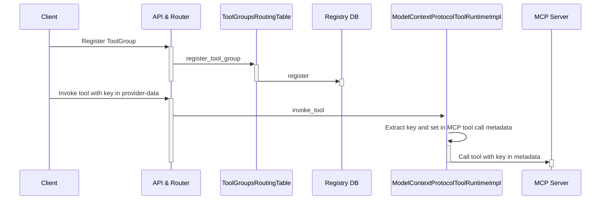
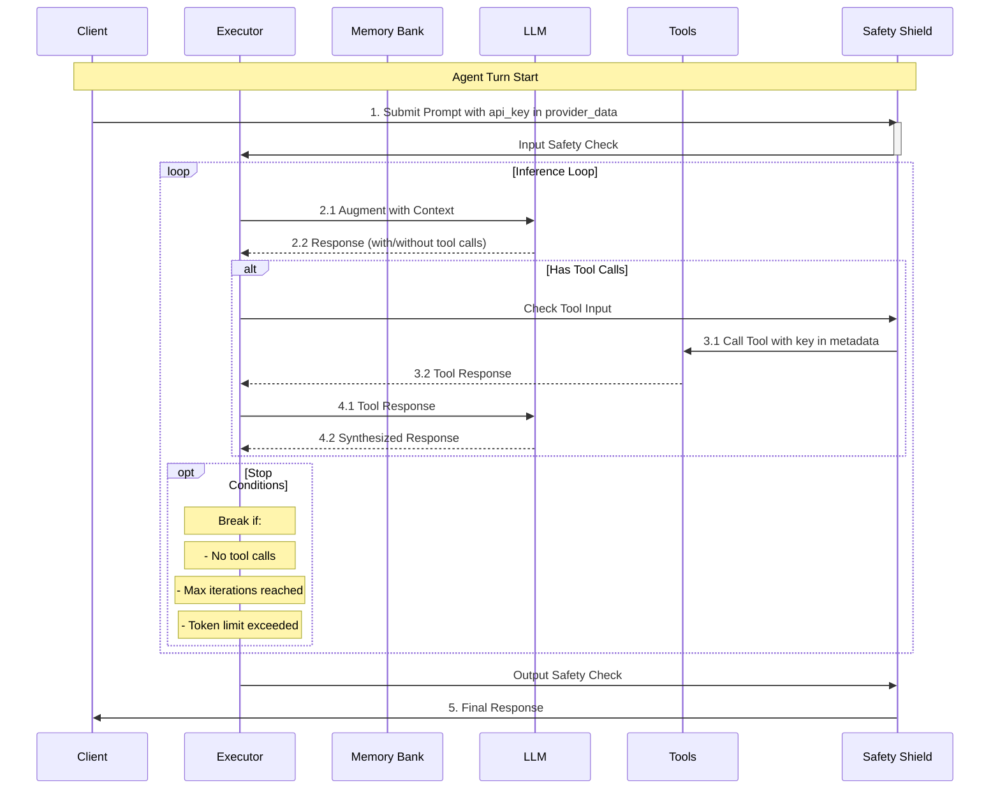

# Design and Implementation for the PoCs

This section provides details on the implementation of the PoCs.

## API Key Propagation to MCP Tool

API Key propagation for MCP does not work out of the box. It requires modifications in the Llama Stack MCP
provider and an opinionated use of the MCP python SDK to pass the `api_key` to the tool function. The following
sequence diagram illustrates the registration flow for a MCP tool and the direct tool invocation via API.

The following sequence diagram illustrates key propagation for a client starting an agent 
turn and for the agent invoking the MCP tool.  The diagram has been extracted from 
[Llama Stack Documentation](https://llama-stack.readthedocs.io/en/latest/building_applications/agent_execution_loop.html)
and modfied accordingly.

The main changes are:

1. In `providers/src/mcp_identity/model_context_protocol.py`
    - enable use of `provider-data` to extract the `api_key` (extend class from `NeedsRequestProviderData`)
    - use `get_request_provider_data()` to get `provider-data` and `api_key`
    - set the `api_key` in the metadata for the `send_request` invoking the tool
2. In the `examples/clients/mcp/tool-util.py` client
    - set the `api_key` in the `provider_data` when initializing the llama stack client.
3. In the MCP server `examples/mcp/sse_server.py`
    - use the [Context](https://github.com/modelcontextprotocol/python-sdk/blob/1691b905e22faa94f45e42ca5dfd87927362be5a/src/mcp/server/fastmcp/server.py#L553) passed to the tool to extract the metadata and the `api_key`.

