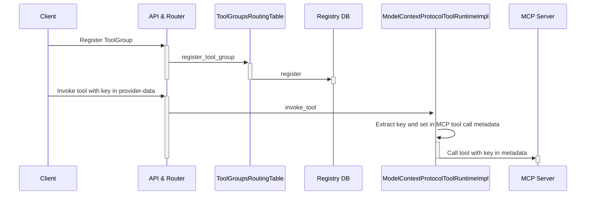
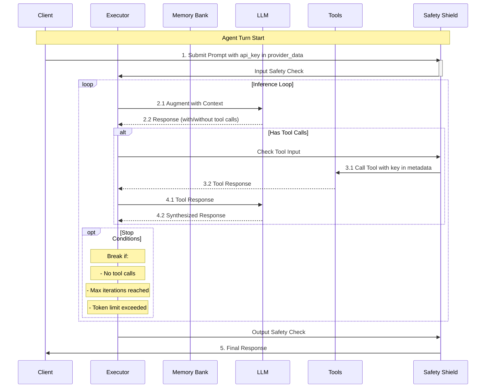
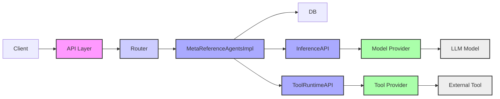
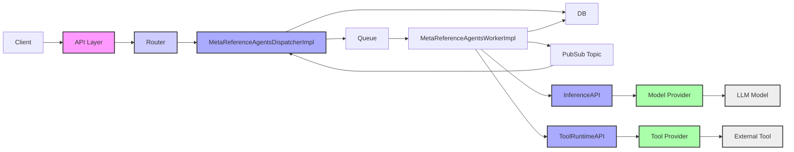

# Design and Implementation for the PoCs

This section provides details on the implementation of the PoCs.

## API Key Propagation to MCP Tool

API Key propagation for MCP does not work out of the box. It requires modifications in the Llama Stack MCP
provider and an opinionated use of the MCP python SDK to pass the `api_key` to the tool function. The following
sequence diagram illustrates the registration flow for a MCP tool and the direct tool invocation via API.

The following sequence diagram illustrates key propagation for a client starting an agent 
turn and for the agent invoking the MCP tool.  The diagram has been extracted from 
[Llama Stack Documentation](https://llama-stack.readthedocs.io/en/latest/building_applications/agent_execution_loop.html)
and modfied accordingly.

The main changes are:

1. In `providers/remote/tool_runtime/model_context_protocol/model_context_protocol.py`
    - enable use of `provider-data` to extract the `api_key` (extend class from `NeedsRequestProviderData`)
    - use `get_request_provider_data()` to get `provider-data` and `api_key`
    - set the `api_key` in the metadata for the `send_request` invoking the tool
2. In `providers/registry/tool_runtime.py`
    - set the `provider_data_validator` for the `model-context-protocol` adapter type.
3. In the `examples/clients/mcp/tool-util.py` client
    - set the `api_key` in the `provider_data` when initializing the llama stack client.
4. In the MCP server `examples/mcp/sse_server.py`
    - use the [Context](https://github.com/modelcontextprotocol/python-sdk/blob/1691b905e22faa94f45e42ca5dfd87927362be5a/src/mcp/server/fastmcp/server.py#L553) passed to the tool to extract the metadata and the `api_key`.

## Web-Queue-Worker Pattern Architecture

The first goal of this PoC is to provide a scalable platform for agents running on Kubernetes for Llama Stack
agents using a Web-Queue-Worker pattern. A second longer term goal is to provide hosting for agents 
written using other frameworks (LangGraph, CrewAI, AG2 etc.)

Current implementation (only modules relevant to agents API are shown)

The PoC uses a **Web-Queue-Worker pattern**, which offers several advantages, including: scalability by allowing independent scaling of the web front-end and worker processes, improved responsiveness by offloading long-running tasks to the background, clear separation of concerns, ease of deployment and management, and the ability to handle high traffic volumes without impacting user experience by decoupling the front-end from the task processing workload through a message queue. 
 

**API Layer**: 

The API layer fronts the Llama Stack Server and is configured to utilize the `MetaReferenceAgentsDispatcherImpl` provider instead of the default `MetaReferenceAgentsImpl`:

* `MetaReferenceAgentsDispatcherImpl` inherits from `MetaReferenceAgentsImpl`, and it overrides the `create_agent_turn` method.
* Instead of initiating the agent `turn` directly, it queues the `turn`, ensuring that events for the `turn` are broadcasted via a Redis pub-sub topic allocated specifically for that `turn`.
Worker Agent:

**Worker Agent**

* The Worker Agent (`MetaReferenceAgentsWorkerImpl`) sets up the `LlamaStackAsLibraryClient` to load the entire Llama stack as a library.
* It retrieves jobs from the queue, executes the agent turn using the agent API, and then publishes the related events to the pub-sub topic associated with that turn.

**Event Handling**

`MetaReferenceAgentsDispatcherImpl` listens to the pub-sub topic for each turn and relays the events back to the client through *Server-Sent Events (SSE)*, ensuring real-time updates and seamless integration between the components.

