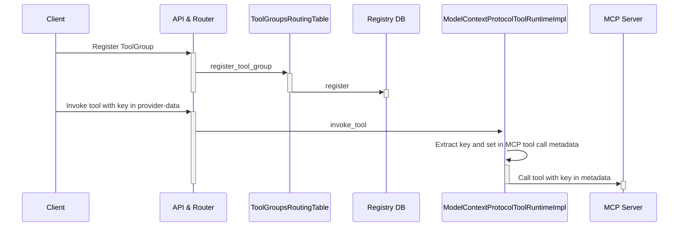
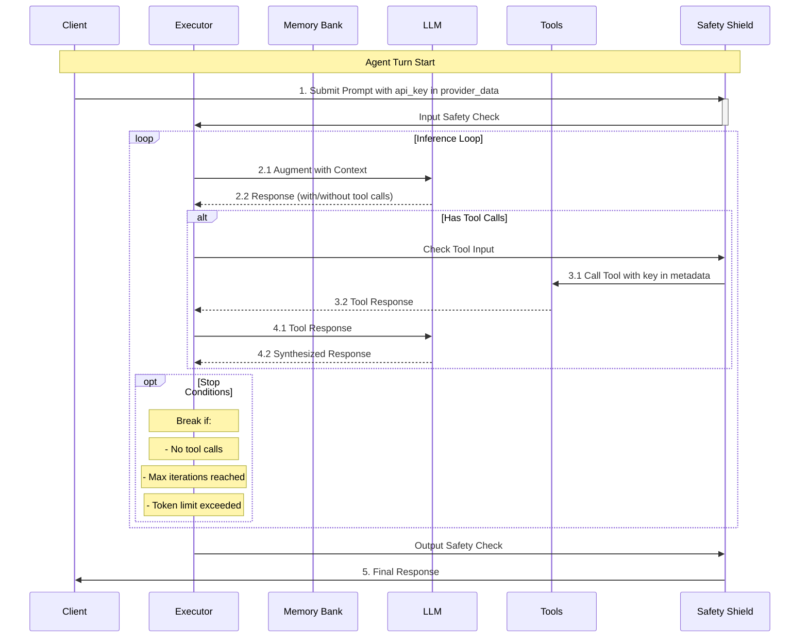
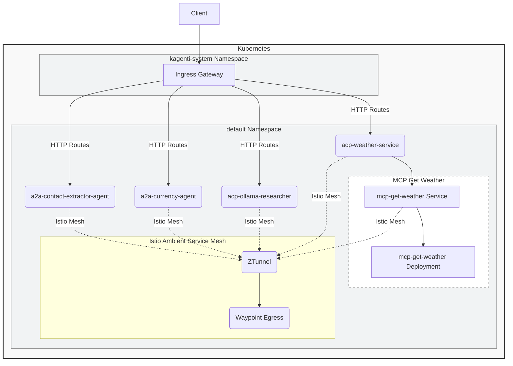

# Design and Implementation for the Demos

This section provides details on the implementation of the demos.

## API Key Propagation to MCP Tool

API Key propagation for MCP does not work out of the box. It requires modifications in the Llama Stack MCP
provider and an opinionated use of the MCP python SDK to pass the `api_key` to the tool function. The following
sequence diagram illustrates the registration flow for a MCP tool and the direct tool invocation via API.

The following sequence diagram illustrates key propagation for a client starting an agent 
turn and for the agent invoking the MCP tool.  The diagram has been extracted from 
[Llama Stack Documentation](https://llama-stack.readthedocs.io/en/latest/building_applications/agent_execution_loop.html)
and modfied accordingly.

The main changes are:

1. In `providers/src/mcp_identity/model_context_protocol.py`
    - enable use of `provider-data` to extract the `api_key` (extend class from `NeedsRequestProviderData`)
    - use `get_request_provider_data()` to get `provider-data` and `api_key`
    - set the `api_key` in the metadata for the `send_request` invoking the tool
2. In the `examples/clients/mcp/tool-util.py` client
    - set the `api_key` in the `provider_data` when initializing the llama stack client.
3. In the MCP server `examples/mcp/sse_server.py`
    - use the [Context](https://github.com/modelcontextprotocol/python-sdk/blob/1691b905e22faa94f45e42ca5dfd87927362be5a/src/mcp/server/fastmcp/server.py#L553) passed to the tool to extract the metadata and the `api_key`.

## Cloud Native Agent Platform Demo

The Cloud Native Agent Platform demo architecture is organized into multiple components that  demonstrate the integration of services and systems within a Kubernetes-based cloud native environment.

### Infrastructure

- **Ingress Gateway**: serves as the entry point for routing external HTTP requests to internal services within the platform.
It is deployed in the `kagenti-system` namespace.

- **Istio Ambient Service Mesh**: Istio Ambient Service Mesh is the new data plane mode for Istio that implements a *service mesh* without sidecar proxies. Ambient Mesh achieves this by using a shared agent called a *Ztunnel* to connect and authenticate elements within the mesh. It also allows for L7 processing when needed by deploying additional *Waypoint* proxies per namespace, accessing the full range of Istio features. 

- **Ztunnel**: Istio's ambient mode uses Ztunnel as a node-local proxy, instead of sidecar proxies for each pod, to facilitate communication within the mesh. Ztunnel leverages the Linux network namespace functionality to enter each pod's network space, allowing it to intercept and redirect traffic. Ztunnel establishes a secure overlay network using the HBONE protocol, providing mTLS encryption for traffic between pods within the mesh.

- **Waypoint Egress Gateway**: manages external communication with outside services or networks, ensuring secure egress traffic from the mesh. A Waypoint is part of the Istio Ambient data plane and acts as a proxy enabling traffic management policies such as routing, load balancing, and retries. Egress gateways enable the implementation of policies for external tool calls, serving as a key enforcement point.

 
### Agents

- **a2a-contact-extractor-agent**: Marvin agent exposed via [A2A](https://google.github.io/A2A) protocol. 
It extracts structured contact information from text using Marvin's extraction capabilities
- **a2a-currency-agent**: LangGraph agent exposed via A2A protocol. It provides exchange rates for currencies.
- **acp-ollama-researcher**: LangGraph agent exposed via [ACP](https://agentcommunicationprotocol.dev/introduction/welcome) protocol.
It implements a research assistant to perform various research tasks.
- **acp-weather-service**: LangGraph agent exposed via ACP protocol, that provides a simple weather info assistant.

### Tools 

- **mcp-get-weather**: an [MCP](https://modelcontextprotocol.io) tool to provide weather info
- **mcp-web-fetch**: an MCP tool to fetch the content of a web page

### Interactions and Data Flow

The Ingress Gateway routes HTTP traffic to the agents for North-South traffic. 
East-West traffic is routed through the Istio Ambient Mesh, leveraging the Ztunnel for secured 
inter-service communication.

A Waypoint proxy manages communication policies and ensures the reliability of service interactions,
more specifically, a Waypoint Egress Gateway securely handles outbound traffic.

