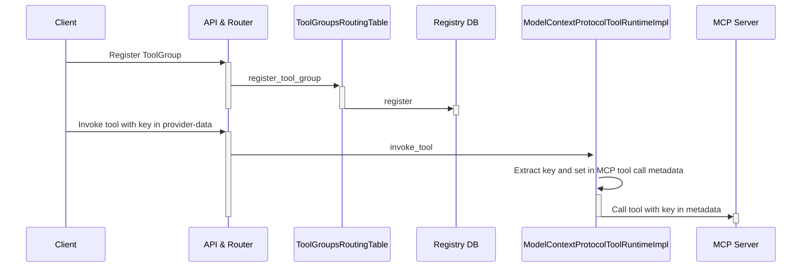

# Design and Implementation for the PoCs

This section provides details on the implementation of the PoCs.

## API Key Propagation to MCP Tool

API Key propagation for MCP does not work out of the box. It requires modifications in the Llama Stack MCP
provider and an opinionated use of the MCP python SDK to pass the `api_key` to the tool function.

The main changes are:

1. In `providers/remote/tool_runtime/model_context_protocol/model_context_protocol.py`
    - enable use of `provider-data` to extract the `api_key` (extend class from `NeedsRequestProviderData`)
    - use `get_request_provider_data()` to get `provider-data` and `api_key`
    - set the `api_key` in the metadata for the `send_request` invoking the tool
2. In `providers/registry/tool_runtime.py`
    - set the `provider_data_validator` for the `model-context-protocol` adapter type.
3. In the `examples/clients/mcp/tool-util.py` client
    - set the `api_key` in the `provider_data` when initializing the llama stack client.
4. In the MCP server `examples/mcp/sse_server.py`
    - use the [Context](https://github.com/modelcontextprotocol/python-sdk/blob/1691b905e22faa94f45e42ca5dfd87927362be5a/src/mcp/server/fastmcp/server.py#L553) passed to the tool to extract the metadata and the `api_key`.

