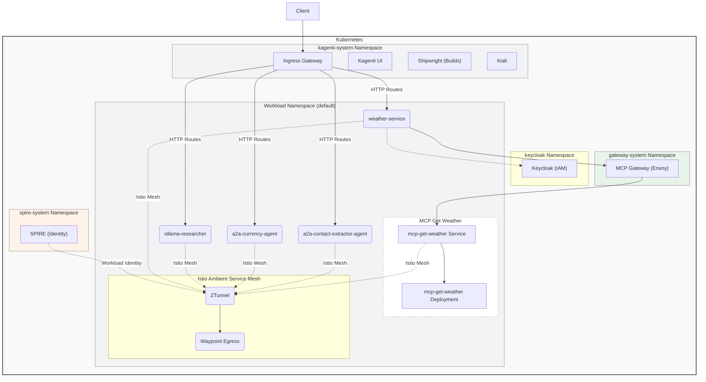

# Cloud Native Agent Platform

The Kagenti Cloud Native Agent Platform architecture is organized into multiple components that  support the integration of services and systems within a Kubernetes-based cloud native environment.

## Infrastructure

- **Ingress Gateway**: serves as the entry point for routing external HTTP requests to internal services within the platform.
It is deployed in the `kagenti-system` namespace.

- **Istio Ambient Service Mesh**: Istio Ambient Service Mesh is the new data plane mode for Istio that implements a *service mesh* without sidecar proxies. Ambient Mesh achieves this by using a shared agent called a *Ztunnel* to connect and authenticate elements within the mesh. It also allows for L7 processing when needed by deploying additional *Waypoint* proxies per namespace, accessing the full range of Istio features. 

- **Ztunnel**: Istio's ambient mode uses Ztunnel as a node-local proxy, instead of sidecar proxies for each pod, to facilitate communication within the mesh. Ztunnel leverages the Linux network namespace functionality to enter each pod's network space, allowing it to intercept and redirect traffic. Ztunnel establishes a secure overlay network using the HBONE protocol, providing mTLS encryption for traffic between pods within the mesh.

- **Waypoint Egress Gateway**: manages external communication with outside services or networks, ensuring secure egress traffic from the mesh. A Waypoint is part of the Istio Ambient data plane and acts as a proxy enabling traffic management policies such as routing, load balancing, and retries. Egress gateways enable the implementation of policies for external tool calls, serving as a key enforcement point.

- **Shipwright Build System**: [Shipwright](https://shipwright.io) is a cloud-native build framework for building container images directly in Kubernetes. Kagenti uses Shipwright to build both agents and MCP tools from source code. Shipwright supports multiple build strategies including `buildah` for external registries with TLS and `buildah-insecure-push` for internal registries without TLS verification.

- **MCP Gateway**: The MCP Gateway provides a unified entry point for [Model Context Protocol (MCP)](https://modelcontextprotocol.io) servers and tools. Deployed in the `gateway-system` namespace, it acts as a routing layer that enables agents to discover and invoke MCP tools. The gateway uses Envoy as a proxy for request routing, load balancing, and authentication. Agents access MCP tools through the gateway using standard HTTP requests, which are then routed to the appropriate tool services.

 
## Agents

- **a2a-contact-extractor-agent**: Marvin agent exposed via [A2A](https://google.github.io/A2A) protocol. 
It extracts structured contact information from text using Marvin's extraction capabilities
- **a2a-currency-agent**: LangGraph agent exposed via A2A protocol. It provides exchange rates for currencies.
- **slack-researcher**: Autogen agent exposed via A2A protocol. It implements a slack assistant to perform various research tasks on slack.
- **weather-service**: LangGraph agent exposed via A2A protocol, that provides a simple weather info assistant.

## Tools 

- **mcp-get-weather**: an [MCP](https://modelcontextprotocol.io) tool to provide weather info
- **mcp-web-fetch**: an MCP tool to fetch the content of a web page

### Interactions and Data Flow

The Ingress Gateway routes HTTP traffic to the agents for North-South traffic. 
East-West traffic is routed through the Istio Ambient Mesh, leveraging the Ztunnel for secured 
inter-service communication.

A Waypoint proxy manages communication policies and ensures the reliability of service interactions,
more specifically, a Waypoint Egress Gateway securely handles outbound traffic.
