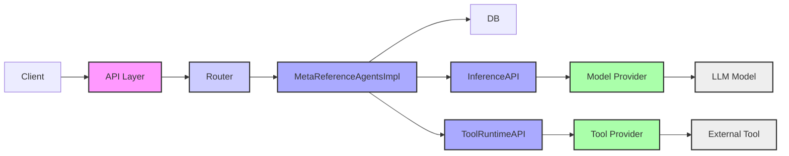
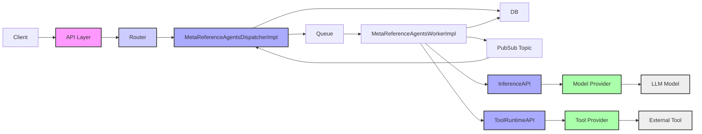

# Llama Stack with Web-Queue-Worker pattern PoC

## Architecture

The first goal of this PoC is to provide a scalable platform for agents running on Kubernetes for Llama Stack
agents using a Web-Queue-Worker pattern. A second longer term goal is to provide hosting for agents 
written using other framewoeks (LangGraph, CrewAI, AG2 etc.)


Current implementation (only modules relevant to agents API are shown)



The PoC uses a **Web-Queue-Worker pattern**, which offers several advantages, including: scalability by allowing independent scaling of the web front-end and worker processes, improved responsiveness by offloading long-running tasks to the background, clear separation of concerns, ease of deployment and management, and the ability to handle high traffic volumes without impacting user experience by decoupling the front-end from the task processing workload through a message queue. 
 


**API Layer**: 

The API layer fronts the Llama Stack Server and is configured to utilize the `MetaReferenceAgentsDispatcherImpl` provider instead of the default `MetaReferenceAgentsImpl`:

* `MetaReferenceAgentsDispatcherImpl` inherits from `MetaReferenceAgentsImpl`, and it overrides the `create_agent_turn` method.
* Instead of initiating the agent `turn` directly, it queues the `turn`, ensuring that events for the `turn` are broadcasted via a Redis pub-sub topic allocated specifically for that `turn`.
Worker Agent:

**Worker Agent**

* The Worker Agent (`MetaReferenceAgentsWorkerImpl`) sets up the `LlamaStackAsLibraryClient` to load the entire Llama stack as a library.
* It retrieves jobs from the queue, executes the agent turn using the agent API, and then publishes the related events to the pub-sub topic associated with that turn.

**Event Handling**

`MetaReferenceAgentsDispatcherImpl` listens to the pub-sub topic for each turn and relays the events back to the client through *Server-Sent Events (SSE)*, ensuring real-time updates and seamless integration between the components.


## Running demo

**DISCLAIMER**

The PoC is work in progress. The current code (server, workers) runs as python processes 
on the host, and infra services (Redis, Postgres) run as docker container. Next steps are to run infra services
and Llama Stack Server and Agent Workers on Kubernetes.

clone this fork:

```shell
git clone https://github.com/pdettori/llama-stack.git
```

cd to project and checkout branch:

```shell
cd llama-stack
git checkout run-queues
```

### Install deps 

1. Make sure you have docker installed (Rancher Desktop or Podman). Docker is used to run the infrastructure services
   (Redis and Postgres). 

2. Install [ollama](https://ollama.com/download)

3. Follow [these steps](https://pypi.org/project/llama-stack/)

    ```shell
    conda create -n stack python=3.10
    conda activate stack
    pip install -e .
    llama stack build --template ollama
    ``` 

4. Install extra deps with:

    ```shell
    uv pip install -r llama_stack/providers/inline/agents/meta_reference_worker/requirements.txt 
    pip install -r llama_stack/providers/inline/agents/meta_reference_worker/requirements.txt 
    ```

### Running the PoC

### Starting the infrastructure services

On a terminal on the `llama-stack` project, run the following:

```shell
llama_stack/providers/remote/agents/queue-worker/start-infra.sh 
```

#### Starting ollama

Open one terminal and start ollama as in [llama stack instructions](https://llama-stack.readthedocs.io/en/latest/getting_started/index.html#start-ollama)

```shell
ollama run llama3.2:3b-instruct-fp16 --keepalive 60m
```

#### Starting llama-stack server

Open another terminal on the `llama-stack` project and branch previosuly cloned, then make sure the conda
env 'stack' is activated and run the server as follows:

```shell
conda activate stack
export LLAMA_STACK_PORT=8321
export INFERENCE_MODEL="meta-llama/Llama-3.2-3B-Instruct"
llama stack run llama_stack/providers/inline/agents/meta_reference_dispatcher/run.yaml 
```

#### Starting llama-stack worker

Open another terminal on the `llama-stack` project and branch previosuly cloned, then make sure the conda
env `stack` is activated, `cd` to `queue-worker` remote agent directory and run the llama-stack agent worker
as follows:

```shell
conda activate stack
export INFERENCE_MODEL="meta-llama/Llama-3.2-3B-Instruct"
python -m llama_stack.providers.remote.agents.queue-worker.main
```

### Running an agent turn using the SDK

On a new terminal on the `llama-stack`, run the following:

```shell
conda activate stack
python -m llama_stack.providers.remote.agents.queue-worker.test.test_agent
```
You should get a streamed output similar to the following:

```shell
No available shields. Disabling safety.
Using model: meta-llama/Llama-3.2-3B-Instruct
Created session_id=20150462-3ab6-47aa-986a-2cadf093cd39 for Agent(a237380b-c92c-4ec9-9280-c62ad1e4f6f8)
tool_execution> Tool:query_from_memory Args:{}
tool_execution> fetched 5294 bytes from memory
inference> KubeFlex is a flexible and scalable platform for running Kubernetes control plane APIs. Its goals include providing lightweight Kube API Server instances, controllers as a service, and flexibility in the choice of API Server build. It offers a single binary CLI for improved user experience, enabling users to initialize, install operators, manage lifecycle of control planes, and contexts.
<redacted>
```

### Running other Llama Stack Agents demo from community

Clone the llama-stack-apps demo:

```shell
git clone https://github.com/meta-llama/llama-stack-apps.git
cd llama-stack-apps
```

You may use the same conda env as specified in the README or create a new one. For these instructions
we will use the same one:

```shell
conda activate stack
pip install -r requirements.txt
```

**Important** - to run the first example, you need a `$TAVILY_SEARCH_API_KEY`. You can get
a free one signig up at [tavily.com](https://tavily.com). The key is only required in the worker
as the agent and the tool call run there. Therefore, you need to stop the worker, set the key 
in the environment and restart:

On the terminal where you previosuly run the worker, stop the current instance with CTRL+C
and then:

```shell
conda activate stack
export TAVILY_SEARCH_API_KEY=<your key>
export INFERENCE_MODEL="meta-llama/Llama-3.2-3B-Instruct"
python -m llama_stack.providers.remote.agents.queue-worker.main
```

Open a new terminal to run the SDK client code, and activate it.

```shell
conda activate stack
```

**Important** The client SDK code doesn't actually require TAVILY_SEARCH_API_KEY 
to be set in the client environment. However, the code is structured to rely on 
the presence of this environment variable to decide whether to use the Tavily 
search tool. Therefore, before running the code, you should set the key to any 
value, as the specific value is irrelevant.

```shell
export TAVILY_SEARCH_API_KEY=any-value
```

Finally, you can run the hello agent example:

```shell
python -m examples.agents.hello localhost 8321
```

#### Running inflation.py

The code requires an adjustment to work. Note that the adjustments on `tool_choice` 
is required even if running the llama-stack as monolith server as usual.

```shell
sed -i.bak -e 's/tool_choice="required"/tool_choice="auto"/' examples/agents/inflation.py
python -m examples.agents.inflation localhost 8321
```

Note: when running the worker agent on MacOS, you may see a number of warnings in the response
of the form:

```shell
[stderr]
Traceback (most recent call last):
  line 5, in <module>
    from bwrap.core import main
ModuleNotFoundError: No module named 'bwrap.core'
[/stderr]
```

This is expected and it is because `bwra, which is a command-line tool used for sandboxing applications 
in Linux, requires a Linux system with namespaces support, and does not work on MacOS`. We should be 
able to make this work e2e (with code execution in the sandboxed env) when running in Kube on a linux box.

#### Running podcast_transcript.py

The code requires couple of adjustments to work. Note that the adjustments on `tool_choice` and 
`toolgroups` to use are required even if running the llama-stack as monolith server as usual.

```shell
sed -e 's/tool_choice="required"/tool_choice="auto"/' -e 's/\["builtin::code_interpreter"\]/& + \["builtin::rag"\]/' examples/agents/podcast_transcript.py
python -m examples.agents.podcast_transcript localhost 8321
```

#### Running rag_as_attachments.py

```shell
python -m examples.agents.rag_as_attachments localhost 8321
```

#### Running rag_with_vector_db.py

```shell
python -m examples.agents.rag_with_vector_db localhost 8321
```

Note: this particular example uses the `faiss` vector DB. By default the faiss provider uses 
`sqllite` as kvstore. Both server and worker have been configured with faiss backed by
postgres. This allow the worker to access the `vector_db_id` created by the client
via `client.tool_runtime.rag_tool.insert`.

#### Running react_agent.py


```shell
python -m examples.agents.react_agent localhost 8321
```

#### TODOs


1. Investigate MCP and how it is used in Lllama Stack for tools calling - DONE

2. Design and build PoC for operator managing deployment of the stack (dispatcher and 
   worker components) and infra services

2. Design solution for zero-trust identity for tool calling on behalf of the user.

3. Design and implement Agent Worker for other frameworks (LangGraph etc.) - DONE
    - how to "register" code for agents written in other frameworks
    - adapt event format to ship back to client


